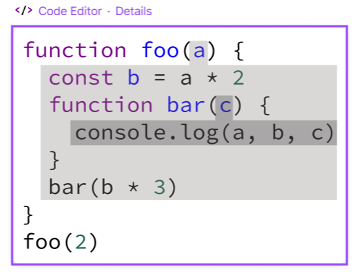

# 函数

函数是ECMAScript中最有意思的部分之一，主要是因为函数实际上是对象。每个函数都是Function类型的实例，而Function也有属性和方法，跟其他引用类型一样。因为函数是对象，所以函数名就是指向函数对象的指针，而且不一定与函数本身紧密绑定。

函数写法如下：

```javascript
// 函数声明方式
function sum(a, b) {
  return a + b
}
// 函数表达式（箭头函数）
const sum = (a, b) => {
  return a + b
}
// Function 构造函数
const sum = new Function("a", "b", "return a + b")
```

第三种语法来定义函数不推荐，因为会被解析两次：第一次是将它作为常规代码解析，第二次是执行期间解释器解析。这显然会影响性能。

第一种函数声明和第二种箭头函数行为基本相同，但是箭头函数很多场景不适用，比如不能使用arguments、super、new.target，也不能作为构造函数。此外箭头函数没有prototype属性、作用域提升。

函数声明和函数表达式JS引擎在加载数据时对它们是区别对待的。JS引擎在任何代码执行之前，会先读取函数声明，并在执行上下文中生成函数定义。而函数表达式必须等到代码执行到它那一行，才会在执行上下文中生成函数定义。

```javascript
console.log(sum1(1, 2))
console.log(sum2(1, 2)) // 报错
function sum1(a,b) {
  return a + b
}
const sum2 = function (a, b) {
  return a + b
}
```

使用function定义的声明代码，在第一行访问是可以正常运行的，因为函数声明会在执行之前先被读取并添加到执行上下文。这个过程叫做函数声明提升。在执行代码时，JS引擎会先执行一遍扫描，把发现函数声明提升到顶部。因此函数定义出现在调用它们代码之后，引擎也会把函数声明提升到顶部。如果把代码中的函数声明改为等价函数表达式，那么执行就会报错。因为这个函数定义包含在一个变量初始化语句中，而不是函数声明中。这意味着代码如果没有执行到加粗那一行，那么执行上下文中就没有函数定义，所以才会报错。


## 函数名与参数

函数名就是指向函数的指针，所以它们跟其它包含对象指针的变量具有相同的行为。

ECMAScript函数的参数跟大多数语言不通，ECMAScript中函数既不关心传入的参数个数，也不关心这些参数的数据类型。如果函数定义接收两个参数，并不意味着调用时就传入两个参数。可以多传，也可以少传。

之所以这样，因为ECMAScript函数的参数在内部表现为一个数组。函数被调用时总会接收一个数组，但函数并不关心这个数组包含什么。实际上，在使用function定义函数时，可以直接使用arguments来获取实参个数，arguments对象是一个类数组（但不是Array的实例），这个类数组也可以使用索引访问值，也有length属性

```javascript
function doAdd(a, b) {
  arguments[1] = 10
  console.log(arguments[0] + b); // 110
}
let aa = 100, bb = 200
doAdd(aa, bb)
console.log(aa, bb) // 100 200
```

上面doAdd函数中第一行，把第二个参数重写为10.因为arguments对象的值会自动同步到对应的命名参数，所以修改`arguments[1]`也会修改b的值。但是这种同步是单向的：修改命名参数的值，不会影响arguments对象中相应的值。

注意：如果只传递一个参数，然后把arguments[1]设置为某个值，那么这个值并不会反映到第二个命名参数。这是因为**arguments对象长度是根据传入的参数个数决定的**，而非定义函数时给出的参数个数。

虽然箭头函数没有arguments对象，但可以在包装函数中把它提供给箭头函数：

```javascript
function foo() {
  const bar = () => {
    // 因为上一个作用域提供了arguments
    console.log(arguments)
  }
  bar()
}
foo()
```

在ECMAScript以前，实现默认参数方式就是检测某个参数是否为undefined, 如果是那么就给他赋值

```javascript
function makeKing(name) {
  name =  typeof name !== 'undefined' ? name : 'jery'
  return name
}
// es6解决方案
function makeKing(name = 'jery') {
  return name
}
```

给参数传递undefined相当于没有传递值，不过这样可以利用多个独立的默认值

```javascript
function makeKing(name, value) {
  return name + value
}
makeKing(undefined, 'makeKing')
```

## 参数扩展和收集


```javascript
const values = [1,2,3,4]
function getSum() {
    return Array.from(arguments).reduce(x, y => x + y, 0)
}
```

上面代码执行，需要把values进行拆分成4个参数传入，这样arguments得到的是一维类数组，而不是类数组包含一项数组。es6之前只能使用`getSum.bind(null, values)`,es6可以使用扩展操作符`getSum(...values)`。扩展运算符并不妨碍前后参数传至。

在构思函数定义时，形参可以使用扩展运算符把不同长度的独立参数合为一个数组。有点类似于arguments对象的构造机制，只不过收集参数的结果会得到Array实例。


收集参数前面如果还有命名参数，则只会收集其余参数；如果没有则会得到空数组。因为收集的参数的结果可变，所以只能把它作为最后的参数。

```javascript
function getSum(...values) {
  return values.reduce((x, y) => x + y, 0)
}
// 收集参数只能在最后
function getSum(one, ...values) {
  return values.reduce((x, y) => x + y, 0)
}

```

## 递归

arguments对象其实还有一个callee属性，是一个指向arguments对象所在的函数，如下经典阶乘函数：

```javascript
function factorial(num) {
  return num <= 1 ? 1 : num * factorial(num - 1);
}
```

上面函数有个问题就是必须要有函数名称，而且这个名称不会变，从而导致紧密耦合。使用`arguments.callee`就可以让函数逻辑与函数名解耦

```javascript
// 非严格模式，严格模式报错
function factorial(num) {
  return num <= 1 ? 1 : arguments.callee(num - 1)
}
```

## caller

ES5给函数新增属性：caller。这个属性的引用是调用当前函数的函数，或者在全局作用域中调用则为null

```javascript
function foo() {
  bar()
}
function bar() {
  // 函数caller
  console.log(bar.caller)
  // arguments 的caller
  console.log(arguments.callee.caller)
}
foo()
```

两个输出的都是foo.valueOf()的值，也就是foo的源代码。这是因为foo调用了bar, bar.caller指向foo。 然后可以使用arguments.callee.caller来引用同样的值降低耦合度。

注意arguments.callee在严格模式下会报错，arguments.caller也是一样。因为严格模式下arguments和函数，不能访问caller、callee和arguments属性，报错信息：`demo.html:15 Uncaught TypeError: 'caller', 'callee', and 'arguments' properties may not be accessed on strict mode functions or the arguments objects for calls to them`, 也不能进行赋值。


## new.target

ECMAScript中的函数始终可以作为构造函数实例化一个新对象，也可以作为普通函数被调用。ES6中新增检测函数是否使用new关键字调用new.target属性。如果函数正常调用的，则new.target的值是undefined;如果是new关键字调用，则new.target将引用被调用的构造函数

```javascript
function NewTarget() {
  if(!new.target) {
    throw '请使用new调用'
  } 
  console.log('继续使用')
}
new NewTarget() // '继续使用'
NewTarget() // '请使用new调用'


// 第二种方式
function NewTarget() {
  if(!(this instanceof NewTarget)) {
    throw '请使用new调用'
  }
  console.log('继续使用')
}
```

## 函数方法call、apply和bind

ECMAScript中的函数是对象，因此有属性和方法。每个函数都有两个属性length、prototype。length保存函数定义形参个数。prototype保存引用类型所有实例方法，toString()、valueOf()等方法都保存在prototype上，从而给实例共享，prototype是不可枚举的，因此使用for-in循环不会返回这个属性。

函数有两个方法：apply()与call()。这两个方法都会指定this值来调用函数，可以设置调用函数时函数体内this对象的值。

- apply方法接收两个参数：函数内this的值和一个参数数组。第二个参数可以是Array的实例也可以是arguments对象
- call方法和apply作用一样，只是传参形式不同，第一个参数和apply一样this的值，而剩下的参数需要逐个传。相当于apply需要参数收集，call需要参数展开。

apply和call方法强大的地方并不是给函数传递参数，而是控制函数调用上下文即函数体内this值得能力 与 可以将任意对象设置为任意函数的作用域。

ECMAScript5出于同样的目的定义bind()方法，它会创建一个新的函数实例，其this值会被当顶到传给bind的对象。

```javascript
function sum(a, b) {
  return a + b
}

// call 与 apply
function callSum(a, b) {
  return sum.call(this, num1, num2)
}
callSum(10, 20)

function callSum(a, b) {
  return sum.apply(this, [num1, num2])
}
callSum(10, 20)

// 控制this
window.color = 'red'
const o = {
  color: 'blue'
}
function sayColor() {
  console.log(this.color)
}
sayColor(o) // blue
sayColor(window) // red
sayColor(this) // red

// bind
window.color = 'red'
const o = {
  color: 'blue'
}
function sayColor() {
  console.log(this.color)
}
const copySayColor = sayColor.bind(o)
copySayColor() // blue
```

如果传入一个原始值来当做this的绑定对象，这个原始值会被转换成它的对象形式。这就是装箱

[this 绑定详细说明](./function/#this)

es5内置了bind。es3提供了call与apply方法，下面手写一个bind函数。

bind特性：传入一个参数，为函数执行时this指向; 返回一个新的函数。

```javascript
if(!Function.prototype.bind) {
  Function.prototype.bind = function(context) {
    if(typeof this !== 'function') {
        throw new TypeError('Function.prototype.bind - what is trying to be bound is not callable')
    }
    const slice = Array.prototype.slice.call
    // 裁剪函数参数
    const args = slice(arguments, 1)
    const _this = this
    // const copySayColor = sayColor.bind(o)
    function newFn() {
        return _this.apply(context, args.concat( Array.from(arguments) ) )
    }
    function Fn() {}
    Fn.prototype = this.prototype
    newFn.prototype = new Fn()
    // newFn.prototype = this.prototype 上面三行替换成一行
    return newFn
  }
}
```


## 词法作用域

### 词法阶段

作用域分为：全局作用域、词法作用域、动态作用域（this）、块级作用域、、函数作用域。


大部分标准语言编译器的第一个工作阶段叫做词法化。词法化的过程会对源代码进行字符检查，如果是有状态的解析过程，还会赋予单词语义。这个概念是理解词法作用域其名称来历基础。

简单来说词法作用域就是定义在此法阶段的作用域。换句话来说词法作用域是由你在写代码时将变量和块作用域写在哪里决定的，因此词法分析器处理代码时会保持作用域不变。

```javascript
function foo(a) {
  const b = a * 2
  function bar(c) {
    console.log(a, b, c)
  }
  bar(b * 3)
}
foo(2)
```

在上面例子中有三个逐级嵌套的作用域



- 最外层整个全局作用域，其中只有一个标识符foo
- 包含着foo所创建的作用域，其中有三个标识符：a、bar、b
- 包含着bar所创建的作用域，其中只有一个标识符：c

作用域气泡由其对应的作用域块代码写在哪里决定，它们是逐级包含的

作用域气泡的结构和相互之间的关系给引擎提供了足够多的信息，引擎用这些信息来查找标识符的位置。在上面代码中，引擎执行console.log声明，并查找a、b、c三个变量引用。它首先从最内部的作用域bar函数的作用域气泡开始查找。引擎无法再这里找到a,因此会去上一级到所嵌套的foo的作用域中继续寻找，在这里找到a, 因此引擎使用这个引用。对b来说也是一样，c引擎在bar中就找到了。

如果bar和foo中内部都存在一个c, console.log就可以直接使用bar中的变量，而无需到外面的foo中查找。 作用域查询会在找到第一个匹配的标识符就停止。

无论函数在哪里被调用，也无论它如何被调用，它的词法作用域都只有函数被声明时所处位置决定。


### 欺骗词法

如果词法作用域完全由写代码期间函数所声明的位置来定义，怎样才能在运行时来修改词法作用域？JS中有两种机制来实现这个目的：eval 与 with，但是欺骗词法作用域会导致性能下降，因为需要编译两次，一次是词法分析，一次是运行时编译。

JS中`eval(...)`函数可以接收一个字符串为参数，并将其中的内容视为在编写时候就存在这个位置。在执行eval之后的代码时，引擎并不知道前面代码是以动态形式插入进来，并对词法作用与环境进行修改的。引擎只会如此往常地进行词法作用域查找。

```javascript
function foo(str, a) {
  eval(str) // 欺骗
  console.log(a, b)
}
var b = 2;
foo("var b = 3", 1)
```

eval调用中的`"var b = 3"`;这段代码会被当做本来就在那里一样处理。由于那段代码声明一个新的变量b,因此它对已存在的foo词法作用域进行了修改。事实上这段代码在运行时在foo内部创建了b变量，并遮蔽了外部作用域中的同名变量。所以当执行log日志时，会在foo内部同时找到a和b,但是永远也无法找到外部b。因此会输出1,3。

在严格模式下，eval在运行时有自己的词法作用域，这意味着其中的声明无法修改所在的作用域。

```javascript
function foo(str) {
  "use strict"
  eval(str)
  console.log(a) // ReferenceError: a is not defined
}
foo("var a = 2");
```

JS中海油其他一些功能效果和eval类似，setTimeout与setInterval的第一个参数可以是字符串，字符串的内容可以被解释为一段动态生成的函数代码。这些功能已经过时并不提倡，不要使用。

new Function()函数的行为也是类似，最后一个参数可以接收代码字符串，并将其转换为动态生成的函数（前面参数都是函数的形参）。这种构建函数的语法比eval略微安全一些，但也尽量避免使用。vue2源码就是使用该方法。

JS中`with`关键字也是用来欺骗词法作用域的功能。with通常被当做重复引用对象本身。

```javascript
const vm = {
  a: 1,
  b: 2,
  c: 3
}

// 单调乏味调用
obj.a = 2
obj.b = 3
obj.c = 4


// 快捷方式
with(vm) {
  a = 2
  b = 3
  c = 4
}
```

但实际上这不仅仅是为了方便地访问对象属性。考虑如下代码

```javascript
function foo(obj) {
    with(obj) {
        a = 2
    }
}
var o1 = { a: 3 }
var o2 = { b: 3 }
foo(o1) // o1.a -> 2
foo(o2) // o2.a -> undefined
console.log(a) // 2 a被泄露到全局作用域中
```

上面例子中创建o1与o2两个对象。其中一个具有a属性，另外一个没有foo函数接收一个obj参数，该参数是一个对象引用，并对这个对象引用执行了`with(obj){...}`的操作，在with块内部，代码只是对变量a进行简单的词法引用，实际上就是一个LHS引用，并将2赋值。

将o1传入进入，a = 2赋值操作找到了o1.a并将2赋值给它，这在后面的log日志中可以体现。而当o2传入进入，o2并没有a属性，因此不会创建这个属性，o2.a保持undefined,但是可以注意到一个奇怪的副作用，实际上a = 2赋值操作创建了一个全局的变量a。

with可以将一个没有或有多个属性的对象处理为一个完全隔离的词法作用域，但是这个块内部正常的var声明并不会被限制在这个块的作用域中，而是被添加到with所处的函数作用域中。

尽管with块可以讲一个对象处理为词法作用域，但是这个块内部正常的var声明并不会被限制在这个块的作用域中，而是被添加到with所处的函数作用域中。

eval函数如果接受了含有一个或多个声明的代码，就会修改其所处的词法作用域，而with声明实际上是根据传递给他的对象凭空创建了一个全新的词法作用域。

可以这样理解，当我们传递o1给with时，with所声明的作用域是o1，而这个作用域中包含有一个同o1.a属性相符的标识符。但当我们将o2作为作用域时，其中并没有a标识符。因此进行了正常的LHS标识符查找。o2作用域、foo的作用域和全局作用域中都没有找到标识符a，因此当`a=2`执行时，会自动创建一个全局变量（因为非严格模式）。

不推荐使用eval和with的原因是会被严格模式所影响。with被完全禁止，而在保留核心功能的前提下，间接或非安全地使用eval也被禁止。

```javascript
// 在vue2的compiler源码中 用使用new Function 与 with配合生成render函数
export function generate(ast: ASTElement) {
  // 处理元素节点
  const code = genElement(ast);
  return {
    render: `
      with(this) {
        return  ${code}
      } `
  };
}


export function compileToFunctions(template: string) {
  // 解析器
  const ast = parse(template);
  // 优化器： 添加静态节点与静态根节点标识
  optimize(ast);
  // 代码生成器：
  const { render } = generate(ast);
  console.log( render );
  return {
    ast,
    render: new Function(render),
  };
}
```

eval和with性能问题：都会在运行时修改或创建新的作用域，以此来欺骗其他在书写时定义的词法作用域。JS引擎会在编译阶段进行数项性能优化。其中有些优化依赖于能够根据代码的词法进行静态分析，并预先确定所有变量的函数和定义位置，才能在执行过程中快速找到标识符。

但如果引擎在代码中发现eval或with，它只能简单地假设关于标识符位置的判断都是无效的，因为无法再此法分析阶段明确知道eval会接受什么代码，这些代码会如何对作用域进行修改，也无法知道传递给with用来创建新词法作用域的对象的内容到底是什么。


### 闭包

严格来说：闭包是一个函数，该函数在生成时会“捕获”作用域内的值。闭包是基于词法作用域书写代码时所产生的自然结果。

闭包是指那些引用了另一个函数作用域中变量的函数。

闭包的函数就是提供函数私有变量的访问。

```javascript
function foo() {
  const obj = {}
  return function() {
    return obj
  }
}

let bar = foo()
// 在外部作用域中访问，foo内部作用域变量
// obj变量作用域延伸
console.log(bar()) // {}

// 解除对函数的引用，释放内存
bar = null
```

在执行foo之后，通常会期待foo的整个内部作用域都被销毁，因为我们知道引擎有垃圾回收器用来释放不在使用的内容空间。由于看上去foo()的内容不会再被调用，所以很自然地会考虑回收。而闭包正是可以组织该行为，事实上内部作用域依然存在，因此没有被回收。那么谁在使用该作用域呢？原来是里面的函数。里面的函数依然持有该作用域的引用，而这个引用就叫做闭包。

然后执行完bar()函数，其执行上下文的作用域链会销毁，但它的活动对象仍然会保存在内存中，直到bar中的匿名函数被销毁后才会销毁，所以最后需要执行`bar = null`

因此，在几微妙之后变量baz被实际调用（调用内部函数bar）,不出意外它可以访问定义时的词法作用域，因此它也可以如预期般的访问变量obj。

这个函数在定义时的词法作用域以外的地方被调用。闭包使得函数可以继续访问定义时的词法作用域。

在定时器、时间监听器、ajax请求、跨窗口通信、web workers或者任何其他的异步（同步）任务中，只要使用回调函数，实际上就是在使用闭包。

循环中使用闭包

```javascript
// 不要使用const, let，因为会劫持当前作用域作用域
for(var i = 1; i <= 5; i++) {
  setTimeout(() => {
    console.log(i)
  }, 0)
}
```

上面试图假设循环中的每个迭代在运行时都会给自己“捕获”一个i的副本。但是根据作用域的工作原始，实际情况是尽管循环中的五个函数是在各个迭代中分别定义的，但是他们都被封闭在一个共享的全局作用域中，因此实际上只有一个i.

```javascript
for(var i = 1; i <= 5; i++) {
  (function() {
      setTimeout(() => {
        console.log(i)
      }, 0)
  })()
}
```

上面修改也不行。每个延迟函数都会讲iife在每次迭代中春刚建的作用域封闭起来。但是它只是个空的作用域，并没有保存下来当时的值，访问的还是全局i

```javascript
for(var i = 1; i <= 5; i++) {
  (function(j) {
      setTimeout(() => {
        console.log(j)
      }, 0)
  })(i)
}
```

现在迭代内使用iife会为每个迭代生成作用域，新的函数作用域保存每次传入的值。


### this

在理解this的绑定过程之前，首先要理解调用位置：调用位置就是函数在代码中被调用的位置（而不是声明位置）。最重要的还是分析调用栈（就是为了到达当前位置所调用的所有函数）。我们关系的调用位置就在当前正在执行的函数的前一个调用中。

```javascript
function baz() {
  console.log("baz")
  bar()
}
function bar() {
  // 当前调用栈是baz -> bar
  // 因此，当前调用位置在baz中
  console.log('bar')
  foo()
}
function foo() {
  // 当前调用栈是baz -> bar -> foo
  // 因此，当前调用位置在bar中
  console.log("foo")
}
baz()
```

**1. 默认绑定**

最常用的函数调用类型：独立函数调用。

非严格模式下，this指向全局变量；当前函数处于严格模式下，则不能讲全局对象用于默认绑定，this会绑定到undefined。

```javascript
var a = 2
function foo() {
  console.log(this.a)
}
foo() // 2
```


**2. 隐式绑定**

调用位置是否有上下文，或者说是否被某个对象“拥有”或“包含”

```javascript
function foo() {
    console.log(this.a)
}
var obj = {
  a: 2,
  foo
}
obj.foo()
```

调用位置使用obj上下文来引用函数，因此可以说函数被调用时obj对象“拥有”或“包含”函数引用。

当函数引用有上下文对象时，隐式绑定规则会把函数调用中的this绑定到这个上下文对象。因为调用foo是this被绑定到obj,因此this.a和obj.a是一样的。

对象属性引用链只有上一层或者说最后一层在调用位置起作用。如下所示：


```javascript
function foo() {
  console.log(this.a)
}
var obj2 = {
  a: 42,
  foo
}
var obj1 = {
  a: 2,
  obj2
}
obj1.obj2.foo() // 42
```

有一个常见this绑定问题就是隐式绑定的函数会丢失绑定对象，也就是说它会应用默认绑定，从而把this绑定到全局对象或者undefined上，取决于是否为严格模式。


```javascript
function foo() {
  console.log(this.a)
}
var obj = {
  a: 2,
  foo
}
var bar = obj.foo;
var a = "global"
bar() // 'global'
```

上面代码`var bar = obj.foo;`，这一行bar只是存储foo函数的引用，并不是一个调用，只是一个赋值操作，然后执行bar, 相当于直接执行foo, 于是就触发了默认绑定。

```javascript
function foo() {
  console.log(this.a)
}
function doFoo() {
  fn()
}
var obj = {
  a: 2,
  foo
}
var a = "global"
doFoo(obj.foo)
```

分析：doFoo函数调用，传入obj.foo，相当于直接传入foo函数进入（或者说foo的引用地址），然后foo在doFoo函数中执行，于是就触发默认绑定。

如果把函数传入语言内容之的函数，而不是传入自己声明的函数。

```javascript
function foo() {
  console.log(this.a)
}
var obj = {
  a: 2,
  foo
}
var a = "global"
setTimeout(obj.foo, 100)
```

结果和上面一样

**3. 显示绑定**

函数调用指定this指向，JS提供两个方法：call和apply.

[详细见这里](./function/#函数方法call、apply和bind)


**4. new 绑定**

在JS中构造函数只是一些使用new操作符时被调用的函数。它们并不会属于某个类，也不会实例化一个类。实际上它们甚至都不能说是一个特殊的函数类型，它们只是被new操作符调用的普通函数而已。

使用new来调用函数，或者说发生构造函数调用时，会自动执行下面操作;

1. 创建一个新的空对象
2. 将这个对象的原型设置为构造函数prototype对象
3. 让构造函数的this指向这个新对象
4. 判断构造函数的返回来兴。如果是基本数据类型，返回新创建的对象；如果是引用类型，则返回这个引用对象

```javascript
function newCopy () {
  // 取实参的第一项
  const Fn = Array.prototype.shift.call(arguments)
  // 判断传入的是否为函数
  if(typeof Fn !== 'function') {
    throw new TypeError('arguments must be a function')
  }
  // 创建一个新独享，并将新对象的原始设置为构造函数的prototype对象
  const newObj = Object.create(Fn.prototype);
  // 将构造函数this，指向新对象
  const result = Fn.apply(newObj, arguments)
  // 判断构造函数返回类型
  return (result && typeof result === 'object' || typeof result === 'function') ? result : newObj
}
```

```javascript
function foo(a) {
  this.a = a
}
const bar = new foo(2)
console.log(bar.a) // 2
```

**判断this**

1. （new绑定）函数是否在new绑定中调用？如果是那么this绑定就是新创建的对象
2. （显示绑定）函数是否通过call、apply显示绑定或者call间接？如果是，this绑定是指定对象
3. （隐式绑定）函数是否在某个上下文对象中调用？如果是，this绑定就是那个上下文
4. （默认绑定）如果以上都不是，则使用默认绑定。如果在严格模式下就是绑定undefined,否则绑定到全局。


## 尾调用优化

ECMAScript6 规范中新增了一项内存管理优化机制，让JS引擎在满足条件是可以重用栈帧。具体来说，这项优化非常适合“尾调用”，即外部函数的返回值是一个内部函数的返回值。如下代码

```javascript
function foo() {
  return bar()
}
```

在ES6之前，执行这个例子会在内存中发生这种情况：

1. 执行到foo函数体，第一个栈帧被推倒栈上
2. 执行foo函数体，到return语句，计算返回值必须先计算bar
3. 执行到bar函数体，第二栈帧被推倒栈上
4. 执行到bar函数体，计算其返回值
5. 将返回值传回foo, 将bar栈帧弹出栈外
6. foo将返回值返回，将foo栈帧弹出栈外

在ES6优化之后，执行这个例子会在内存中发生如下操作：

1. 执行到foo函数体，第一个栈帧被推倒栈外
2. 执行foo函数体，到达return语句。求值返回语句，所以先执行bar
3. 这时候引擎发现把第一个栈帧弹出栈外也没有问题，因为bar返回值也是foo返回值
4. 弹出foo栈帧
5. 执行bar函数体，栈帧被推倒栈上
6. 执行bar函数，计算返回值并将其返回
7. 将bar的栈帧弹出栈外

注意：现在灭有办法测试尾调用优化是否起作用。不过因为这是es6规范所规定的，兼容的浏览器实现都能保证在代码满足条件的情况下应用这个优化。

尾调用优化的条件就是确定外部栈帧真的没有必要存在。涉及如下条件：

- 代码在严格模式下执行
- 外部函数的返回值是对尾调用函数的调用
- 尾调用函数返回后不执行额外逻辑
- 尾调用函数不是引用外部函数作用域中自由变量的闭包

```javascript
"use strict"
// 无优化，尾调用没有返回
function foo() {
  bar()
}
// 无优化：尾调用没有直接返回
function foo() {
  let baz = bar()
  return baz
}
// 无优化：尾调用返回后必须转型为字符串
function foo() {
  return bar().toString()
}
// 无优化：尾调用是闭包
function foo() {
  let bar = 'bar'
  function baz() {
    return bar
  }
  return baz
}

// 有优化：栈帧销毁前执行参数计算
function foo(a, b) {
  return bar(a + b)
}
// 有优化: 初始化返回值不涉及栈帧
function foo(a, b) {
  if(a < b) return a
  return bar(a + b)
}
```

无论是递归调用还是非递归调用，都可以应用优化。引擎并不区分尾调用中调用的函数自身还是其它函数。不过，这个优化在递归场景下的效果是最明显的，因为递归代码最容易在栈内存中迅速尝试大量栈帧。

之所以要求严格模式，主要因为非严格模式下函数调用中允许使用f.arguments和f.caller。而它们都会引用外部函数的栈帧。显然这意味着不能应用优化。因此尾调用优化要求必须在严格模式下有小，防止引用这些属性。

下面是递归斐波那契数列的函数：


```javascript
function fib(n) {
  if(n < 2) return n
  return fib(n - 1) + fib(n - 2)
}
console.log(fib(6))

// 优化
"use strict"
function fib(n) {
  return fibImpl(0, 1, n)
}
function fibImpl(a, b, n) {
  if(n === 0) return a
  return fibImpl(b, a+b, n - 1)
}
```

第一种不符合尾调用优化的条件，因为返回语句中有一个相加操作。结果，fib(n)的栈帧数的内存复杂的是O(2^n)


