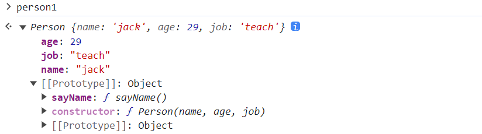
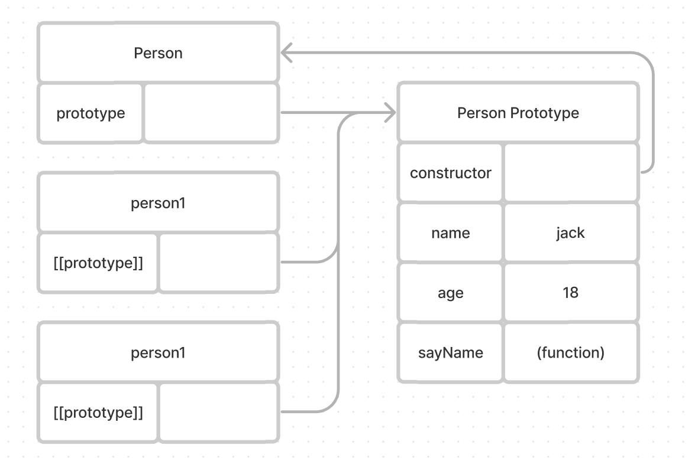
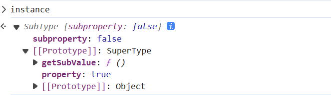

# Object

ECMAScript将对象定义为一组属性的无序集合。它的属性和方法都由一个名称来标识，这个名称映射到一个值。正是这个原因，可以把ECMAScript的独享想象成一张散列表，其中的内容就是一组名/值对，值可以是数据或者函数。

## 属性类型

ECMA-262使用一些内部特性来描述属性的特征。这些特征是由JS实现引擎的规范定义的。因此，开发者不能再JS中直接访问这些特性。为了将这些特性标识为内部属性，规范会用两个中括号括起来。

属性分为两种：数据属性和访问器属性。

数据属性包含一个保存数据的值。值会从这个位置读取，也会写入到这个位置。数据属性有4个特性描述它们的行为：

- `[[Configurable]]` 表示属性可以通过delete删除并重新定义，是否可以修改它的特性，以及改为访问器属性。默认情况都为true
- `[[Enumberable]]` 表示属性是否可以通过for-in循环返回。默认情况下，所有直接定义在对象属性的都是true, 原型链上的都是false
- `[[Writable]]` 表示属性的值是否可以被修改。默认情况都是true
- `[[Value]]` 实际值，默认值undefined

访问器属性不包含数据值。相反，它们包含一个getter和setter函数，不过不是必须的。读取的时候调用getter，这个函数责任就是返回一个有效值。写入会调用setter函数，会传递一个参数，就是新值，这个函数可以在里面对数据做出修改。

- `[[Configurable]]` 表示属性可以通过delete删除并重新定义，是否可以修改它的特性，以及改为访问器属性。默认情况都为true
- `[[Enumerable]]` 表示属性是否可以通过for-in循环返回。默认情况下，所有直接定义在对象属性的都是true, 原型链上的都是false
- `[[Get]]` getter函数，读取的时候调用。默认为undefined
- `[[Set]]` setter函数， 在写入属性的时候调用。默认值为undefined


```javascript
// 属性数据表示对象
const person = {
    name: '张三'
}

Object.defineProperty(person, 'name', {
  configurable: true,
  enumberable: true,
  writable: true,
  value: '张三'
})

// 原型链数据属性
function def(target, key, value) {
  Object.defineProperty(target, key, {
    configurable: true,
    enumerable: false,
    writable: true,
    value
  })
}
def(Array.prototype, 'ForEach', function(cb, thisArg = this) {
  for(let i = 0, len = this.length; i < len; i++) {
    const result = cb.apply(thisArg, [this[i], i, this])
    if(result === false) break;
  }
})

;[1,2,3,4].ForEach((item, index, arr) => {
  console.log(item, index, arr)
})
```

```javascript
// 属性访问器
const person = {
  name: '张三'
}

Object.defineProperty(person, 'name', {
  configurable: true,
  enumerable: true,
  get() {
    return this.name // 这里如果使用person[name] 会死循环
  },
  set(val) {
    person['name'] = val
  }
})
```

可以使用Object.defineProperties()方法可以一次性定义多个属性。

```javascript
let book = {}
Object.defineProperties(book, {
  year_: { value: 2017 },
  edition: { value: 1 },
  year: {
    get() {},
    set() {}
  }
})
```


可以设置属性描述符，那么就有读取属性描述符，可以使用`Object.getOwnPropertyDescriptor(target, key)`。

es6新增了`Object.getOwnPropertyDescriptors(target)` 这个方法会在每个自有属性上调用`Object.getOwnPropertyDescriptor(target, key)`并在一个新对象中返回。


## 工厂模式

在JS中工厂模式是一种创建对象的设计模式，它提供了一种方法，可以将实例创建对象的工作和其他代码分离，从而增加代码的模块化程度和可读性。

这种模式虽然可以解决创建多个类似对象的问题，，但并不能直接解决对象的表示问题，也就是新创建的对象是什么类型。这是因为工厂模式主要关注的是对象的创建过程，而不是对象的类型。

在JavaScript中，我们通常通过对象的构造函数或者类来定义对象的类型。工厂模式在创建对象时，通常不会明确地告诉用户这个对象是什么类型。例如，我们可能有一个Person工厂，这个工厂可以创建各种类型的Person，但是用户可能并不知道具体创建的是哪种Person。

```javascript
// 封装一个对象的行为
function createPerson(name, age, job) {
  const o = Object.create(null);
  o.name = name
  o.age = age
  o.job = job
  o.sayName = function() {
    console.log(this.name)
  }
  return o
}
const person1 = createPerson("jack", 29, "teach");
const person2 = createPerson("grep", 27, "doctor");
```

## 构造函数模式

在JavaScript中，构造函数模式是一种常见的设计模式，它用于创建对象并初始化它们的属性。虽然它不是GoF（Gang of Four）设计模式之一，但它仍然是一种有用的模式，可以帮助编写更清晰、更可维护的代码。

构造函数模式的核心概念是使用函数来创建对象。在JavaScript中，构造函数通常是一个以大写字母开头的函数，用于设置对象的初始状态并执行必要的初始化代码。通过构造函数模式，我们可以将对象的类型与对象的创建逻辑解耦，从而使代码更加模块化。

```javascript
function Person(name, age, job) {
  this.name = name
  this.age = age
  this.job = job
  this.sayName = function() {
    console.log(this.name)
  }
}

const person1 = new Person("jack", 29, "teach");
const person2 = new Person("grep", 27, "doctor");

// false
console.log(console.log(person1.sayName === person2.sayName))
```

这个例子替代了上面的`createPerson()`工厂函数，但是内部实现基本是一样。只是有如下区别：

- 没有显示创建对象
- 属性和方法直接赋值给this
- 没有return

要创建Person的实例，应使用new操作符。这种方式调用构造函数会执行下列操作：

1. 在内存中创建一个新对象。
2. 在这个新对象内部的`[[Prototype]]`特性被赋值为构造函数的prototype属性。
3. 构造函数内部的this被赋值为这个新对象（即this指向新对象）。
4. 执行构造函数内部代码（给新对象添加属性）。
5. 如果构造函数返回非空对象，则会返回该对象，否则返回刚创建的实例。

```javascript
// new Fn(1, 2, 3)
// new(Fn, 1, 2, 3)
function myNew(...Args) {
  // new(fun)、new(Arr)、new(Obj)、。。。
  const [fun, ...args] = Args
  if(fun !== 'function')
    throw new TypeError('argument must be a function')
  const obj = Object.create(fun.prototype);
  const result = fun.apply(obj, args);
  return result && typeof  result === 'object' ? result : obj
}
```

在上面例子中，最后打印输出为false, 这就代表我每次实例化的时候都会去为sayName去开辟一个空间，这样太浪费了。要解决这个办法，就是使用函数引用方式，把sayName方法放在外面。然后构造函数内部进行引用该方法。


```javascript
function Person(name, age, job) {
  this.name = name
  this.age = age
  this.job = job
  this.sayName = sayName
}

function sayName() {
  console.log(this.name)
}

const person1 = new Person("jack", 29, "teach");
const person2 = new Person("grep", 27, "doctor");
// true
console.log(person1.sayName === person2.sayName)
```

虽然解决了上面的问题，但是全局作用域被搞乱了。因为sayName只能在特定的对象上进行调用。如果这个对象需要多少方法，那么全局就要定义多少，这会导致自定义类型引用的代码不能很好地聚集在一起。这个问题可以使用原型模式来解决。

## 原型模式

在JavaScript中，原型模式是一种创建对象的设计模式，它使用了原型来复用和共享对象。这种模式的核心概念是所有对象都是通过一个原型对象来继承其属性和方法。

每个函数都会创建一个prototype属性，这个属性值是一个特定引用类型的实例共享的属性和方法，这个对象就是通过调用构造函数创建的对象的原型。使用原型对象的好处就是，它上面定义的方法和属性都是共享的。

```javascript
function Person(name, age, job) {
  this.name = name
  this.age = age
  this.job = job
}

Person.prototype.sayName = function sayName() {
  console.log(this.name)
}

const person1 = new Person("jack", 29, "teach");
const person2 = new Person("grep", 27, "doctor");
// true
console.log(person1.sayName === person2.sayName)
```




与构造函数模式不同，使用这种原型模式定义的属性和方法是由所有实例共享的。因此person1和person2访问的是相同的sayName方法。要理解这个过程就需要理解ECMAScript的原型本质。


## 原型


JavaScript 中所有的对象都有一个内置属性，称为它的 prototype（原型）。它本身是一个对象，故原型对象也会有它自己的原型，逐渐构成了原型链。原型链终止于拥有 null 作为其原型的对象上。

当你试图访问一个对象的属性时：如果在对象本身中找不到该属性，就会在原型中搜索该属性。如果仍然找不到该属性，那么就搜索原型的原型，以此类推，直到找到该属性，或者到达链的末端，在这种情况下，返回 undefined


```javascript
function Person() {}

console.log(Person.constructor === Function)
// 原型对象的constructor属性 指回 构造函数
console.log(Person.prototype.constructor === Person)
// 函数身上有prototype属性 而Person.constructor是指[[Prototype]]上的
console.log(Person.constructor !== Person.prototype.constructor)
```

在自定义构造函数时，原型对象默认只会获得constructor属性，其他的所有方法都继承自Object。

每次调用构造函数创建实例，这个实例的内部`[[Prototype]]`指针就会被赋值为构造函数的原型对象：`person.__proto__ === Person.prototype`



- `Person.isPrototypeOf(person1)` 检查一个对象是否存在于另一个对象的原型链中
- `Object.getPrototypeOf(person1)` 返回指定对象的原型（即内部 [[Prototype]] 属性的值）。person1实例返回`Person.prototype`
- `Object.prototype.hasOwnProperty.call(foo, "bar")`法返回一个布尔值，表示对象自有属性（而不是继承来的属性）中是否具有指定的属性。
- in 操作符， 判断属性是否存在，无论在实例上还是原型上。
- 只要in返回true, hasOwnProperty返回false, 那么说明该属性是原型属性。
- Object.keys 可以获取对象上所有可以枚举的属性（包括原型），返回对象key, 以数组形式
- Object.values 返回对象值的数组
- Object.entries 返回键值对数组


在高级程序设计中说原型并不是没有问题，因为它弱化向构造函数传递初始化参数的能力，会导致所有实例默认都取得相同属性值。原型最主要的问题源自它的共享性。

这个特定对函数来说可以，原始值属性也行，同名属性可以使用遮蔽原型上的属性。真正的问题来自包含引用值得属性

```javascript
function Person() {}
Person.prototype = {
  constructor: Person,
  name: 'Jack',
  age: 18,
  friends: ['Shelby', 'court'],
  sayName() { return this.name }
}
const person1 = new Person()
const person2 = new Person()
person1.friends.push('Van')
console.log(person1.friends) // ['Shelby', 'court', 'Van']
console.log(person1.friends) // ['Shelby', 'court', 'Van']
console.log(person1.friends === person2.friends)
```

上面例子中的`friends`属性，有意在多个实例见共享数组，那么没什么问题。但一般来说，不同实例应该有自己的属性副本。这就是实际开发中通常不单独使用原型模式的原因。


## 继承

### 原型链实现继承

构造函数、原型和实例之间的关系：每个构造函数都有一个原型对象；原型有一个属性指回构造函数，而实例有一个内部指针指向原型。

如果原型是另一个类型的实例，那就意味着这个原型本身有一个内部指针指向另一个原型，相应地另一个原型也有一个指针指向另一个构造函数。这样就在实例和原型之间构造了一条原型链。这就是原型链的基本构想。


```javascript
function SuperType() {
  this.property = true
}
SuperType.prototype.getSuperValue = function() {
  return this.property
}
function SubType() {
  this.subproperty = false
}
// 继承SuperType
SubType.prototype = new SuperType()
SubType.prototype.getSubValue = function() {
  return this.subproperty
}
// new 构造函数的prototype 替换给新对象的原型
// SubType.prototype === instance.__proto__
const instance = new SubType()
console.log(instance.getSuperValue())
```




原型链虽然是实现继承的强大工具，但是它也有有问题，主要是原型中包含引用值得时候也会被共享

### 盗用构造函数

思路：在子类构造函数中调用父类构造函数。使用apply或call方法以新创建的对象为上下文执行构造函数。

```javascript
function SuperType() {
  this.colors = ["red", "blue", "green"]
}
function SubType() {
  SuperType.call(this)
}

const instance1 = new SubType()
const instance2 = new SubType()
instance1.color.push('black')
console.log(instance1.color) // ["red", "blue", "green", "black"]
console.log(instance2.color) // ["red", "blue", "green"]
```

缺点：使用构造函数模式自定义类型的问题：必须在构造函数中定义方法，因此函数不能重用。此外，子类也不鞥访问父类原型上定义的方法，因此所有类型只能使用构造函数模式。由于存在这些问题，盗用构造函数基本上也不能单独使用。

### 组合继承

组合继承（伪经典继承）综合原型链和盗用构造函数，将两者的优点集中起来。思路就是使用原型链继承原型上的属性和方法，而通过盗用构造函数继承实例属性。这样既可以把方法定义在原型上以实现重用，又可以让每个实例都有自己的属性。

```javascript
function SuperType(name) {
  this.name = name
  this.colors = ["red", "blue", "green"];
}
SuperType.prototype.sayName = function() {
  console.log(this.name)
}
function SubType(name, age) {
  SuperType.call(this, name)
  this.age = age
}
SubType.prototype = new SuperType()
SubType.prototype.sayName = function() {
  console.log(this.age)
}
const instance1 = new SubTye('Jack', 18)
const instance2 = new SubType('Greg', 27)
```

函数SuperType被执行三次，第一次，call把他调用了，后面调用就是实例化的时候。

### 原型式继承

不自定义类型也可以通过原型实现对象之间的信息共享。

```javascript
function obj (o) {
  function F() {}
  F.prototype = o
  return F
}
// 与es6 Object.create同理
Object.create(o)
```

原型式继承非常适合不需要单独创建构造函数，但仍然需要在对象间共享信息的场合。属性中包含的引用值始终会在相关对象间共享，跟使用原型模式一样。

### 寄生式继承


与原型式继承比较接近的一种继承方式是寄生式继承。思路就是寄生构造函数和工厂模式：创建一个实现继承的函数，以某种方式增强对象，然后返回这个对象。


```javascript
function createAnother(original) {
  const clone = object(original)
  clone.sayHi = function() {
    console.log('hi')
  }
  return clone
}
```

寄生式继承同样适合主要关注对象，而不在乎类型和构造函数的场景。object()函数不是寄生继承所需要的，任何返回新对象的函数都可以在这里使用。

通过寄生式继承给对象添加函数会导致函数难以重用，与构造函数模式类似。

### 寄生式组合继承

组合式继承也存在效率问题。父类构造函数始终会被调用两次：一次是创建子类原型时调用，另一次是在构造函数是调用。本质上子类原型最终是要包含超类对象的所有实例属性，子类构造函数只要在执行时重写自己的原型就行。

```javascript
function SuperType(name) {
  this.name = name
  this.colors = ["red", "blue", "green"]
}
SuperType.prototype.sayName = function() {
  console.log(this.name)
}
function SubType(name, age) {
  SuperType.call(this.name)
  this.age = age
}
SubType.prototype = new SuperType()
SubType.prototype.constructor = SubType
SubType.prototype.sayAge = function() {
  console.log(this.age)
}
```
上面代码有两组name和colors属性：一组在实例上，另一组在SubType的原型上，这是调用两次SuperType构造函数的结果，可以使用下面方法解决

寄生式组合继承通过盗用构造函数继承属性，但使用混合式原型链继承方法。基本思路是不通过调用父类构造函数给子类原型赋值，而是取得父类原型的一个副本。实际上就是使用寄生继承来继承父类原型，然后将返回的新对象赋值给子类原型。

```javascript
function inheritPrototype(subType, superType) {
  // 创建对象
  const prototype = object(superType.prototype)
  // 增强对象
  prototype.constructor = subType
  // 赋值对象
  subType.prototype = prototype
}

function SuperType(name) {
  this.name = name
  this.colors = ["red", "blue", "green"]
}
SuperType.prototype.sayName = function() {
  console.log(this.name)
}
function SubType(name, age) {
  SuperType.call(this.name)
  this.age = age
}
inheritPrototype(SubType, SuperType)
SubType.prototype.sayAge = function() {
  console.log(this.age)
}
```

这里只调用了一次SuperType构造函数，避免SubTYpe.prototype上出现不必要属性，这个例子效率很高，而且原型链仍然不变，因此instanceof操作符和isPrototype()方法正常有效。寄生式组合继承可以算是引用类型继承的最佳模式。

## 类

前面说的继承都是使用es5的特性模拟类似类的行为，但都非常冗长和混乱。为了解决这个问题ES6引入类（class）

```javascript
// 类声明
class person {}
// 类表达式
const Animal = class {}
```

类和函数表达式类似，在它们被求值前不能被引用。不过，与函数定义不同的是，虽然函数声明可以提升，但类定义不能。另外函数声明不同的是，函数受函数作用域影响，但类受块级作用域影响。


类的构成：构造函数方法、实例方法、获取函数、设置函数、和静态类方法

```javascript
class Foo {
  // 构造函数
  constructor() {}
  // 方法
  get myFoo() {}
  // 静态方法
  static name() {}
}
```

instanceof操作符可以检测对象是否是构造函数的实例。

```javascript
function instanceOf(left, right) {
    let proto = left.__proto__
    while (true) {
        if (proto === null) return false
        if (proto === right.prototype) {
            return true
        }
        proto = proto.__proto__
    }
}
```
