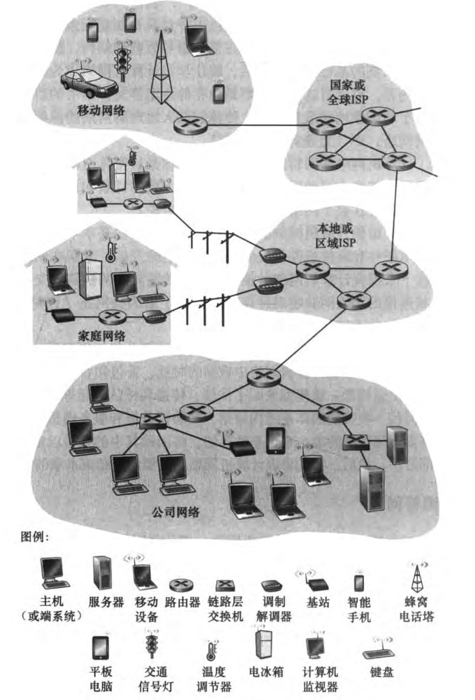

# 概述

视频：B站[中科大郑烇老师的《计算机网络（自顶向下方法 第七版）》](https://www.bilibili.com/video/BV1JV411t7ow/?p=3&spm_id_from=333.788.top_right_bar_window_history.content.click&vd_source=dc1b41bd270015bd7b36c8b25af2756a)

电子ptf: 《计算机网络（自顶向下方法 第七版）》

提纲：

- Internet
- 协议
- 网络边缘
- 接入网、物理媒体
- 网络核心：分组交换、线路交换
- Internet/ISP 结构
- 性能：丢包、延时、吞吐量
- 协议层次、服务模型。

现在越来越多的非传统的因特网”物品“正在与因特网连接，这些物品也叫**主机（主机节点）**或者**端系统**。

从源主机到目标主机中有交换机、路由器等网络设备进行工作，这种叫设备称为**中转节点**，把节点连接起来称为**链路**。

边：通信链路。

- 接入网链路：主机连接到互联网的链路（圆的和方的接在一起）（圆的是中转节点，方的是主机节点）
- 主干链路：路由器间的链路（圆的和圆的接在一起）

协议：所有厂商约定好规则，然后按照这个规则进行生产，那么就可以达到不同厂商之间生产的通信设备就可以互操作性。

协议（protocol）定义了在两个或多个通信实体之间交换的报文的格式和顺序（约定好），以及报文发送和接收一条报文或其他时间所采取的动作。

**Internet**: 指的是网络与网络之间所串连成的庞大网络，这些网络以一组通用的协议相连。数以亿计的互联的计算设备（主机、运行网络应用程序），通信链路（光纤、同轴电缆、无线电、卫星等），分组交换设备（路由器、交换机等）组成形成逻辑上的单一巨大国际网络。

