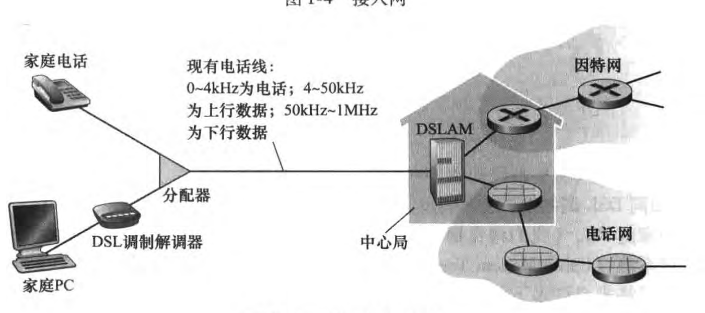
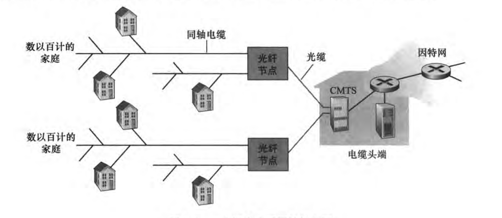
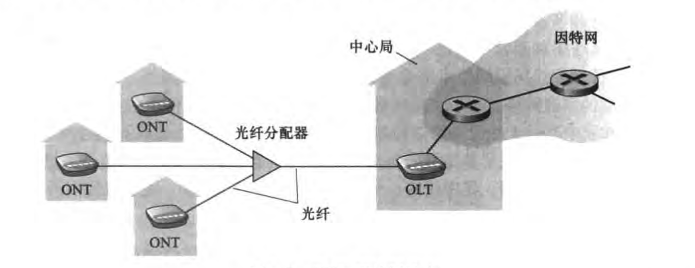
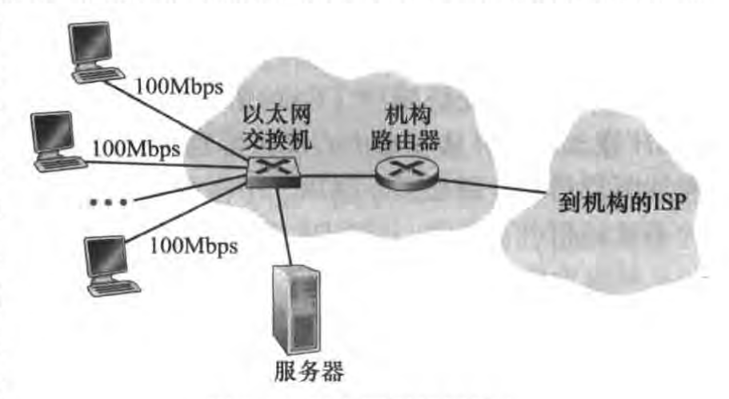
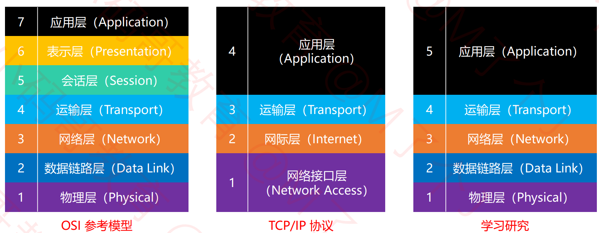
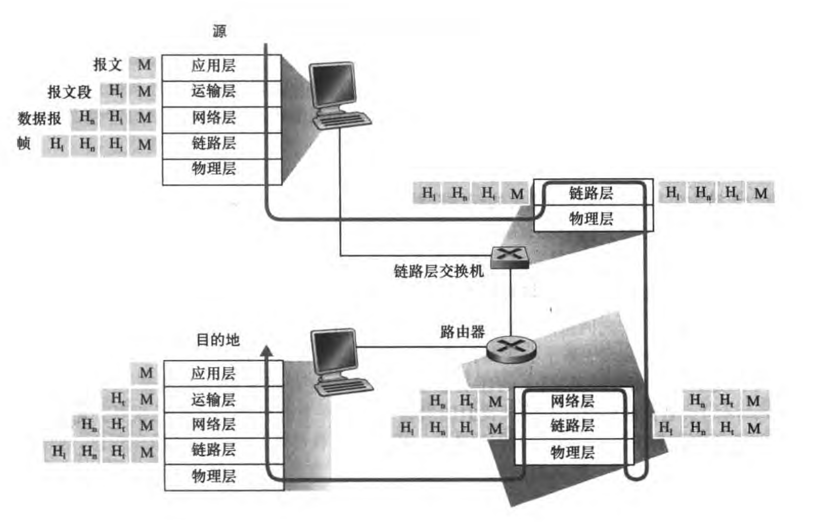

# 网络通信

因特网一般指互联网。 互联网（internet），又称国际网络，指的是网络与网络之间所串连成的庞大网络，这些网络以一组通用的协议相连，形成逻辑上的单一巨大国际网络。

协议（protocol）定义了在两个或多个通信实体之间交换的报文的格式和顺序（约定好），以及报文发送和接收一条报文或其他时间所采取的动作。

## 接入网

宽带住宅接入一般是数字用户线（Digital Subscriber Line, DSL 也就是电话线）、电缆、光纤。

**电话线接入**：用户通常去电话公司处申请DSL因特网接入。那么这个电话公司也是它的ISP。然后用户上网就会产生数字数据经过调制解调器转换为高音频，发送出去到当地中心局的DSLAM中将其转换回来（数字形式）发送到因特网上。

家庭电话线同时承载数据和传统的电话信号，使用不同的频率进行编码：

- 高速下行信道，位于50kHz到1kHz 频段
- 中速上行信道，位于4kHz 到50kHz频段
- 普通双向电话信道，位于0到4kHz频段

这种方法使得单根DSL线路看起来就像三根单独线路一样，因此电话呼叫和网络连接能够同时共享DSL链路（频分复用技术）。

**电缆接入**：利用有线电视基础设施接入因特网。

光缆将电缆头端连接到地区枢纽，从这里使用传统的同轴电缆到达各家，每个地区枢纽通常支持500-5000家。因为这个系统中应用了光纤和同轴电缆，所以被称为混合光纤同轴系统。

电缆因特网接入的重要特征就是共享广播媒体。

`光纤到户（Fiber To The Home, FTTH）` 

- 从本地中心局到家庭有几种光纤分布方案。最简单就是直接光纤，从本地中心局到户一根专线。也叫主动光纤网络（Active Optical Network, AON）。
- 还有一种就是从本地中心局中的光纤线路端接收器（Optical Line Terminator, OLT）（该OLT提供光信号和电信号之间的转换）中出来的。每根光纤实际上由许多家庭共享，直到相对接近这些家庭的位置，然后分成每户一根；该光纤在,也叫被动光纤网络（Passive Optical Network, PON）。

**以太网接入**：在企业和大学以及很多家庭中，使用局域网（LAN）将端系统连接到边缘路由器中。

**wifi接入**：在无线LAN环境中，无线用户从/到一个接入点发送/接收分组，该接入点与企业网连接（也有可能有线以太网），企业网在与有线因特网相连。一个无线LAN用户通常必须位于接入点几十米范围内。基于IEEE 802.11技术的虚线LAN接入，也叫wifi

**广域网接入**：移动设备中应用与蜂窝移动电话相同的无线基础设施，通过蜂窝提供运营商的基站来发送和接收，用户只需要位于基站的范围内就行。

## 协议分层

协议分层具有概念化和结构化的有点，分层提供了一种结构化方式来讨论系统组件。模块化使更新系统组件更容易。缺点就是一层可能冗余较低层的功能。例如，许多协议栈在基于每段链路和基于端到端两种情况
下，都提供了差错恢复 种潜在的缺点是某层的功能可能需要仅在其他某层才出现的信息（如时间戳值），这违反了层次分离的目标。

因特网的协议栈由5个层次组成：物理层、链路层、网络层、运输层、应用层

1. 应用层：

网络应用程序及它们应用层协议存留的地方。因特网应用层包含许多协议，例如：HTTP、SMTP、FTP。

应用层协议分布在多端系统上，而一个端系统中的应用程序使用协议与另一个端系统中的应用程序交换信息分组。这种位于应用层的信息分组称为报文（message）

2. 运输层

在应用程序端点之间传送应用层报文。在因特网中，有两种运输协议，即TCP和UDP,利用其中任一个都能运输应用层报文。

TCP向它的应用程序提供了面向连接的服务。这种服务包括了应用层报文向目的地的确保传递和流量控制（即发送方/接收方速率匹配)。

TCP 也将长报文划分为短报文，并提供拥塞控制机制，因此当网络拥塞时，源抑制其传输速率。

UDP 协议向它的应用程序提供无连接服务。这是一种不提供不必要服务的服务，没有可靠性，没有流量控制，也没有拥塞控制。运输层的分组称为报文段 (segment)

3. 网络层，也叫ip层

因特网的网络层负责将称为数据报（datagram）的网络层分组从一台主机移动到另一台主机。在一台源主机中的因特网运输层协议 (TCP UDP) 向网络层递交运输层报文段和目的地址，就像通过邮政服务寄信件时提供一个目的地址一样。

4. 链路层

网络层通过源和目的地之间的一系列路由器路由数据报。为了将分组从一个节点（主机或路由器）移动到路径上的下一个节点，网络层必须依靠链路层的服务。特别是在每个节点，网络层将数据报下传给链路层，链路层沿着路径将数据报传递给下一个节点，在下一个节点，链路层将数据报上传给网络层。

5. 物理层

虽然链路层的任务是将整个帧从一个网络元素移动到邻近的网络元素，而物理层的任务是将该帧中的一个个比特从一个节点移动到下一个节点。在这层中的协议仍然是链路相关的，并且进一步与该链路的实际传输媒体相关。

## 封装

在发送主机端，一个应用层报文被传输给运输层。运输层接收取到报文并附上信息（运输层收不信息H1），改首部将被接收端的运输层使用。应用层报文和运输层首部信息构成运输层报文段。运输层报文段因此封装了应用层报文。附加信息也许包含：

- 允许接收端运输层向上向适当的应用程序交付报文的信息
- 差错检查位信息，该信息让接收方能够判断报文中的比特是否在途中修改

运输层则向网络层传输该报文段，网络层增加了如源和目的端系统地址等网络层首部信息，生成网络层数据报。改数据接下来被传递给链路层，链路层增加它自己的链路层首部信息并生成链路层帧。这就是封装。

## 应用层

## 运输层

## 网络层

## 链路层

## 物理层

