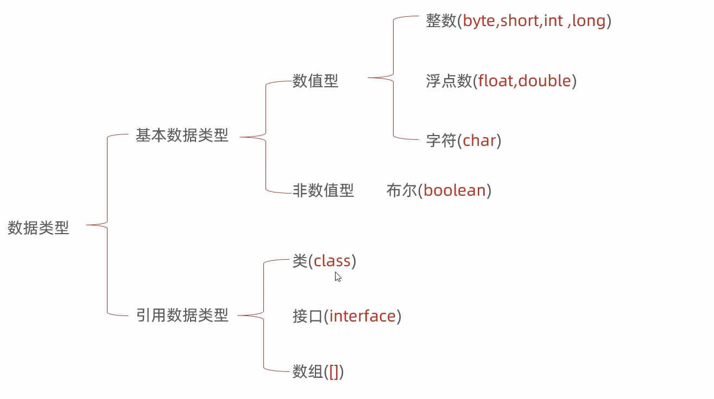

# 基础

## 基本数据类型

每个数据类型都有它的取值范围。编译器会根据每个变量或常量的数据类型为期分配内存空间。Java数值、字符值和布尔值数据提供八种基本数据类型


|类型名|范围|存储空间|
|----|----|----|
|byte| $-2^7$ 或 -128 ~ $-2^7 -1$ 或 127| 8位带符号数 |
|short| $-2^{15}$ 或 -32768 ~  $-2^{15}-1$ 或 32767 | 16位带符号数 |
|int| $-2^{31}$ 或 -2 147 483 648 ~  $-2^{31}-1$ 或 2 147 483 647| 32位带符号数 |
|long| $-2^{63}$ 或 -9 223 372 036 854 775 808 ~  $-2^{63}-1$ 或 9 223 372 036 854 775 807 | 64 位带符号数|
|float| 负数范围：-3.4028235E+38 ~ -1.4E-45 <br /> 正数范围：1.4E-45 ~ 3.4028235E+38 | 32位，标准IEEE 754|
|double| 负数范围：-1.7976931348623157E+380 ~ -4.9E-324 <br/> 正数范围：4.9E-324 ~ 1.7976931348623157E+308 | 64位，标准IEEE 754|
|char| 0 ~ 65535 |16位无符号整数|
|boolean| true、false| 8位无符号整数 |

Scanner对象读取数值的方法如下：

|方法|描述|
|----|----|
|nextByte()| 读取一个byte类型整数 |
|nextShort()| 读取一个short类型的整数|
|nextInt()| 读取一个int类型的整数 |
|nextLong()| 读取一个long类型的整数|
|nextFloat() | 读取一个float类型的数|
|nextDouble()| 读取一个double类型的数|

```java
// 定义一个三位数，将其拆分为个位、十位、百位
public class Main {
  public static void main(String[] args) {
    System.out.println("Hello world!");
    int num = 123;
    int b = num / 100;
    int s = num % 100 / 10;
    int g = num % 10;
    System.out.printf("%d, %d, %d", b, s, g);
  }
}
```

不同类型的数值参与计算会进行隐式转换小转大。大转小可以使用强制类型转换。

- 字符串与任何基本类型做加法，都是拼接
- 字符与数字相加，取出内存中对应的数字与数字相加
- 字符与boolean相加，报错


```java
public class Main {
  public static void main(String[] args) {
    int a = 10;
    double b = 13.14;
    // 输出double类型，向上转换 23.140000
    System.out.printf("%f", a + b);

    // 强制类型转换 23
    short c = (short)(a + b);
    System.out.printf("%d\n", c);
    
    // 字符类型 75
    // 字符存储在底层是存储数值
    char s = 'A'; // 65
    System.out.printf("%d\n", s + a);
    // 78
    System.out.println(6 + 'H');
    // 6HH
    System.out.println(6 + "HH");
    // HHH
    System.out.println('H' + "HH");
    // trueHHH
    System.out.println(true + "HH");
  }
}
```


## 方法


```java
public class Main {
  public static void main(String[] args) {
    // ·方法调用
    isEventNumber(10)
    int max = getMax(8 ,11);
    System.out.println(max);
    
    // true
    System.out.println( isNarcissus(153) );
    // false
    System.out.println( isNarcissus(154) );
  }
  // 判断是否是偶数
  public static void isEventNumber(int num) {
    
    System.out.println(num % 2 == 0 ? "偶数" : "奇数");
  }
  // 输出最大值
  public static int getMax(int num1, int num2) {
    // Math.max(num1, num2)
    return num1 > num2 ? num1 : num2;
  }
  // 判断是否为水仙花数（三位数）
  public static boolean isNarcissus(int num) {
    int b = num / 100;
    int s = num % 100 / 10;
    int g = num % 10;
    return num == Math.pow(b, 3) + Math.pow(s, 3) + Math.pow(g, 3);
  }

  // 方法重载  
  // public static int sum(int a, int b) 方法签名，所以才会有函数重载
  public static int sum(int a, int b) {
    return a + b
  }
  public static double sum(double a, double b) {
    return a + b
  }
  public static double sum(double a, double b, double c) {
    return a + b + c
  }
}
```

## 数组

### 一维数组

```java
public class Main {
  public static void main() {
    // 静态初始化
    int[] value = new int[]{ 1, 2, 3, 4, 5, 6 };
    // 简化格式
    int[] value1 = { 1, 2, 3, 4, 5, 6 };
    // 数组溢出报错, 为null
    // System.out.println(value1[20]);
    for(int i = 0, len = value1.length; i < len; i++) {
        System.out.println(value1[i]);
    }
    // 动态初始化, 没有填充项默认值为0
    int[] value2 = new int[3];


    int maxValue = max({ 80, 90, 100, 60, 80, 70 });
    // 求最大值
    System.out.printf("数组{ 80, 90, 100, 60, 80, 70 }最大值：%d\n", max(new int[]{ 80, 90, 100, 60, 80, 70 }));
  }
  public static int max(int[] arr) {
    int maxValue = arr[0];
    for(int i = 1, len = arr.length; i < len; i++) {
        if(maxValue < arr[i]) maxValue = arr[i];
    }
    return maxValue;
  }
}
```

```java
// 数组随机数打乱
public class Main {
  public static void main() {
    int[] arr = { 70, 80, 90, 100, 101, 102 };
    int[] arr1 = outOfOrder(arr);
    System.out.println(arrJoin(arr1));
  }
  public static String arrJoin(int[] arr) {
    return arrJoin(arr, ",");
  }
  public static String arrJoin(int[] arr, String str) {
    String s = "";
    for(int i = 0, len = arr.length;  i < len; i++ ) {
        s = i != len - 1 ? (s + arr[i] + str) : (s + arr[i]);
    }
    return s;
  }
  // 打乱数组元素
  public static int[] outOfOrder(int[] arrs) {
    int len = arrs.length;
    int[] arr = Arrays.copyOf(arrs, len);
    Random r = new Random();
    for(int i = 0; i < len; i++) {
      int index = r.nextInt(len);
      if(i != index) {
        int temp = arr[i];
        arr[i] = arr[index];
        arr[index] = temp;
      }
    }
    return arr;
  }
}
```

### 二维数组

```java
// 定义
int[][] arr = new int[][]{ {1,2,3}, {1,2,3}, {1,2,3} };
int arr1[][] = { {1,2,3}, {1,2,3}, {1,2,3} };
int[] arr[] = { {1,2,3}, {1,2,3}, {1,2,3} };
```

## 导包

在同一包下，在不同包下的导入。

```java
// src/com.wenshan/Main.java
package com.wenshan;
public class Main {
  public static void main(String[] args) {
    StudentText s = new StudentText();
    s.study();
  }
}

// src/com.wenshan/Student
package com.wenshan;

public class StudentText {
    public void study() {
        System.out.println("好好学习");
    }
}

// src/com.shanghai.wenshan/Student
package com.shanghai.wenshan;

public class Student {
    public static void main(String[] args) {
        // 方法1
        com.wenshan.StudentText s = new com.wenshan.StudentText();
        s.study();
    }
}
/* ----- 上面 和 下面 二选一就行了------ */
// src/com.shanghai.wenshan/Student
package com.shanghai.wenshan;
import com.wenshan.StudentText;
public class Student {
    public static void main(String[] args) {
        // 方法二，引包
        StudentText s = new StudentText();
        s.study();
    }
}
```




$(1+x)^{n} =1$

$-2_{7}$
$x^{22}$

$\sin \alpha + \sin \beta =2 \sin \frac{\alpha + \beta}{2}\cos \frac{\alpha - \beta}{2}$

$\begin{array}{c} 
  A={\left[ a_{ij}\right]_{m \times n}},B={\left[ b_{ij}\right]_{n \times s}} \\  
  c_{ij}= \sum \limits_{k=1}^{{n}}a_{ik}b_{kj} \\  
  C=AB=\left[ c_{ij}\right]_{m \times s}  
  = \left[ \sum \limits_{k=1}^{n}a_{ik}b_{kj}\right]_{m \times s} 
\end{array}$

$O = \begin{bmatrix}  
  0 & 0 & \cdots & 0 \\  
  0 & 0 & \cdots & 0 \\  
  \vdots & \vdots & \ddots & \vdots \\  
  0 & 0 & \cdots & 0  
\end{bmatrix}$

$P \left( \bigcup \limits_{i=1}^{+ \infty}A_{i}\right) = \prod \limits_{i=1}^{+ \infty}P{\left( A_{i}\right)}$     

$(1+x)^{n} =1 + \frac{nx}{1!} + \frac{n(n-1)x^{2}}{2!} + \cdots$ 


$\begin{array}{l}  
  \nabla \cdot \mathbf{E} =\cfrac{\rho}{\varepsilon _0}  \\  
  \nabla \cdot \mathbf{B} = 0 \\  
  \nabla \times  \mathbf{E} = -\cfrac{\partial \mathbf{B}}{\partial t }  \\  
  \nabla \times  \mathbf{B} = \mu _0\mathbf{J} + \mu _0\varepsilon_0 \cfrac{\partial \mathbf{E}}{\partial t }   
\end{array}$


