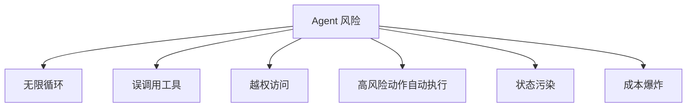

# Agent 安全

## 本章目标

这一章讨论 Agent 为什么比普通问答系统更容易出风险，以及应该如何加护栏。

读完后你应该能：

- 理解 Agent 的典型风险来源
- 知道常见护栏设计方式
- 会从权限、终止条件、日志和确认机制角度思考 Agent 安全

---

## 为什么 Agent 风险更高

因为它不只是“说话”，它还会：

- 做决策
- 调工具
- 读知识
- 推进多步流程

一旦链路更长，错误传播也会更严重。

---

## 常见风险图



---

## 1. 最大轮次限制

最基础但最重要的护栏之一就是：

- 限制最大步数
- 超过步数直接终止

```python
def run_with_limit(max_steps: int = 5):
    step = 0
    while step < max_steps:
        step += 1
        # 执行逻辑
    return "达到最大步数，终止执行"
```

---

## 2. 工具白名单

不要把所有系统能力都暴露给 Agent。

更稳妥的方式是：

- 只暴露必要工具
- 不同场景暴露不同工具集
- 高风险工具单独处理

---

## 3. 高风险动作人工确认

例如：

- 发退款
- 删数据
- 发邮件
- 修改业务状态

这类动作不应只凭模型判断就自动执行。

更安全的方式是：

- 模型提出建议
- 系统弹出确认
- 人确认后再执行

---

## 4. 状态与输出校验

Agent 的每一步都可能写入状态，因此状态污染是一个非常现实的问题。

建议做法：

- 对关键状态字段做结构化校验
- 对最终输出做 schema 校验
- 对工具参数做二次校验

---

## 5. 日志和可追踪性

真实项目里，Agent 一定要记录：

- 当前 goal
- 每轮 thought
- 每轮 action
- 工具参数
- tool output
- 是否 finish
- 总步数

如果没有这些日志，出了问题几乎无法定位。

---

## 6. 两个业务案例

### 案例一：客服工单 Agent

风险：

- 误判断问题类别
- 误调用支付相关工具
- 给出错误处理建议

护栏：

- 限制工具集
- 要求最终建议结构化
- 高风险操作仅输出建议，不自动执行

### 案例二：研发自动修复 Agent

风险：

- 自动修改配置
- 自动执行危险命令

护栏：

- 只允许“分析”和“建议”模式
- 真正修改必须人工确认

---

## 7. 一个简单的护栏执行示例

```python
HIGH_RISK_ACTIONS = {"delete_data", "send_refund", "modify_config"}


def guarded_action(action: str, confirmed: bool = False):
    if action in HIGH_RISK_ACTIONS and not confirmed:
        raise PermissionError("高风险动作需要人工确认")
    return f"执行动作: {action}"
```

---

## 8. 面试里怎么讲 Agent 安全

可以从这几类回答：

1. 限制最大轮次，防止无限循环
2. 限制工具暴露范围，防止误调用和越权
3. 对高风险动作加人工确认
4. 对关键输出和参数加结构化校验
5. 加全链路日志，便于审计和排障

这会非常像真实生产经验。

---

## 本章小结

这一章最重要的结论有五个：

- Agent 风险比普通问答系统更高
- 最大轮次、工具白名单、人工确认是三大基础护栏
- 状态校验和日志对稳定性极其重要
- 模型可以提出动作建议，但真正执行应由系统权限控制
- 安全能力是 Agent 工程化不可缺少的一部分

---

## 练习题

1. 为一个 Ticket Agent 设计 3 条安全规则
2. 为一个研发 Copilot 设计 3 条安全规则
3. 写一个带高风险动作确认的工具执行函数
4. 设计一份 Agent 日志字段列表

---

## 下一章

Agent 主线学完后，你可以继续回到框架章节，把这些思想映射到 LangChain 和 LangGraph 中；也可以继续看工程化章节，把 Agent 做成真正稳定的系统。
