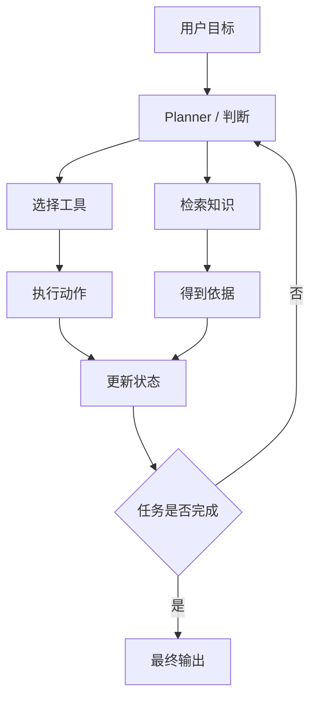

# Agent 导论

## 本章目标

这一章是 Agent 模块的总入口。它要解决的不是“Agent 很火，所以了解一下”，而是帮你建立一个真正能指导开发和面试表达的认知框架。

读完后你应该能：

- 用工程语言解释 Agent 是什么
- 区分 Agent、普通聊天、工作流和 Tool Calling 的边界
- 理解 Agent 系统最常见的组成部分
- 知道 Agent 为什么强，也为什么容易失控

---

## 先给一个工程化定义

Agent 最容易被误解成：

- 一种更高级的新模型
- 一种带魔法的自动化 AI
- 一个会自己思考的黑盒系统

但从工程视角看，更准确的定义是：

> Agent 是一种围绕目标、状态、工具、知识和流程组织的大模型应用架构，用于处理不能一步完成的复杂任务。

这个定义里最重要的不是“模型”，而是：

- 目标
- 状态
- 工具
- 流程
- 终止条件

---

## 为什么 Agent 会出现

前面你已经学过：

- Prompt 解决“怎么把任务说清楚”
- Structured Output 解决“怎么让结果可被程序消费”
- Tool Calling 解决“怎么让模型连接外部能力”
- RAG 解决“怎么让模型依据外部知识回答”

但很多真实任务并不是一轮就能完成的。

例如：

- 先判断问题类型
- 再决定查知识还是调工具
- 工具执行完后再继续下一步
- 最后把多个中间结果整合成最终回答

这时单轮问答就不够了，Agent 就顺理成章地出现了。

---

## Agent 的总体结构图



这张图表达了 Agent 的核心：

- 它不是固定问答
- 它会反复判断、执行、更新状态

---

## 1. Agent 和普通聊天的区别

### 普通聊天

- 以“问题 -> 回答”为主
- 通常一轮或简单多轮
- 很少显式连接工具和状态机

### Agent

- 以“目标 -> 多步完成”为主
- 会在过程中做判断
- 会连接工具、知识库、工作流
- 会维护状态

一句话理解：

> 普通聊天更像回答问题，Agent 更像推进任务。

---

## 2. Agent 和工作流（Workflow）的区别

这也是一个经常混淆的点。

### 固定工作流

步骤提前写死：

1. 先检索
2. 再总结
3. 再输出

### Agent

部分步骤不是完全写死，而是要由模型或规则动态判断：

- 该不该检索
- 该不该调工具
- 调哪个工具
- 是否继续下一轮

所以你可以这样区分：

> Workflow 更偏固定流程，Agent 更偏动态决策流程。

当然，真实系统里两者经常混合存在。

---

## 3. 一个典型 Agent 会包含哪些部分

### 目标（Goal）

系统要完成什么任务。

### 状态（State）

执行过程中积累的信息。

### 决策逻辑（Planner / Reasoner）

决定下一步做什么。

### 能力组件（Tools / RAG / Memory）

提供动作和知识支持。

### 终止条件（Done Condition）

决定什么时候结束，而不是无限循环。

---

## 4. 一个最小 Agent 认知示例

下面这个例子不是生产级实现，但能清楚体现 Agent 的核心骨架。

```python
from dataclasses import dataclass, field
from typing import Any


@dataclass
class AgentState:
    goal: str
    steps: list[str] = field(default_factory=list)
    observations: list[str] = field(default_factory=list)
    done: bool = False


def think(state: AgentState) -> dict[str, Any]:
    if not state.observations:
        return {
            "thought": "先查询订单状态",
            "action": "query_order_status",
            "args": {"order_id": "A1001"},
        }

    return {
        "thought": "已经拿到订单结果，整理成用户可读答案",
        "action": "finish",
        "args": {},
        "final_answer": f"订单情况如下：{state.observations[-1]}",
    }


def act(action: str, args: dict[str, Any]) -> Any:
    if action == "query_order_status":
        return {"order_id": args["order_id"], "status": "paid", "delivery": "tomorrow"}
    raise ValueError(f"unsupported action: {action}")


def run_agent(goal: str) -> str:
    state = AgentState(goal=goal)

    while not state.done:
        decision = think(state)
        state.steps.append(decision["thought"])

        if decision["action"] == "finish":
            state.done = True
            return decision["final_answer"]

        observation = act(decision["action"], decision["args"])
        state.observations.append(str(observation))

    return "任务结束"
```

这个例子已经包含了最小闭环：

- `think`
- `act`
- `state`
- `finish`

---

## 5. Agent 为什么强

Agent 的强，不在于某次回答多聪明，而在于它能够：

- 处理多步任务
- 动态选择工具
- 结合知识与动作
- 逐步逼近目标

比如一个客服工单 Agent，可以：

1. 识别问题是支付还是订单
2. 决定查 FAQ 还是查业务系统
3. 调工具获取结果
4. 再组织成客服可用建议

这比“单轮问答”更接近真正的业务能力。

---

## 6. Agent 为什么容易失控

Agent 很强，但也非常容易出问题，因为链路变长后，不确定性会放大。

常见问题包括：

- 死循环
- 工具误调用
- 工具结果理解错误
- 成本飙升
- 状态污染
- 最终输出不可控

这也是为什么 Agent 一定要加：

- 轮次上限
- 工具白名单
- 输出校验
- 日志
- 权限控制

---

## 7. 两个典型业务案例

### 案例一：客服工单 Agent

流程可能是：

1. 分析工单问题类型
2. 若是订单问题，调用订单查询工具
3. 若是支付问题，调用支付状态工具
4. 若信息不足，先查 FAQ
5. 汇总输出“原因 + 下一步建议”

### 案例二：研发排障 Agent

流程可能是：

1. 读取错误日志
2. 分类是前端、网关还是部署问题
3. 检索内部文档或调用错误码工具
4. 汇总成排障建议

这两个例子都说明：

- Agent 不是只会聊天
- 它更像“任务推进器”

---

## 8. 面试中怎么讲 Agent

不要说：

> Agent 就是一个更智能的机器人。

更好的表达应该是：

> Agent 是围绕目标执行多步任务的大模型系统设计方式，我会从状态、工具、知识、终止条件和护栏几方面去设计它。

如果你能这样讲，面试官会明显感觉你理解的是系统，而不是热点词。

---

## 本章小结

这一章最重要的结论有五个：

- Agent 不是新模型，而是一种系统设计方式
- 它适合处理不能一步完成的复杂任务
- 它的核心是目标、状态、工具、流程与终止条件
- Agent 比普通聊天更像任务推进系统
- Agent 的价值和风险是同时存在的，护栏设计非常重要

---

## 练习题

1. 用自己的话解释 Agent 和普通聊天的区别
2. 举一个必须用 Agent、但单轮问答不够的场景
3. 画一张你理解中的 Agent 工作流 Mermaid 图
4. 说明为什么 Agent 必须有终止条件

---

## 下一章

理解 Agent 最经典的入口是：[ReAct 模式](./react)
