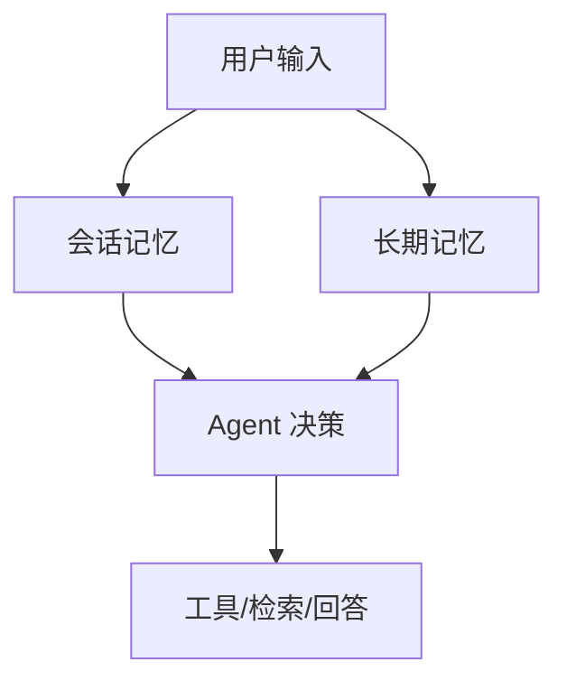

# Memory

## 本章目标

这一章讨论 Agent 的记忆问题，也就是：系统怎样在多轮执行中保留和使用重要上下文。

读完后你应该能：

- 区分会话记忆和长期记忆
- 理解 Agent 里的记忆本质上是状态管理问题
- 知道哪些信息该记、哪些不该记
- 设计一个简单的记忆结构

---

## 为什么 Agent 需要 Memory

如果一个 Agent 在执行多步任务时记不住前面发生过什么，就很容易出现：

- 重复调用同样的工具
- 多次询问同样的信息
- 回答自相矛盾
- 中间结果丢失

所以 Memory 不是“锦上添花”，而是很多 Agent 能否稳定工作的基础。

---

## Memory 的两大类

### 1. 会话级记忆

只在当前任务或当前对话中有效。

例如：

- 用户本轮目标是什么
- 已经调用过哪些工具
- 当前有哪些 observation

### 2. 长期记忆

跨会话持久保留。

例如：

- 用户偏好
- 历史处理结果
- 长期积累的上下文信息

---

## 记忆结构图



---

## 1. 一个简单的会话记忆结构

```python
from dataclasses import dataclass, field


@dataclass
class SessionMemory:
    goal: str
    past_steps: list[str] = field(default_factory=list)
    observations: list[str] = field(default_factory=list)
    notes: list[str] = field(default_factory=list)
```

这个结构非常朴素，但已经能够支持：

- 当前目标
- 已做过哪些事
- 看到了什么结果
- 需要保留哪些中间笔记

---

## 2. 记忆不是越多越好

很多初学者会有一个误区：

> 既然是记忆，那当然记得越多越好。

其实不是。

记忆过多会带来几个问题：

- 状态越来越臃肿
- 上下文越来越长
- 无关历史干扰当前决策
- 成本和复杂度上升

所以一个更成熟的思路是：

> 只记对当前和未来决策真正有价值的信息。

---

## 3. 哪些信息值得记

### 值得记

- 当前目标
- 已经完成的步骤
- 工具关键结果
- 用户偏好
- 关键约束条件

### 不一定值得全量记

- 每一轮冗长自然语言输出
- 重复无价值日志
- 已经过时的中间推测

---

## 4. 一个教学版记忆更新函数

```python
def update_memory(memory: SessionMemory, step: str, observation: str):
    memory.past_steps.append(step)
    memory.observations.append(observation)
```

如果你后面接 LangGraph，会发现这类逻辑本质上就是状态更新。

---

## 5. 两个业务案例

### 案例一：客服 Ticket Agent

需要记住：

- 当前工单类别
- 是否已经查询过订单状态
- 是否已经查询过支付状态
- 当前建议是否已经形成

否则系统很容易反复查同一个工具。

### 案例二：研发排障 Agent

需要记住：

- 当前错误现象
- 已检索到的 FAQ 结论
- 是否已经定位到可能原因

否则多轮推理会反复回到起点。

---

## 6. 长期记忆适合什么场景

长期记忆更适合：

- 用户偏好型系统
- 多次重复协作任务
- 需要跨会话积累背景信息的系统

例如一个研发协作助手，长期记忆里可以记录：

- 团队常见问题类型
- 用户喜欢的回答风格
- 过去常用的排障路径

---

## 7. 常见坑

### 坑一：把记忆等同于全部聊天记录

聊天记录只是原始素材，不等于高质量记忆。

### 坑二：不做记忆筛选

状态越来越膨胀，最终影响效果和成本。

### 坑三：长期记忆没有边界

容易引入过时信息，甚至带来隐私和权限风险。

---

## 8. 前端工程师的迁移理解

如果你熟悉：

- Redux / Zustand
- store
- reducer
- session state

那你可以把 Memory 直接想成：

> Agent 的业务状态层。

这会让你理解得非常快。

---

## 本章小结

本章最重要的结论是：

- Agent 里的 Memory 本质上是状态管理问题
- 会话记忆和长期记忆要分开考虑
- 不是记得越多越好，而是记得越有用越好
- 没有合适的记忆设计，多步 Agent 很容易变得混乱和低效

---

## 练习题

1. 为“客服工单 Agent”设计一个 `SessionMemory`
2. 为“研发排障 Agent”设计一个 `SessionMemory`
3. 列出哪些信息应该长期记忆，哪些只该短期保存
4. 解释为什么“全部聊天记录”不等于“高质量记忆”

---

## 下一章

当任务进一步复杂化时，单 Agent 可能不够了：[Multi-Agent](./multi-agent)
