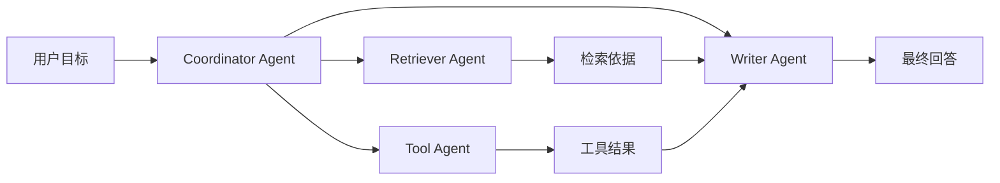

# Multi-Agent

## 本章目标

这一章讨论多 Agent 协作的设计思想。

读完后你应该能：

- 理解为什么有些任务适合拆成多个 Agent
- 知道多 Agent 常见分工方式
- 判断什么时候应该用多 Agent，什么时候不该滥用

---

## 为什么会出现 Multi-Agent

单 Agent 虽然足够强大，但有时会出现这些问题：

- 任务跨度太大
- 同时承担检索、工具调用、总结、评审等多种角色
- 状态和职责混在一起

这时，拆成多个角色化 Agent，会让系统更清晰。

---

## 一个典型分工图

---

## 1. 常见分工方式

### 协调者 + 执行者

- 一个 Agent 负责统筹
- 其他 Agent 负责具体子任务

### 按专业角色拆分

- 检索 Agent
- 工具 Agent
- 总结 Agent
- 评审 Agent

### 按流程阶段拆分

- 计划 Agent
- 执行 Agent
- 复核 Agent

---

## 2. Multi-Agent 的优点

- 职责更清晰
- 便于调试和优化
- 每个 Agent 的 Prompt 和工具可以更聚焦
- 更适合复杂任务拆解

---

## 3. Multi-Agent 的代价

### 代价一：系统更复杂

节点更多、状态更多、路由更多。

### 代价二：成本更高

多个 Agent 通常意味着更多模型调用。

### 代价三：调试更难

你不只要看一个 Agent 的问题，还要看它们之间的交互问题。

所以 Multi-Agent 不是“越高级越好”，而是“复杂度真的需要时再上”。

---

## 4. 两个业务案例

### 案例一：企业知识客服系统

可以拆成：

- Query Rewrite Agent：把用户问题改写得更适合检索
- Retriever Agent：负责召回相关知识
- Answer Agent：负责基于依据输出回答

### 案例二：研发协作助手

可以拆成：

- Log Analysis Agent：分析日志
- Doc Search Agent：查文档
- Fix Suggestion Agent：输出修复建议

---

## 5. 什么时候不该用 Multi-Agent

下面这些情况通常不值得：

- 单 Agent 已经足够完成任务
- 任务很简单
- 系统延迟要求很高
- 团队还没有把单 Agent 系统做好

一句话建议：

> 先把单 Agent 做稳，再考虑多 Agent。

---

## 本章小结

你现在应该记住：

- Multi-Agent 是复杂任务下的职责拆分策略
- 它的收益来自清晰分工，代价来自系统复杂度和成本
- 不是所有项目都需要多 Agent，别为了“高级感”而滥用

---

## 练习题

1. 为一个“研发排障系统”设计 3 个协作 Agent
2. 解释为什么一个简单 FAQ 助手通常不需要多 Agent
3. 画一个多 Agent 协作 Mermaid 图

---

## 下一章

Agent 越复杂，越要讲安全与护栏：[Agent 安全](./agent-safety)
