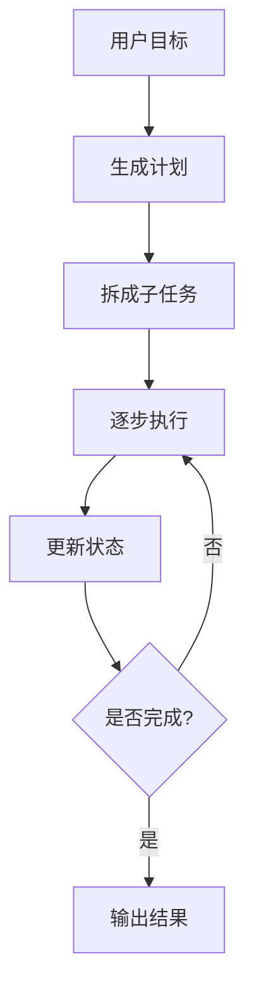

# Planning

## 本章目标

这一章讨论 Agent 里的另一条重要主线：Planning，也就是任务规划。

读完后你应该能：

- 理解为什么有些任务不能只靠走一步看一步
- 知道 Planning 和 ReAct 的区别与关系
- 写出一个教学版计划生成示例
- 判断什么场景更适合先规划再执行

---

## 为什么需要 Planning

ReAct 很适合逐步试探式推进任务，但有些任务一开始就很适合先做整体规划。

例如：

- 做一份调研报告
- 处理多阶段审批问题
- 分析一个复杂工单
- 做一个需要多个工具协同的任务

如果完全不先规划，系统可能会：

- 跳来跳去
- 重复动作
- 方向感差
- 成本更高

---

## ReAct 和 Planning 的区别

### ReAct

更像：

- 边走边判断
- 边行动边观察

### Planning

更像：

- 先给出任务分解
- 再按计划逐步执行

一句话理解：

> ReAct 更偏局部决策，Planning 更偏全局组织。

真实系统里，它们经常会组合使用。

---

## Planning 流程图



---

## 1. 一个最小计划生成示例

```python
def plan_task(user_goal: str) -> list[str]:
    if "工单" in user_goal:
        return [
            "识别工单类型",
            "决定是否需要检索 FAQ",
            "决定是否需要调用业务工具",
            "汇总结果并输出建议",
        ]
    return ["理解目标", "收集信息", "输出结果"]


goal = "处理用户支付成功但订单状态未更新的工单"
plan = plan_task(goal)
print(plan)
```

虽然这不是模型生成计划，但它已经体现了 Planning 的本质：

- 先任务分解
- 再执行

---

## 2. 用模型生成计划的思路

如果用模型来做规划，Prompt 往往会要求它：

- 先不要直接回答
- 先输出执行步骤
- 每一步尽量具体
- 不要超出已知工具边界

例如：

```python
def build_plan_prompt(goal: str) -> str:
    return f"""
    你是一名任务规划助手。
    请将下面目标拆解为可执行步骤。

    要求：
    - 步骤具体、可执行
    - 避免重复步骤
    - 只输出步骤列表

    目标：{goal}
    """
```

---

## 3. 两个业务案例

### 案例一：客服工单 Agent

目标：

```text
处理“支付成功但订单未更新”的客服工单
```

计划可能是：

1. 判断工单类型
2. 查询支付状态
3. 查询订单状态
4. 判断是否存在状态不一致
5. 输出处理建议

### 案例二：研发排障 Agent

目标：

```text
定位 chunk load error 导致白屏的原因
```

计划可能是：

1. 确认错误现象
2. 检索内部文档
3. 判断是否与资源版本不一致有关
4. 输出排查步骤

---

## 4. Planning 的优点

- 提升执行方向感
- 减少重复操作
- 更适合复杂任务拆解
- 更利于日志记录和可解释性

---

## 5. Planning 的局限

### 局限一：计划不一定总是对的

计划本身也可能偏离问题本质。

### 局限二：任务环境变化时，原计划可能失效

这意味着：

- 计划不是永远不变
- 需要结合执行结果动态调整

因此，更成熟的系统往往是：

> Planning + ReAct 的组合。

---

## 6. 一个更完整的教学思路

你可以把 Agent 执行拆成两阶段：

1. 先生成计划
2. 再按步骤执行

例如：

```python
def execute_plan(plan: list[str]) -> list[str]:
    results = []
    for step in plan:
        results.append(f"已执行: {step}")
    return results
```

这虽然是教学版，但很适合帮助你理解“计划”和“执行”不是一回事。

---

## 7. 什么时候应该优先考虑 Planning

更适合先规划的场景通常有这些特点：

- 任务步骤较多
- 任务需要多个工具
- 任务需要阶段性目标
- 用户目标本身比较复杂

而如果任务很短、很直接，纯 ReAct 甚至单轮处理可能已经够了。

---

## 本章小结

你现在应该记住：

- Planning 解决的是复杂任务的全局组织问题
- 它和 ReAct 不是替代关系，而是可以组合使用
- 计划不是越长越好，而是要具体、可执行、贴合工具边界
- 对复杂任务来说，先规划通常会让系统更稳、更易解释

---

## 练习题

1. 为一个“客服工单处理 Agent”写一份计划列表
2. 为一个“研发排障 Agent”写一份计划列表
3. 比较 ReAct 和 Planning 各自更适合什么场景
4. 设计一个“计划 -> 执行 -> 调整”的流程图

---

## 下一章

规划解决全局组织，但多轮系统还需要记住过程：[Memory](./memory)
