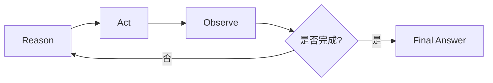

# ReAct 模式

## 本章目标

这一章介绍 Agent 设计里最经典、最值得先掌握的模式之一：ReAct。

读完后你应该能：

- 理解 ReAct 的基本思想
- 知道它为什么适合作为 Agent 入门模型
- 写出一个教学版 ReAct 循环
- 理解它在工具调用和问题排查中的价值

---

## ReAct 是什么

ReAct 来自两个词：

- `Reason`
- `Act`

也就是：

1. 先思考
2. 再行动
3. 再观察结果
4. 然后继续下一轮

它的核心思想是：

> 不让模型一次性直接拍脑袋给最终答案，而是让它在“思考 - 行动 - 观察”的循环里逐步逼近目标。

---

## ReAct 的流程图



这是 Agent 领域最值得记住的一张图之一。

---

## 为什么 ReAct 很重要

因为它把 Agent 里最关键的行为拆开了：

- 思考：现在该做什么
- 行动：真的去调工具或查资料
- 观察：读取返回结果
- 继续：决定下一步

这比“一次生成最终答案”更适合真实任务。

---

## 1. 一个最小 ReAct 骨架

```python
from dataclasses import dataclass, field


@dataclass
class ReActState:
    question: str
    thoughts: list[str] = field(default_factory=list)
    observations: list[str] = field(default_factory=list)
    done: bool = False


def think(state: ReActState) -> dict:
    if not state.observations:
        return {
            "thought": "先查询订单状态，因为用户在问物流时间前需要确认订单是否已支付",
            "action": "query_order_status",
            "args": {"order_id": "A1001"},
        }

    return {
        "thought": "已经拿到订单状态，可以直接给出结论",
        "action": "finish",
        "final_answer": f"根据查询结果，{state.observations[-1]}",
    }


def act(action: str, args: dict) -> str:
    if action == "query_order_status":
        return "订单 A1001 已支付，预计明天发货"
    raise ValueError(f"unsupported action: {action}")


def run_react(question: str) -> str:
    state = ReActState(question=question)

    while not state.done:
        decision = think(state)
        state.thoughts.append(decision["thought"])

        if decision["action"] == "finish":
            state.done = True
            return decision["final_answer"]

        observation = act(decision["action"], decision["args"])
        state.observations.append(observation)

    return "任务结束"
```

---

## 2. 这段代码体现了什么

最关键的不是代码长短，而是结构：

- `think()` 决定下一步动作
- `act()` 负责执行动作
- `observation` 保存动作结果
- `finish` 负责终止循环

这四件事组合起来，就是 ReAct 的最小闭环。

---

## 3. 为什么 ReAct 比“一步到位”更适合复杂任务

假设用户问：

```text
为什么我的订单已经扣款了，但状态还没变？
```

如果模型直接回答，可能会凭经验猜：

- 支付延迟
- 回调问题
- 系统同步问题

但如果用 ReAct：

1. 先查支付状态
2. 再查订单状态
3. 再根据两个结果判断是不是回调异常

这时答案就更有依据。

---

## 4. 两个业务案例

### 案例一：客服工单分析

问题：

```text
用户反馈支付成功但订单未更新。
```

ReAct 流程：

1. 思考：需要先判断支付和订单状态是否一致
2. 行动：调用支付状态工具
3. 观察：支付成功
4. 行动：调用订单状态工具
5. 观察：订单仍 pending
6. 输出：怀疑回调链路异常

### 案例二：研发排障

问题：

```text
页面白屏，控制台提示 chunk load error。
```

ReAct 流程：

1. 思考：先确认是否是静态资源版本不一致
2. 行动：检索内部部署 FAQ
3. 观察：FAQ 指向 CDN 缓存问题
4. 输出：建议刷新 CDN 缓存并检查版本切换策略

---

## 5. ReAct 的优点

- 链路清晰
- 易于调试
- 容易记录 thought / action / observation
- 很适合和工具调用结合
- 很适合作为 Agent 教学入口

---

## 6. ReAct 的局限

### 局限一：容易循环过多

如果没有轮次上限，就可能无限推理下去。

### 局限二：thought 质量强依赖 Prompt 和模型

模型判断错了，后续动作就会连锁出错。

### 局限三：流程很复杂时，单纯 ReAct 可能不够

这时可能需要引入更强的 planning 或状态图。

---

## 7. 工程实践建议

如果你在项目里用 ReAct，建议至少加上：

- `max_steps`
- 工具白名单
- 每轮日志
- 错误兜底
- 终止条件

例如：

```python
def run_react_with_limit(question: str, max_steps: int = 5) -> str:
    state = ReActState(question=question)
    step_count = 0

    while not state.done and step_count < max_steps:
        step_count += 1
        decision = think(state)
        state.thoughts.append(decision["thought"])

        if decision["action"] == "finish":
            state.done = True
            return decision["final_answer"]

        observation = act(decision["action"], decision["args"])
        state.observations.append(observation)

    return "达到最大步骤上限，未完成任务"
```

---

## 8. 面试里怎么讲 ReAct

你可以这样表达：

> 我理解 ReAct 是 Agent 里非常经典的模式，通过“思考 - 行动 - 观察”的循环，让模型不直接拍最终答案，而是逐步调用工具、读取结果、推进任务，这种方式更适合排障、查询和多步决策类场景。

这种说法会比“ReAct 就是一个 Agent 方式”更有含金量。

---

## 本章小结

这一章最重要的结论有四个：

- ReAct 是 Agent 的经典基础模式
- 它把任务拆成思考、行动、观察的循环
- 它非常适合与工具调用和知识检索结合
- 生产中必须给它加轮次上限、日志和护栏

---

## 练习题

1. 用自己的话解释 ReAct 和普通单轮回答的区别
2. 把上面的例子改成“支付状态 + 订单状态”的双工具版本
3. 给 ReAct 循环加一个 `max_steps`
4. 设计一份 thought / action / observation 日志结构

---

## 下一章

ReAct 更偏逐步决策，接下来学习更偏“先规划”的思路：[Planning](./planning)
