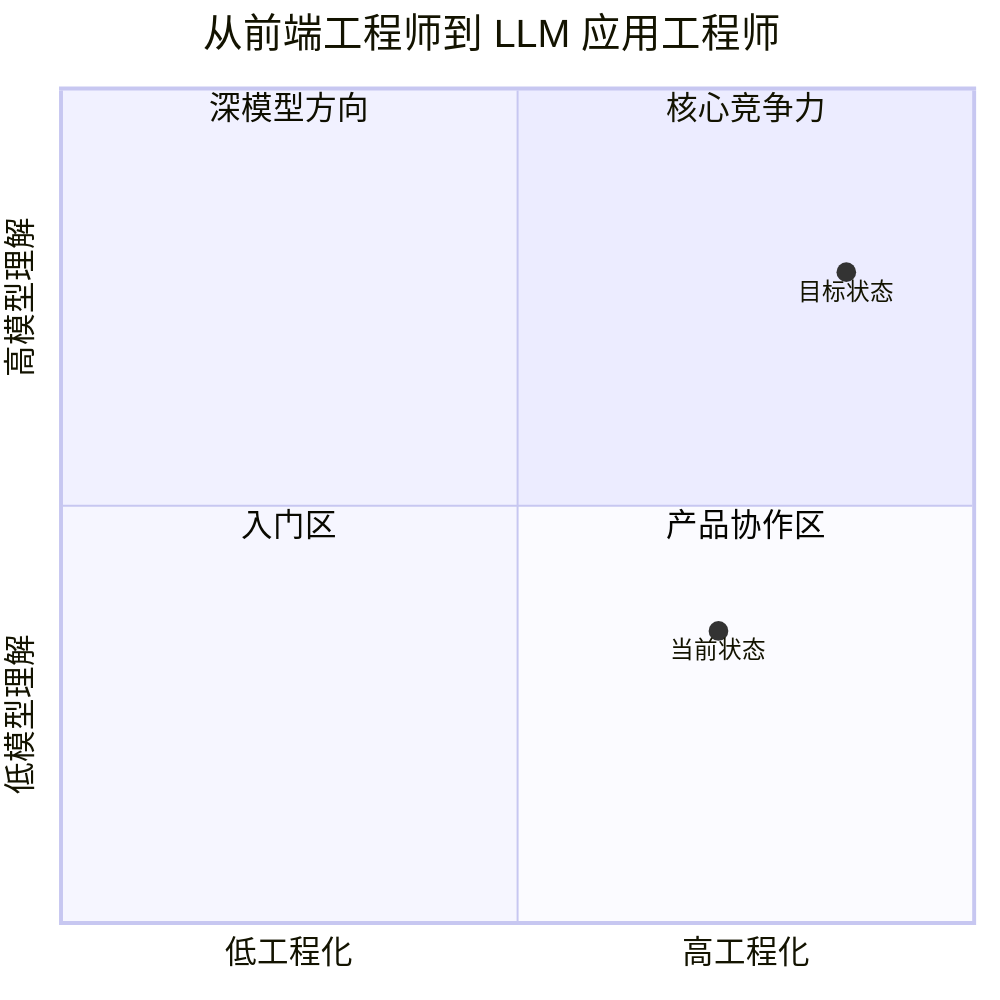

# 就业路线与面试准备

## 本章目标

这一章把前面的学习内容转换成真正的求职语言。

---

## 适合你的岗位方向

- AI 应用工程师
- LLM 工程师
- AI 产品型全栈工程师

对于中级前端工程师来说，最现实的切入点通常是：

> 能做 AI 应用、能做交互、也能做工程化落地的复合型工程师。

---

## 能力迁移图

---

## 简历怎么写

不要只写：

- 学习了 Prompt
- 学习了 RAG
- 学习了 Agent

更好的写法是：

- 设计并实现企业知识库问答系统，完成文档切块、向量检索、引用展示与离线评测
- 基于 Python 构建 Tool Calling 链路，实现订单、支付和物流工具接入
- 设计客服工单 Agent，加入最大轮次、日志与降级策略
- 使用 FastAPI + Web 前端完成 AI 应用端到端交付

---

## 面试常见问题

### 什么是 RAG

你要从“问题 - 方案 - 链路”来讲，而不是背定义。

### Tool Calling 和 RAG 的区别

一个是“查知识”，一个是“做动作”。

### 如何评估一个 LLM 应用

从召回、生成、结构化成功率、工具调用成功率、延迟、成本等维度回答。

### 如何控制 Agent 风险

讲最大轮次、工具白名单、权限控制、日志、人工确认。

---

## 求职 90 天计划

### 第 1 月

- 学完主干章节
- 跑通最小 Demo

### 第 2 月

- 做完一个 RAG 项目
- 做完一个 Agent 项目

### 第 3 月

- 补评测、日志、部署
- 打磨简历和项目讲解
- 开始投递

---

## 本章小结

就业导向学习的关键不是背更多概念，而是做出真实项目，并且能清楚讲出你的设计取舍和工程思路。

---

## 本书阶段性结束

如果你一路学到了这里，说明你已经拥有一套完整的 LLM 应用开发主线。接下来最重要的事情，就是反复做项目、打磨表达、准备面试。
