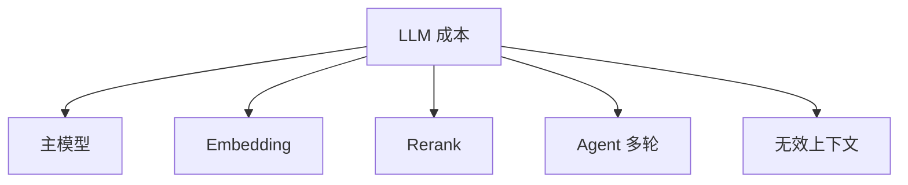

# 成本优化

## 本章目标

这一章讨论 LLM 应用里非常现实的一件事：成本。

读完后你应该能：

- 理解成本由哪些环节组成
- 知道常见优化策略
- 学会从系统设计角度减少无效消耗

---

## 成本主要来自哪里

很多人只盯着聊天模型调用，但真实项目中，成本可能来自：

- 主模型调用
- embedding 调用
- rerank
- query rewrite
- Agent 多轮执行
- 过长上下文

所以成本优化必须看全链路，而不是只看某一项。

---

## 成本结构图

---

## 1. 最常见的优化方向

### 缩短上下文

少塞无关内容，是最直接的优化方式。

### 做缓存

对重复问题、embedding、热门结果做缓存。

### 模型分层

不是所有任务都要上最贵模型。

### 减少不必要的链路

不是每个请求都需要 rerank、query rewrite、Agent 多轮。

---

## 2. 一个简单的模型分层思路

例如：

- 普通分类任务 -> 轻量模型
- 高复杂推理 -> 高阶模型
- embedding -> 单独 embedding 模型

这比“所有请求都上最强模型”更可持续。

---

## 3. 两个业务案例

### 案例一：RAG 问答

优化点：

- 控制 `top_k`
- 只在必要时做 query rewrite
- embedding 做缓存

### 案例二：Ticket Agent

优化点：

- 最大轮次限制
- 简单问题不走全 Agent 链路
- 高风险复杂问题才启用高阶模型

---

## 本章小结

你现在应该记住：

- 成本优化要看全链路
- 最有效的优化往往来自减少无效调用和无效上下文
- 模型分层和缓存是最常见也最实用的两类优化

---

## 练习题

1. 列出你项目里可能的 5 个成本来源
2. 设计一套轻重模型分层方案
3. 说明 RAG 场景里哪几个点最适合做缓存

---

## 下一章

工程化模块学完后，接下来就把这些能力转成真正的作品集项目：[项目实战总览](../projects/index)
