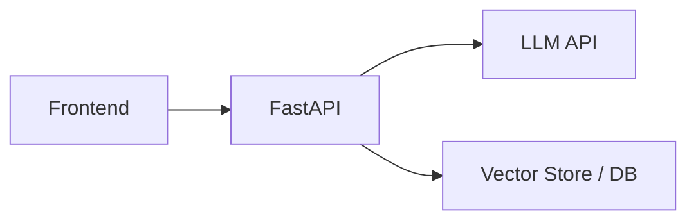

# 部署

## 本章目标

这一章讨论如何把一个本地可运行的 LLM 应用，变成可访问、可演示、可面试展示的系统。

读完后你应该能：

- 理解常见部署形态
- 知道前后端分开部署的基本思路
- 用求职项目视角理解“什么叫足够好的部署”

---

## 为什么部署重要

从求职角度看，一个线上能打开的 Demo 往往比“本地有代码但你要先装一堆依赖”更有说服力。

因为部署能力体现了：

- 你不只是会写 demo
- 你还知道如何交付和展示

---

## 常见部署结构

---

## 1. 最常见的求职项目部署方式

### 前端

- Vercel
- Netlify

### Python API

- Railway
- Render
- 云服务器

### 数据与向量存储

- 托管服务
- 或项目初期用轻量存储方案

---

## 2. 部署时要考虑什么

- 环境变量管理
- API Key 安全
- 后端服务可用性
- 请求超时
- 前后端跨域和接口联调

---

## 3. 求职项目的部署标准

不是每个人都要做企业级 K8s，但至少应该做到：

- 能打开页面
- 能发起真实请求
- 有一套基本说明文档
- 关键功能能演示

这已经足够支撑大部分求职展示。

---

## 本章小结

你现在应该记住：

- 部署不是锦上添花，而是交付能力的一部分
- 对求职项目来说，可访问 Demo 会明显提升说服力
- 前端 + Python API + 模型服务 是最常见的部署形态

---

## 练习题

1. 画出你项目的部署结构图
2. 列出你的项目部署需要哪些环境变量
3. 说明为什么 API Key 不应该放到前端里

---

## 下一章

最后一个工程化主题是很多项目会忽视但很现实的问题：[成本优化](./cost-optimization)
