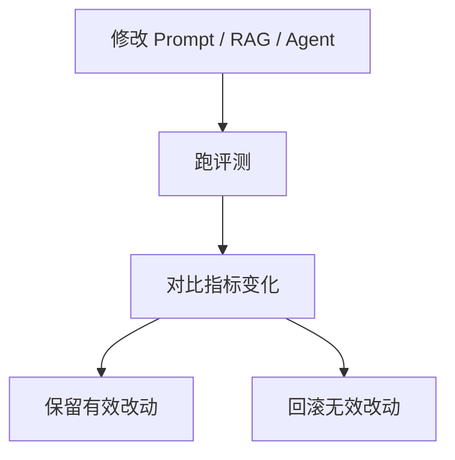

# 评测

## 本章目标

这一章讨论 LLM 应用里最核心的工程能力之一：评测。

读完后你应该能：

- 理解为什么没有评测就没有稳定优化
- 知道如何设计最小评测集
- 写出一个可运行的基础评测脚本
- 学会把评测结果转化为系统优化方向

---

## 为什么评测是第一优先级

在传统开发里，很多逻辑是确定性的，可以用单元测试覆盖；
在 LLM 系统里，输出天然带概率性，如果没有评测，你很容易陷入：

- 感觉这次回答不错
- 感觉那次改 Prompt 更好了
- 但完全没有证据说明系统真的更稳定了

所以一个非常重要的工程原则是：

> 没有评测，就没有真正意义上的迭代。

---

## 评测在系统中的位置



---

## 1. 评测集最少应该包含什么

一个基础评测集，至少应该有：

- 真实问题
- 期望答案关键词或标签
- 边界问题
- 常见失败问题

如果是 RAG 系统，还建议加上：

- 期望命中的文档或条款

如果是 Agent 系统，还建议加上：

- 期望工具路径
- 期望终止条件

---

## 2. 一个最小评测集示例

```python
test_cases = [
    {
        "question": "年假最多能结转几天？",
        "expected_keyword": "5天",
    },
    {
        "question": "试用期离职需要提前多久？",
        "expected_keyword": "提前3天",
    },
    {
        "question": "支付成功但订单未更新应该先查哪里？",
        "expected_keyword": "支付状态",
    },
]
```

---

## 3. 一个最小可运行评测脚本

```python
def run_eval(answer_fn):
    passed = 0
    for case in test_cases:
        answer = answer_fn(case["question"])
        if case["expected_keyword"] in answer:
            passed += 1
    print(f"passed: {passed}/{len(test_cases)}")
```

这段脚本虽然简单，但已经具备了最核心的工程意义：

- 同样一组问题
- 反复跑
- 比较不同版本结果

---

## 4. 评测不只是一种形式

在真实系统里，你可以把评测拆成多层：

### 文本质量评测

- 是否包含关键结论
- 是否回答完整
- 是否有明显幻觉

### 结构化输出评测

- JSON 是否合法
- 字段是否完整
- 枚举值是否正确

### RAG 评测

- 正确文档是否召回
- 最终答案是否基于依据

### Agent 评测

- 工具是否调用正确
- 是否在合理轮次内完成
- 是否进入错误循环

---

## 5. 两个业务案例

### 案例一：知识库问答系统

如果一个问题回答错误，你应该先看：

- 是不是没召回对文档
- 还是召回对了但回答没组织好

这意味着评测要分层，而不是只看最终答复。

### 案例二：Ticket Agent

如果系统给出错误建议，你应该看：

- 问题分类是否错了
- 工具调用是否错了
- 还是最后总结错了

这说明 Agent 评测也要按链路拆层。

---

## 6. 评测结果怎么用来指导优化

一个更成熟的工程师做法是：

1. 先收集失败样本
2. 给失败样本分类
3. 判断问题出在 Prompt / 检索 / 工具 / 状态 / 模型哪个层
4. 只修改一个关键变量
5. 重新跑评测

这样你才能积累真正可复用的优化经验。

---

## 7. 常见坑

### 坑一：只看“我觉得更好了”

没有量化或规则化标准，很难做真正优化。

### 坑二：评测集太少

几个样本不足以支撑判断。

### 坑三：一次改太多东西

最终不知道到底是哪一项改动起作用。

### 坑四：不记录版本

Prompt、模型、top_k、chunk_size 改了什么，最好都能追踪。

---

## 8. 一个更像项目代码的版本记录思路

```python
EVAL_CONFIG = {
    "model": "gpt-4.1-mini",
    "prompt_version": "v3",
    "top_k": 3,
    "chunk_size": 400,
}
```

每次跑评测时把这份配置记录下来，会让你后面更容易分析版本差异。

---

## 本章小结

这一章最重要的结论是：

- 评测是 LLM 工程化的第一能力
- 评测集应该尽量贴近真实问题
- 不同系统要拆不同层做评测
- 评测的价值不只是打分，而是帮助你定位问题、指导优化

---

## 练习题

1. 为你的项目设计 10 个基础评测问题
2. 给每个问题标一个 `expected_keyword`
3. 写一个最小评测脚本
4. 设计一份 `EVAL_CONFIG`，记录本次实验参数

---

## 下一章

评测让你知道系统有没有变好，接下来要解决“出问题时怎么看”： [观测](./observability)
