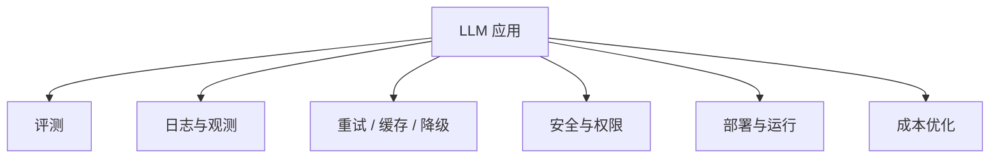

# LLM 应用工程化导论

## 本章目标

这一章是工程化模块的总入口。它的目标不是讲零散技巧，而是帮你建立一个非常关键的认知：

> 大模型应用真正进入企业可用状态，靠的不是会几个热点词，而是工程化能力。

读完后你应该能：

- 理解为什么工程化是 LLM 应用成败关键
- 知道评测、观测、缓存、降级、安全、部署、成本优化分别在解决什么问题
- 建立从 Demo 到生产系统的整体思维

---

## 为什么工程化这么重要

很多人做 LLM 项目时，会经历这样的阶段：

1. 第一次调通 API，很兴奋
2. Prompt 有点效果，更兴奋
3. 接了 RAG 或工具调用，觉得已经很强
4. 一上线就发现：
   - 效果不稳定
   - 日志不完整
   - 成本失控
   - 失败无法回溯
   - 用户不信任结果

这时就会意识到：

> LLM 项目不是“提示词项目”，而是“系统项目”。

---

## 工程化总览图

---

## 1. 工程化不是最后再补的东西

初学者容易觉得：

- 先把功能做出来
- 工程化以后再说

但真实情况是，很多设计如果一开始不考虑，后面会很难补。

例如：

- 没有统一日志结构，后期很难补观测
- Prompt 没有版本化，后期很难评测对比
- 工具调用没有护栏，后期风险很大
- 没考虑缓存，成本会非常高

所以更好的思路是：

> 从一开始就带着工程化意识做 Demo。

---

## 2. 一个可用 LLM 应用最少要具备什么

如果你想把一个项目做成可求职展示的作品，建议至少具备这些能力：

- 有明确输入输出
- 有结构化输出或明确结果格式
- 有日志
- 有最基础评测
- 有失败兜底
- 有一定成本意识

这几个点会显著拉开“玩具 Demo”和“像样项目”的差距。

---

## 3. 各工程模块分别解决什么问题

### 评测

解决：

- 系统有没有变好
- 哪一项改动真正有效

### 观测

解决：

- 线上问题如何定位
- 哪一步出了问题

### 重试、缓存、降级

解决：

- 稳定性
- 成本
- 用户体验

### 安全

解决：

- Prompt 注入
- 越权工具调用
- 高风险动作控制

### 部署

解决：

- 如何从本地脚本变成可演示系统

### 成本优化

解决：

- 模型调用和 embedding 成本过高问题

---

## 4. 一个更成熟的认知框架

你可以把 LLM 工程化理解成三层：

### 第一层：效果层

- Prompt
- RAG
- Tool Calling
- Agent

### 第二层：稳定层

- 重试
- 兜底
- 缓存
- 结构化校验

### 第三层：运营层

- 日志
- 评测
- 成本
- 监控
- 版本管理

很多项目卡住，不是第一层没做，而是第二层和第三层太弱。

---

## 5. 两个业务案例

### 案例一：企业知识库助手

如果没有工程化：

- 检索错了也不知道
- 文档更新后系统答旧内容
- 用户不信任，因为没有引用来源

如果做了工程化：

- 有评测集
- 有来源展示
- 有索引更新流程
- 有日志回流优化

### 案例二：客服 Ticket Agent

如果没有工程化：

- 工具误调用难定位
- Agent 死循环难排查
- 成本不可控

如果做了工程化：

- 有步骤日志
- 有最大轮次限制
- 有高风险动作确认
- 有失败兜底

---

## 6. 面试里怎么体现工程化能力

不要只说：

- 我做了 RAG
- 我做了 Agent

更好的说法是：

- 我为 RAG 设计了基础评测集，并将召回和生成分开评估
- 我为工具调用和 Agent 流程增加了日志、轮次限制和降级策略
- 我通过缓存与模型分层控制整体成本

这会让你的项目从“能跑”变成“像真实项目”。

---

## 本章小结

这一章最重要的结论有五个：

- LLM 应用最终比拼的是系统能力，而不只是 Prompt 技巧
- 工程化不是后补项，而是从 Demo 阶段就应该考虑的能力
- 评测、观测、缓存、降级、安全、部署、成本优化共同构成工程化主线
- 很多项目真正的差距，来自稳定性和可维护性，而不是模型本身
- 如果你想就业，工程化能力是非常重要的加分项

---

## 练习题

1. 列出你认为一个 LLM 项目最少应该具备的 5 个工程化能力
2. 解释为什么“能跑起来”不等于“可交付”
3. 画一张你理解中的 LLM 工程化 Mermaid 图

---

## 下一章

工程化第一项，也是最重要的一项，是：[评测](./evaluation)
