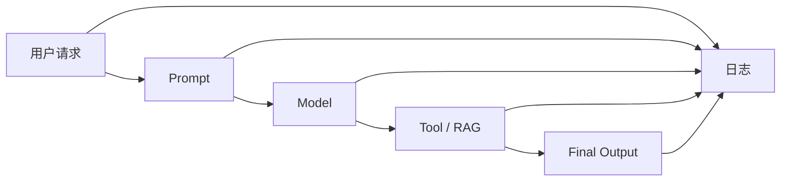

# 观测

## 本章目标

这一章讨论 LLM 应用里的“可观测性”，也就是：

> 当系统效果不好、调用失败、成本异常、工具误用时，你如何知道到底发生了什么。

读完后你应该能：

- 理解为什么观测是排障基础
- 设计一份最小日志结构
- 知道哪些字段必须记录
- 学会从链路视角定位问题

---

## 为什么 LLM 系统特别需要观测

因为它不是单一函数调用，而常常包含多层链路：

- Prompt
- 模型调用
- 检索
- 工具执行
- 状态更新
- 输出生成

任何一环都可能出错。

如果没有日志和观测，最终你只能看到：

- 用户说“回答不对”
- 但你完全不知道：
  - 是 Prompt 问题
  - 还是检索问题
  - 还是工具问题
  - 还是模型问题

---

## 观测链路图



---

## 1. 至少要记录哪些信息

建议最少记录：

- request_id
- 用户输入
- 关键 Prompt 版本
- 模型名
- 检索结果摘要
- 工具调用参数
- 工具返回结果摘要
- 最终输出
- 耗时
- 异常信息

如果是 Agent，还建议记录：

- step_count
- thought / action / observation

---

## 2. 一个简单日志封装

```python
import logging

logging.basicConfig(level=logging.INFO)
logger = logging.getLogger("llm-app")


def log_event(event: str, payload: dict):
    logger.info("%s | %s", event, payload)
```

使用示例：

```python
log_event("model_request", {
    "request_id": "req-001",
    "model": "gpt-4.1-mini",
    "prompt_version": "v3",
})
```

---

## 3. 一份更像工程项目的日志结构

```python
def build_log_payload(
    request_id: str,
    user_input: str,
    model: str,
    prompt_version: str,
    latency_ms: int,
    error: str | None = None,
) -> dict:
    return {
        "request_id": request_id,
        "user_input": user_input,
        "model": model,
        "prompt_version": prompt_version,
        "latency_ms": latency_ms,
        "error": error,
    }
```

这样设计的好处是：

- 字段稳定
- 便于筛选
- 后续接日志平台也方便

---

## 4. 观测要服务于排障

好的观测不是“记很多东西”，而是帮助你回答问题：

- 哪一步最慢
- 哪一步最容易失败
- 哪个 Prompt 版本效果更差
- 哪个工具误调用最多
- 哪类问题最常导致追问

---

## 5. 两个业务案例

### 案例一：RAG 问答系统

如果用户说“这个答案不对”，你最好能立即看到：

- 问的是啥
- 检索到了哪些 chunk
- 最终喂给模型的 context 是什么

### 案例二：Ticket Agent

如果系统误用了工具，你最好能看到：

- 它在第几步调用
- thought 是什么
- 参数是什么
- 返回值是什么

这类日志在调 Agent 时价值极高。

---

## 6. 常见坑

### 坑一：只记最终输出，不记中间过程

这样几乎没法分析链路问题。

### 坑二：日志字段不稳定

今天记这个，明天换字段名，后续分析会非常困难。

### 坑三：日志里泄露敏感信息

观测不能以牺牲安全为代价。

---

## 7. 工程建议

建议从一开始就统一日志策略：

- 统一 `request_id`
- 统一事件名
- 统一核心字段
- 高风险字段做脱敏

这会让你的项目明显更像真实系统。

---

## 本章小结

你现在应该记住：

- 没有观测，就很难排查 LLM 系统问题
- 日志不只是记录结果，更要记录链路关键节点
- 观测设计的目标是支持定位、分析和迭代
- 日志结构稳定和敏感信息脱敏同样重要

---

## 练习题

1. 为你的项目设计一份最小日志字段表
2. 写一个 `log_event` 封装
3. 为 RAG 项目设计一个“检索日志”结构
4. 为 Agent 项目设计一个“step 日志”结构

---

## 下一章

知道问题在哪之后，下一步是让系统更稳：[重试、缓存与降级](./retry-cache-fallback)
