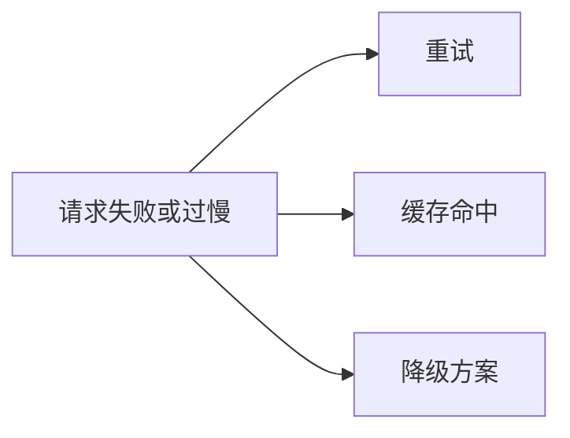

# 重试、缓存与降级

## 本章目标

这一章讨论三件在 LLM 系统里极其实用的稳定性手段：

- 重试
- 缓存
- 降级

读完后你应该能：

- 理解它们各自解决什么问题
- 写出基础的重试函数
- 设计简单的缓存和降级思路
- 知道什么时候不该滥用它们

---

## 为什么这三件事很关键

在真实系统里，失败并不罕见：

- 模型接口偶发超时
- 工具服务临时失败
- embedding 请求抖动
- 高阶模型不可用或过慢

这时你不能让整个系统直接崩掉，而要尽量：

- 再试一次
- 走缓存
- 或降级到更保守的路径

---

## 稳定性三件套图



---

## 1. 重试：解决偶发失败

```python
import time


def with_retry(fn, retries: int = 3, delay: float = 1.0):
    last_error = None
    for _ in range(retries):
        try:
            return fn()
        except Exception as exc:
            last_error = exc
            time.sleep(delay)
    raise last_error
```

### 适合重试的场景

- 网络波动
- 模型接口临时超时
- 工具服务偶发错误

### 不适合盲目重试的场景

- 参数本身就错误
- 权限不足
- 工具逻辑性失败

---

## 2. 缓存：解决重复成本和重复延迟

缓存最常见的价值有两个：

- 提升速度
- 降低成本

### 常见缓存点

- embedding 缓存
- 热门问题回答缓存
- RAG 检索结果缓存
- Prompt 模板渲染后的中间结果缓存

---

## 3. 一个最简单的内存缓存示例

```python
CACHE = {}


def cached_ask(question: str, answer_fn):
    if question in CACHE:
        return CACHE[question]
    answer = answer_fn(question)
    CACHE[question] = answer
    return answer
```

这个示例很基础，但足够帮助你理解：

- 某些重复请求完全没必要重复调用模型

---

## 4. 降级：解决“高阶链路失败怎么办”

降级的核心是：

> 当理想路径失败时，系统不要彻底崩，而是退到一个更保守但更稳的方案。

例如：

- 高阶模型失败 -> 切轻量模型
- RAG 检索失败 -> 只返回“资料不足”模板
- 工具失败 -> 输出人工处理建议

---

## 5. 一个简单的降级思路

```python
def answer_with_fallback(primary_fn, fallback_fn):
    try:
        return primary_fn()
    except Exception:
        return fallback_fn()
```

---

## 6. 两个业务案例

### 案例一：RAG 问答

主路径：

- query rewrite
- 检索
- rerank
- 回答生成

降级路径：

- 跳过 rerank
- 或直接返回“找到的最相关文档如下，请人工确认”

### 案例二：Ticket Agent

主路径：

- 分类
- 多工具调用
- 汇总建议

降级路径：

- 若工具失败，则输出“建议人工复核”的保守答案

---

## 7. 常见坑

### 坑一：所有失败都无限重试

会让系统更慢、更贵，还未必更稳定。

### 坑二：缓存策略太粗糙

知识库或上下文变化后，可能返回旧结果。

### 坑三：降级方案和主路径差距太大

用户体验会出现明显割裂。

---

## 本章小结

你现在应该记住：

- 重试解决偶发失败
- 缓存解决重复调用的成本和延迟
- 降级解决高阶路径失败时的兜底问题
- 这三件事共同构成 LLM 系统稳定性的基础设施

---

## 练习题

1. 写一个基础 `with_retry` 函数
2. 写一个最小缓存封装
3. 为 RAG 系统设计一条降级路径
4. 为 Agent 系统设计一条降级路径

---

## 下一章

系统稳了，还要安全：[安全](./security)
