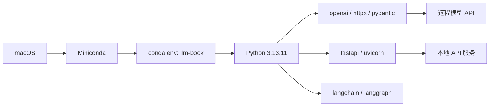
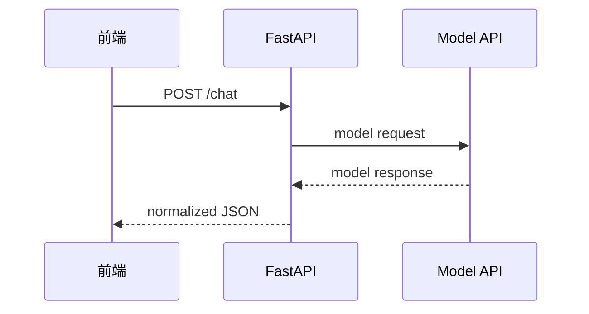

# 环境

## 本章目标

这一章只做一件事：为后面的所有大模型学习准备一套长期可用、干净稳定的开发环境。

读完后你应该能：

- 安装并使用 `Miniconda`
- 创建 `Python 3.13.11` 环境
- 安装后续章节需要的基础依赖
- 组织一个适合 LLM 项目的 Python 目录结构
- 跑通第一个模型 API 调用脚本

---

## 为什么推荐 Miniconda

对于大模型应用开发，依赖变化快、项目切换频繁、环境隔离重要。和直接使用系统 Python 相比，`Miniconda` 的好处非常明显：

- 环境隔离更稳定
- 方便切换 Python 版本
- 不容易污染系统环境
- 更适合处理 AI 和数据类依赖

如果你原来主要做前端，这相当于从“全局 npm 包随便装”升级成“每个项目自己的 runtime”。

---

## 环境总览图



---

## 1. 安装 Miniconda

安装完成后，先确认命令可用：

```bash
conda --version
```

如果能看到版本号，说明基础安装完成。

---

## 2. 创建专用环境

```bash
conda create -n llm-book python=3.13.11 -y
conda activate llm-book
python --version
```

建议给这套教材固定一个环境名，比如 `llm-book`。后面所有实验都在这个环境里进行。

---

## 3. 安装基础依赖

```bash
pip install openai httpx pydantic python-dotenv fastapi uvicorn typer rich numpy
```

后续如果学习 LangChain / LangGraph，再补：

```bash
pip install langchain langchain-openai langgraph
```

### 这些依赖分别做什么

- `openai`：调用兼容 OpenAI 协议的模型 API
- `httpx`：通用 HTTP 请求工具
- `pydantic`：结构化输出与数据校验
- `python-dotenv`：读取 `.env`
- `fastapi`：构建后端 API
- `uvicorn`：运行 FastAPI
- `typer`：命令行工具开发
- `rich`：终端输出格式化

---

## 4. 推荐目录结构

当你开始写真正的 LLM 项目时，建议目录按功能分层：

```text
llm-project/
  app/
    main.py
    api/
      routes.py
    core/
      config.py
      logger.py
    llm/
      client.py
      prompts.py
      schemas.py
      tools.py
      rag.py
      agent.py
  data/
  notebooks/
  tests/
  .env
  requirements.txt
```

这和前端项目里的 `api`、`utils`、`store`、`hooks` 一样，都是在做职责拆分。

---

## 5. 配置环境变量

项目根目录创建 `.env`：

```bash
OPENAI_API_KEY=your_api_key
OPENAI_BASE_URL=https://api.openai.com/v1
OPENAI_MODEL=gpt-4.1-mini
```

写一个配置文件 `app/core/config.py`：

```python
from dotenv import load_dotenv
from pydantic import BaseModel
import os

load_dotenv()


class Settings(BaseModel):
    openai_api_key: str
    openai_base_url: str = "https://api.openai.com/v1"
    openai_model: str = "gpt-4.1-mini"


settings = Settings(
    openai_api_key=os.environ["OPENAI_API_KEY"],
    openai_base_url=os.getenv("OPENAI_BASE_URL", "https://api.openai.com/v1"),
    openai_model=os.getenv("OPENAI_MODEL", "gpt-4.1-mini"),
)
```

---

## 6. 第一个可运行示例

创建 `hello_llm.py`：

```python

import os
from  openai import OpenAI
from dotenv import load_dotenv

# https://hf-mirror.com 修改模型源
os.environ["HF_ENDPOINT"] = "https://hf-mirror.com"

load_dotenv()


messages = [
    {"role": "user", "content": "请用 3 句话解释什么是大模型。"},
]

client = OpenAI(
    base_url=os.getenv("OPENAI_BASE_URL"),
    api_key=os.getenv("OPENAI_API_KEY")
)

chat_response = client.chat.completions.create(
    model=os.getenv("OPENAI_MODEL"),
    messages=messages,
)
print("Chat response:", chat_response.choices[0].message.content)
print(chat_response.id)
```

运行：

```bash
python hello_llm.py
```

---

## 7. 前后端联调视角下的环境理解

你是前端出身，所以最好把这套环境直接想成一个完整开发栈：



这不是“单纯学 Python”，而是在搭你未来 AI 应用的后端支架。

---

## 8. 常见问题

### 为什么不用系统 Python

因为后续会接很多库，隔离环境能减少依赖冲突。

### 为什么用 Python 而不是 Node.js

因为 LLM 生态里，Python 社区更新更快，资料和样例更丰富。

### Python 3.13.11 会不会太新

个别库可能支持滞后，所以碰到兼容性问题时要查版本说明。学习期先用兼容性好的依赖组合。

---

## 本章小结

这一章完成后，你已经有了后续所有实验的底座：

- `Miniconda`
- `Python 3.13.11`
- `.env`
- 基础依赖
- 第一个 API 调用脚本

---

## 练习题

1. 创建 `llm-book` 环境并安装基础依赖
2. 跑通 `hello_llm.py`
3. 改写示例，让模型输出 Markdown 列表
4. 新建一个 `FastAPI` 工程目录，把配置文件放进 `app/core/config.py`

---

## 下一章

下一章不直接讲模型，而是先补齐最常用的 Python 开发基础：[Python for LLM 开发基础](./python-llm-basics)
