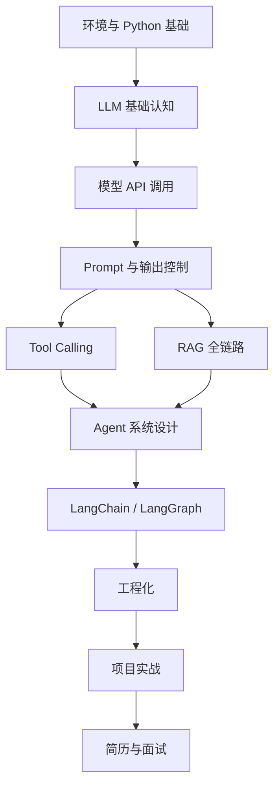
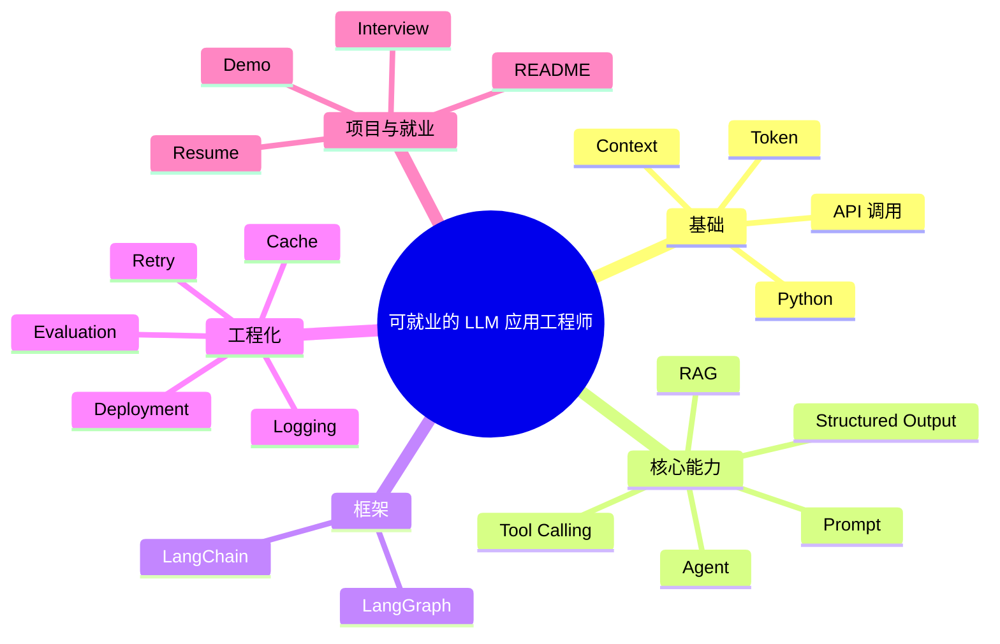

# 前言

## 本主题解决什么问题

很多人学大模型时会遇到三个常见问题：

1. 学到的都是碎片词汇，缺少主线
2. 看了很多原理，却不会写应用代码
3. 会调 API，但不会做 RAG、Agent、工程化和项目包装

这套要解决的，就是从“知道术语”到“能够交付应用”之间的断层。

---

## 学习地图

---

## 模块安排

### 模块一：环境、Python 与模型 API

- [环境准备：Miniconda 与 Python 3.13.11](./environment)
- [Python for LLM 开发基础](./python-llm-basics)
- [大模型基础认知](./llm-basics)
- [模型 API 调用基础](./model-api-basics)

### 模块二：Prompt 与输出控制

- [Prompt 工程导论](./prompt/index)
- [Zero-shot、One-shot 与 Few-shot](./prompt/zero-shot-few-shot)
- [常见 Prompt 模式](./prompt/prompt-patterns)
- [Prompt 调试方法](./prompt/prompt-debugging)
- [结构化输出](./prompt/structured-output)

### 模块三：工具调用

- [Function Calling 基础](./tools/function-calling-basics)
- [工具 Schema 设计](./tools/tool-schema-design)
- [工具路由与执行](./tools/tool-routing)
- [工具安全与边界](./tools/tool-safety)

### 模块四：RAG 全链路

- [RAG 总览](./rag/index)
- [文档处理](./rag/document-processing)
- [切块策略](./rag/chunking)
- [Embedding 与向量存储](./rag/embedding-vector-store)
- [检索策略](./rag/retrieval)
- [Rerank](./rag/rerank)
- [混合检索](./rag/hybrid-search)
- [Query Rewrite](./rag/query-rewrite)
- [RAG 评测](./rag/rag-evaluation)
- [RAG 生产实践](./rag/rag-production)

### 模块五：Agent 系统设计

- [Agent 导论](./agent/index)
- [ReAct 模式](./agent/react)
- [Planning](./agent/planning)
- [Memory](./agent/memory)
- [Multi-Agent](./agent/multi-agent)
- [Agent 安全](./agent/agent-safety)

### 模块六：LangChain 与 LangGraph

- [LangChain 导论](./langchain/index)
- [LangChain 基础组件](./langchain/langchain-basics)
- [Output Parser](./langchain/output-parser)
- [LangChain RAG 实战](./langchain/rag-with-langchain)
- [LangChain Agent 实战](./langchain/agent-with-langchain)
- [LangGraph 导论](./langgraph/index)
- [StateGraph](./langgraph/state-graph)
- [Tool Node](./langgraph/tool-node)
- [条件路由](./langgraph/conditional-routing)
- [多步 Agent 工作流](./langgraph/multi-step-agent)

### 模块七：工程化与项目

- [LLM 应用工程化导论](./engineering/index)
- [评测](./engineering/evaluation)
- [观测](./engineering/observability)
- [重试、缓存与降级](./engineering/retry-cache-fallback)
- [安全](./engineering/security)
- [部署](./engineering/deployment)
- [成本优化](./engineering/cost-optimization)
- [项目实战总览](./projects/index)
- [RAG 项目](./projects/rag-assistant-project)
- [Ticket Agent 项目](./projects/ticket-agent-project)
- [前端研发 Copilot 项目](./projects/frontend-copilot-project)
- [就业路线与面试准备](./career)

---

## 适合你的学习方式

推荐按下面方式学习：

- 先通读模块首页，建立知识地图
- 再逐章敲代码，而不是只看结论
- 每学完一个模块，就做一个最小 Demo
- 学完 RAG、Agent、工程化后，再做完整项目

---

## 学完后的目标

学完整套内容后，你应该具备下面这些能力：

---

## 开始阅读

请先从第一章开始：[环境准备：Miniconda 与 Python 3.13.11](./environment)
