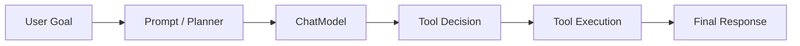

# LangChain Agent 实战

## 本章目标

这一章讨论如何用 LangChain 的思路组织一个基础 Agent 流程，并帮助你看清：LangChain 在 Agent 场景下擅长什么，不擅长什么。

读完后你应该能：

- 理解 LangChain 如何接工具、Prompt 和模型
- 知道它适合什么程度的 Agent 编排
- 理解为什么更复杂的状态流常常转向 LangGraph

---

## Agent 组件图

---

## 1. LangChain 在 Agent 场景里的价值

它比较擅长帮助你把这些东西组织起来：

- Prompt
- 工具描述
- 模型调用
- 输出解析

也就是说，它适合做：

- 中小型 Agent 流程
- 快速原型
- 工具编排 Demo

---

## 2. 一个典型的使用思路

你可以把 Agent 场景里的 LangChain 写法理解成：

- 用 Prompt 告诉模型如何决策
- 用工具组件暴露可用能力
- 用模型输出驱动下一步动作

如果流程还是比较线性，这样已经够用。

---

## 3. 一个业务案例

### 客服工单分诊 Agent

Agent 流程可能是：

1. 判断问题类型
2. 根据类型调用订单、支付或物流工具
3. 输出结构化建议

对于这种不算太复杂的单线流程，LangChain 是可以胜任的。

---

## 4. 它的边界在哪里

一旦你开始需要：

- 显式状态管理
- 条件路由
- 多节点循环
- 多阶段可视化工作流

LangChain 单独使用通常就会变得不够自然。

这也是为什么很多更复杂的 Agent 场景会转向 LangGraph。

---

## 5. 常见坑

### 坑一：以为只要上 LangChain 就自动有 Agent 能力

Agent 的关键还是目标拆解、工具设计、状态与护栏。

### 坑二：复杂状态流硬塞到线性链路里

这样代码通常会越来越难维护。

---

## 本章小结

你现在应该理解：

- LangChain 适合做组件式 Agent 原型和中等复杂度编排
- 但当状态流变复杂时，LangGraph 往往更合适
- 框架只是组织方式，Agent 的本质仍然是目标、状态、工具和流程设计

---

## 练习题

1. 设计一个“工单分诊 Agent”的 LangChain 组件图
2. 解释为什么复杂 Agent 往往会转向 LangGraph
3. 举一个你认为 LangChain 足够、但 LangGraph 可能过重的场景

---

## 下一章

既然复杂 Agent 更适合状态图，接下来进入：[LangGraph 导论](../langgraph/index)
