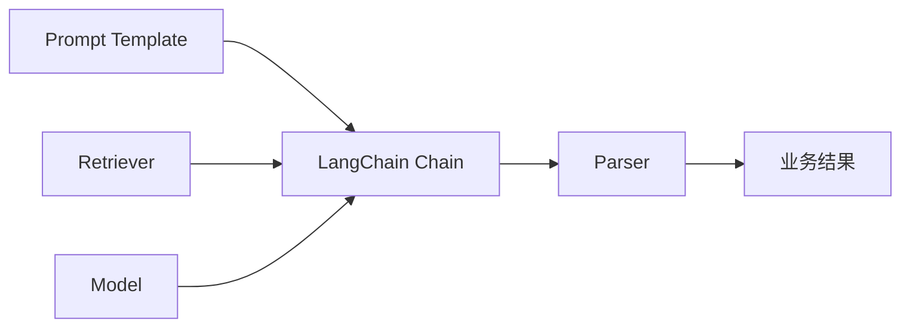

# LangChain 导论

## 本章目标

这一章的目标不是让你背 LangChain API，而是帮你建立一个更成熟的判断：在什么场景下，原生 SDK 已经足够；在什么场景下，引入 LangChain 会明显提升开发效率和可维护性。

读完后你应该能：

- 理解 LangChain 解决的核心问题
- 明白它和原生写法的关系
- 知道它为什么适合用于 Prompt、检索、解析和组合链路
- 为后续 RAG 与 Agent 实战建立框架视角

---

## 为什么需要框架层

当你刚开始做 LLM 项目时，原生 SDK 通常已经够用。

例如你可以直接写：

- 一个 Prompt
- 一次模型调用
- 一次 JSON 解析

但随着系统变复杂，你会逐渐出现这些需求：

- Prompt 要模板化
- 输出要可解析、可校验
- 检索器要可替换
- 链路要可组合
- 中间步骤要更清楚地组织起来

这时，LangChain 提供的价值就不是“多一个库”，而是：

> 把 LLM 应用里的常见组件抽象成可组合的模块。

---

## LangChain 更适合解决什么问题

从应用视角看，LangChain 擅长的是：

- Prompt 组织
- 模型调用封装
- 结构化输出解析
- 检索链路组合
- 多步流程的组件拼接

它并不神秘，本质上更像是：

> 面向 LLM 应用的组件化开发框架。

---

## LangChain 在系统中的位置

这张图表达的是：

- Prompt 不是随便拼字符串
- Retriever 不是散落在业务代码里
- Parser 也不该每次都手写

LangChain 的价值就在于把这些东西更系统地组织起来。

---

## 它和原生写法是什么关系

这是一个很重要的认知。

### 原生写法的优点

- 更透明
- 更容易理解底层流程
- 更适合入门和调试

### LangChain 的优点

- 更适合组件化复用
- 更容易组合多步链路
- 更适合中大型应用维护

所以更推荐的学习顺序是：

1. 先理解原生 SDK 的基本原理
2. 再学习 LangChain 的抽象方式

这也是为什么你前面先学了原生 Prompt、RAG、Tool Calling，再来到这里。

---

## 一个典型使用场景

比如你要做一个知识问答助手，链路可能包括：

- Prompt 模板
- 检索器
- 模型
- 输出解析器

如果全部自己手搓，当然能做；但随着项目变大，会变得越来越零散。

LangChain 提供的是一种更整洁的组合方式。

---

## 什么时候适合用 LangChain

### 适合

- 你已经理解原生调用流程
- 系统开始包含多个可组合组件
- 你需要更统一的代码组织方式
- 你准备开始写 RAG / Agent 中等复杂度应用

### 不一定适合

- 只是一个单次调用脚本
- 只是最小 demo
- 你还没理解底层链路，直接上框架容易迷失

---

## 两个常见误区

### 误区一：LangChain 很高级，所以应该一开始就学

实际上，如果你还没理解原生流程，LangChain 只会把简单问题包得更复杂。

### 误区二：用了 LangChain 就等于懂了 Agent / RAG

框架只是承载方式，真正重要的是你是否理解底层逻辑和系统设计。

---

## 本章小结

你现在应该建立的认知是：

- LangChain 的价值在于组件化与组合能力
- 它适合在你已经理解原生流程后再引入
- 它不是必须，但在中大型 LLM 应用里很常见
- 学 LangChain 不应替代学原理，而应建立在原理之上

---

## 练习题

1. 解释原生 SDK 写法和 LangChain 写法的区别
2. 列举 3 个你觉得适合用 LangChain 的场景
3. 列举 2 个你觉得原生 SDK 就足够的场景

---

## 下一章

接下来正式进入 LangChain 的基础组件：[LangChain 基础组件](./langchain-basics)
