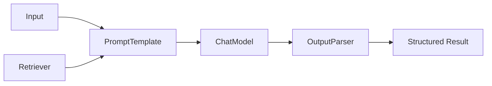

# LangChain 基础组件

## 本章目标

这一章会系统介绍 LangChain 最常见的几个基础组件，并告诉你它们在整个 LLM 应用里分别承担什么角色。

读完后你应该能：

- 理解 PromptTemplate、Model、Parser、Retriever、Runnable 的职责
- 知道 LangChain 为什么强调“可组合”
- 写出一个最小 LangChain 链路

---

## LangChain 的核心思想：组件化

你可以把 LangChain 想成一个前端组件库或中间件流水线系统。

它做的事情不是重新发明 LLM，而是把常见能力拆成模块：

- PromptTemplate
- ChatModel
- OutputParser
- Retriever
- Runnable

然后允许你像搭积木一样把它们拼起来。

---

## 基础组件关系图



---

## 1. PromptTemplate

它的职责是：

- 管理 Prompt 模板
- 注入变量
- 让 Prompt 不再散落在业务代码里

### 示例

```python
from langchain_core.prompts import ChatPromptTemplate

prompt = ChatPromptTemplate.from_messages([
    ("system", "你是一名 AI 讲师。"),
    ("human", "请解释什么是 {topic}。"),
])
```

使用时可以传参：

```python
prompt.invoke({"topic": "RAG"})
```

---

## 2. ChatModel

它的职责是封装模型调用。

```python
from langchain_openai import ChatOpenAI

model = ChatOpenAI(model="gpt-4.1-mini")
```

这个对象背后会处理：

- 消息输入
- 模型调用
- 返回结果封装

---

## 3. OutputParser

它的职责是：

- 把模型输出转成更适合程序处理的结构
- 减少你手写解析逻辑的重复劳动

这是 LangChain 在工程里最实用的能力之一。

---

## 4. Retriever

它的职责是：

- 接收查询
- 从知识库中取回相关文档

在 RAG 场景里，Retriever 是非常关键的一个组件。

---

## 5. Runnable

Runnable 可以理解成 LangChain 中“可组合执行单元”的通用抽象。

最直观的体验就是这类写法：

```python
chain = prompt | model
```

或者：

```python
chain = prompt | model | parser
```

这和前端里把多个处理步骤通过管道串起来很像。

---

## 6. 一个最小可运行示例

```python
from langchain_openai import ChatOpenAI
from langchain_core.prompts import ChatPromptTemplate

prompt = ChatPromptTemplate.from_messages([
    ("system", "你是一名 AI 讲师，回答时先给定义，再给例子。"),
    ("human", "请解释什么是 {topic}。"),
])

model = ChatOpenAI(model="gpt-4.1-mini")

chain = prompt | model

result = chain.invoke({"topic": "RAG"})
print(result.content)
```

这段代码已经很能说明 LangChain 的风格：

- Prompt 是一个组件
- Model 是一个组件
- 两者通过管道组合

---

## 7. 一个更接近工程的组合思路

```python
from langchain_core.output_parsers import StrOutputParser

parser = StrOutputParser()

chain = prompt | model | parser
result = chain.invoke({"topic": "向量数据库"})
print(result)
```

这样做的好处是：

- 输出更统一
- 代码更清晰
- 后续接别的 parser 更方便

---

## 8. 两个业务案例

### 案例一：课程解释器

用 `PromptTemplate + ChatModel + StrOutputParser`，快速做一个“解释某个 AI 概念”的小工具。

### 案例二：需求分析助手

用模板化 Prompt 输出“目标、输入、风险、MVP 建议”，后续再接结构化解析器。

---

## 9. 常见坑

### 坑一：没理解原生 SDK，就直接堆 LangChain

结果是看得懂代码，理解不了链路。

### 坑二：组件越多越好

过度抽象会让简单问题变复杂。

### 坑三：把 LangChain 当成黑盒

真正重要的是理解每个组件在做什么。

---

## 本章小结

这一章你最该记住的是：

- LangChain 的核心优势是组件化和组合能力
- PromptTemplate、Model、Parser、Retriever、Runnable 是最常见的基础积木
- `prompt | model | parser` 是它非常典型的开发风格
- 学会组件职责，比死记 API 更重要

---

## 练习题

1. 用 `ChatPromptTemplate` 写一个概念解释器
2. 在链路后面加上 `StrOutputParser`
3. 试着把“需求分析助手”改造成 LangChain 写法

---

## 下一章

接下来继续把“模型输出转成程序结构”这件事讲深一点：[Output Parser](./output-parser)
