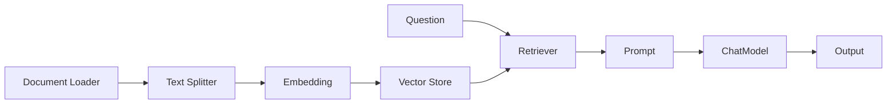

# LangChain RAG 实战

## 本章目标

这一章的目标是：把你前面学过的 RAG 主线，用 LangChain 的组件化方式重新组织一遍。

你会看到：

- 原生思路没有变
- 只是组件表达方式更清晰了

读完后你应该能：

- 理解 LangChain 风格的 RAG 链路
- 知道 Loader、Splitter、Retriever、Prompt、Model 的角色分工
- 把原生 RAG 认知迁移到框架写法里

---

## LangChain 风格的 RAG 结构图



---

## 1. 先理解组件映射

你前面学过的原生 RAG，对应到 LangChain 大致是：

- 文档加载 -> Loader
- 文本切块 -> Text Splitter
- embedding -> Embedding Model
- 向量检索 -> Vector Store + Retriever
- 生成回答 -> Prompt + ChatModel

这说明框架只是表达方式变了，主线没有变。

---

## 2. 一个最小思路示例

下面是教学化示例，重点在理解组件，不要求你立刻记住所有 API：

```python
from langchain_openai import ChatOpenAI, OpenAIEmbeddings
from langchain_core.prompts import ChatPromptTemplate

prompt = ChatPromptTemplate.from_messages([
    ("system", "你是一名企业知识库助手，请严格依据检索资料回答。"),
    ("human", "问题: {question}\n\n资料:\n{context}"),
])

model = ChatOpenAI(model="gpt-4.1-mini")
embeddings = OpenAIEmbeddings(model="text-embedding-3-small")
```

这个片段先帮你建立 LangChain 风格下的角色分工。

---

## 3. Retriever 为什么是核心组件

在 LangChain 里，Retriever 是最重要的 RAG 组件之一。

它承担的是：

- 接收问题
- 从向量存储中找相关文档
- 返回候选上下文

从工程角度看，它相当于把“检索逻辑”从业务层抽离出来。

---

## 4. 一个更接近真实链路的理解

完整链路通常像这样：

1. Loader 读文档
2. Splitter 切块
3. Embedding 建立向量表示
4. Vector Store 保存与检索
5. Retriever 召回上下文
6. Prompt 将问题和上下文组装
7. Model 生成答案

这比你手写一个大脚本更适合中型项目维护。

---

## 5. 业务案例

### 案例一：企业制度问答

LangChain 很适合把：

- 文档加载
- 切块
- 检索
- 生成

组织成一条可复用链路。

### 案例二：研发知识搜索

当你要处理不同文档来源、不同 retriever 配置时，LangChain 的可替换性会更明显。

---

## 6. 常见坑

### 坑一：把框架 API 当成重点，忽略底层 RAG 原理

这样你一换库就不会了。

### 坑二：用 LangChain 后就不再关心 chunking 和 retrieval 质量

框架不会自动替你做出正确策略。

### 坑三：一开始就接很复杂的外部组件

学习期建议先抓住主链路，再加复杂配置。

---

## 本章小结

你现在应该能建立一个清晰认知：

- LangChain 没有改变 RAG 的本质，只是把它组件化了
- Retriever 是 RAG 链路中的关键抽象
- 你前面学的 chunking、embedding、retrieval 依然是核心，不会因为框架而失效

---

## 练习题

1. 写出原生 RAG 链路和 LangChain RAG 链路的组件映射表
2. 解释 Retriever 在 LangChain RAG 中的职责
3. 试着设计一个“制度问答”的 LangChain 组件组合图

---

## 下一章

RAG 学完后，接下来看看 LangChain 如何组织工具和 Agent：[LangChain Agent 实战](./agent-with-langchain)
