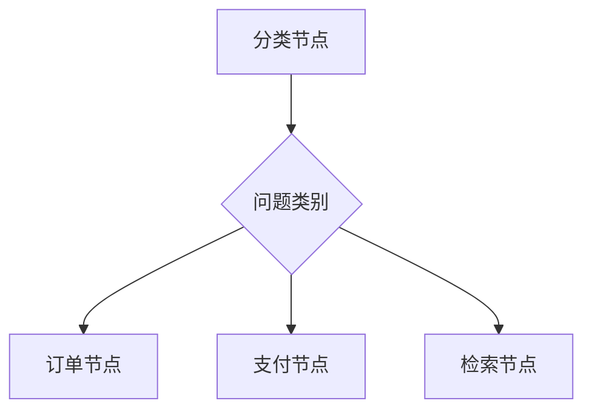

# 条件路由

## 本章目标

这一章讨论 LangGraph 中最能体现“图思维”优势的能力之一：条件路由。

---

## 为什么条件路由重要

复杂任务通常不会永远按一条直线走下去。

常见情况：

- 如果是订单问题，走订单工具
- 如果是支付问题，走支付工具
- 如果资料不足，走检索节点
- 如果任务完成，走结束节点

这就是条件路由的典型价值。

---

## 路由图

---

## 本章小结

条件路由让 Agent 从“线性脚本”升级为“可分支的工作流系统”。

---

## 下一章

最后看一个更接近完整项目的场景：[多步 Agent 工作流](./multi-step-agent)
