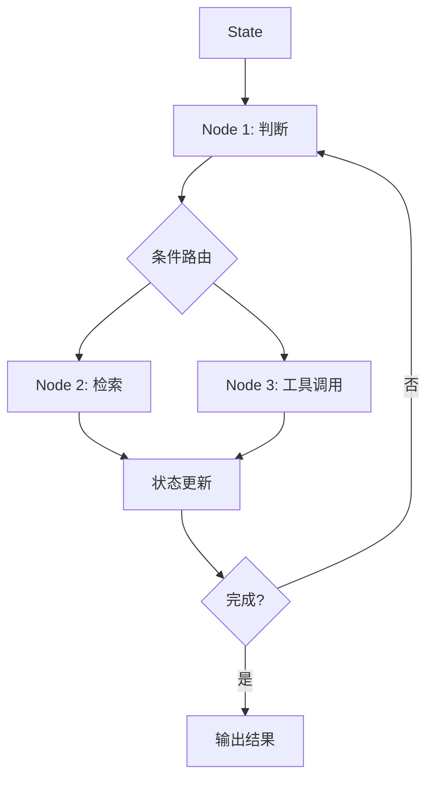

# LangGraph 导论

## 本章目标

这一章的目标是让你理解：为什么很多复杂 Agent 工作流最终会从“链式组合”升级到“状态图编排”。

读完后你应该能：

- 理解 LangGraph 解决的核心问题
- 明白它和 LangChain 的关系
- 知道什么时候该从链式思维切到状态图思维

---

## 为什么 LangGraph 会出现

当你的 Agent 应用开始变复杂时，常常会遇到这些需求：

- 当前状态要显式保存
- 下一步要根据状态走不同路径
- 工具执行后要更新状态
- 某些节点要循环执行，直到满足终止条件

如果继续用纯线性链路来写，会越来越像“隐式状态机”，难以维护。

LangGraph 的核心价值就在于：

> 把复杂 Agent 流程显式表达为一个状态图。

---

## LangChain 和 LangGraph 的关系

你可以这样理解：

- LangChain 更像组件与链路组织层
- LangGraph 更像状态化工作流编排层

它们不是完全对立关系，而是经常组合使用。

---

## 一张图理解 LangGraph

这就是 LangGraph 的核心思维：

- 显式状态
- 显式节点
- 显式路由

---

## 什么场景特别适合 LangGraph

- 多步 Agent
- 带工具调用和知识检索的复杂流程
- 需要循环执行直到完成的任务
- 需要明确条件分支和状态更新的系统

---

## 本章小结

你现在应该记住：

- LangGraph 的核心不是“另一个框架”，而是“显式状态图思维”
- 当 Agent 流程复杂到需要状态和条件路由时，LangGraph 更自然
- 它和 LangChain 常常是协同关系，而不是非此即彼

---

## 练习题

1. 解释 LangChain 和 LangGraph 的区别
2. 画一个你理解中的多步 Agent 状态图
3. 举一个你认为必须用状态图表达的业务流程

---

## 下一章

接下来进入 LangGraph 的核心抽象：[StateGraph](./state-graph)
