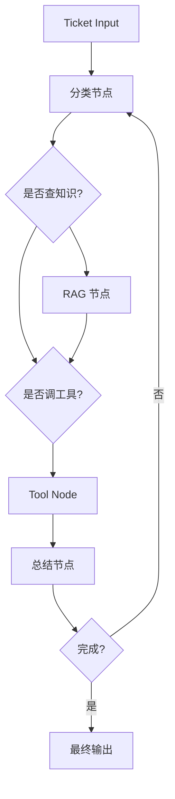

# 多步 Agent 工作流

## 本章目标

这一章从整体视角总结如何用 LangGraph 组织一个多步 Agent 系统。

---

## 一个典型多步 Agent 示例

例如做客服 Ticket Agent，流程可能是：

1. 接收工单文本
2. 分类问题类型
3. 决定是否需要 RAG
4. 决定是否需要工具调用
5. 汇总结果
6. 判断是否结束

这类流程如果没有状态图，通常很快会变得混乱。

---

## 总体结构图

---

## 本章小结

LangGraph 的真正价值在于：当 Agent 流程变复杂时，它能把隐式逻辑变成显式状态图，让系统更清楚、更易调试、更适合长期维护。

---

## 下一章

框架部分学完后，后面你可以继续回到工程化与项目章节，把这些能力做成真正可交付作品。
