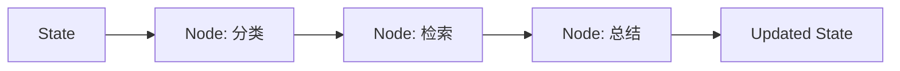

# StateGraph

## 本章目标

这一章讲的是 LangGraph 最重要的核心概念：StateGraph。

它是你理解整个 LangGraph 体系的关键。

读完后你应该能：

- 理解“状态图”在 Agent 系统中的意义
- 明白为什么状态要被显式建模
- 理解 State、Node、Edge 三者的关系

---

## 为什么状态必须显式化

在简单对话里，状态可以模糊地藏在上下文里；但在复杂 Agent 系统里，如果状态不显式化，通常会出现：

- 逻辑混乱
- 工具结果丢失
- 多轮执行不可追踪
- 很难调试和可视化

所以 StateGraph 的第一原则是：

> 把系统在执行中的关键数据，显式存进状态里。

---

## StateGraph 的基本组成

### State

系统当前掌握的上下文信息。

### Node

对状态做处理的节点。

### Edge

节点之间的流转关系。

---

## 结构图



---

## 一个典型的 State 示例

```python
from typing import TypedDict


class TicketState(TypedDict):
    user_question: str
    category: str
    retrieved_context: str
    tool_result: str
    final_answer: str
```

这个状态非常像前端里的 store，只不过它不是 UI 状态，而是 Agent 工作流状态。

---

## 为什么这个思路很适合前端工程师

因为你已经很熟悉：

- 状态流
- reducer 思维
- 节点更新状态
- 条件路由

你可以把 LangGraph 理解成：

> 面向 AI 工作流的状态管理框架。

---

## 本章小结

你现在应该明白：

- StateGraph 的关键不是 API，而是“状态显式建模”
- 复杂 Agent 的可维护性，很大程度上来自状态设计质量
- 对前端工程师来说，这个思维迁移其实是很自然的

---

## 练习题

1. 设计一个 `TicketState`
2. 设计一个“文档问答 Agent”的状态字段
3. 解释为什么状态显式化会提升可维护性

---

## 下一章

有了状态以后，常见节点之一就是工具执行节点：[Tool Node](./tool-node)
