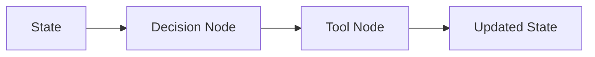

# Tool Node

## 本章目标

这一章讨论 LangGraph 中非常关键的一类节点：Tool Node。

它负责把“模型决定调用什么工具”这件事真正放进工作流图中。

---

## 为什么工具应该是节点

如果工具调用只是散落在业务逻辑中，那么：

- 不容易观察
- 不容易复用
- 不容易插入日志和权限控制

把工具执行抽象成节点之后，你会得到：

- 更清晰的执行边界
- 更好的调试能力
- 更容易加护栏和日志

---

## 结构图

---

## 本章小结

Tool Node 的价值在于：让工具执行成为工作流图中的一等公民，而不是散落的副作用代码。

---

## 下一章

当图中有多个分支时，就需要条件判断：[条件路由](./conditional-routing)
