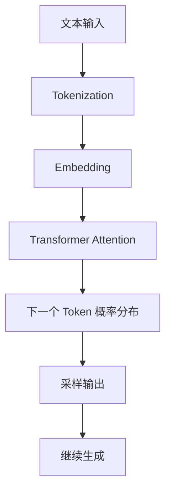
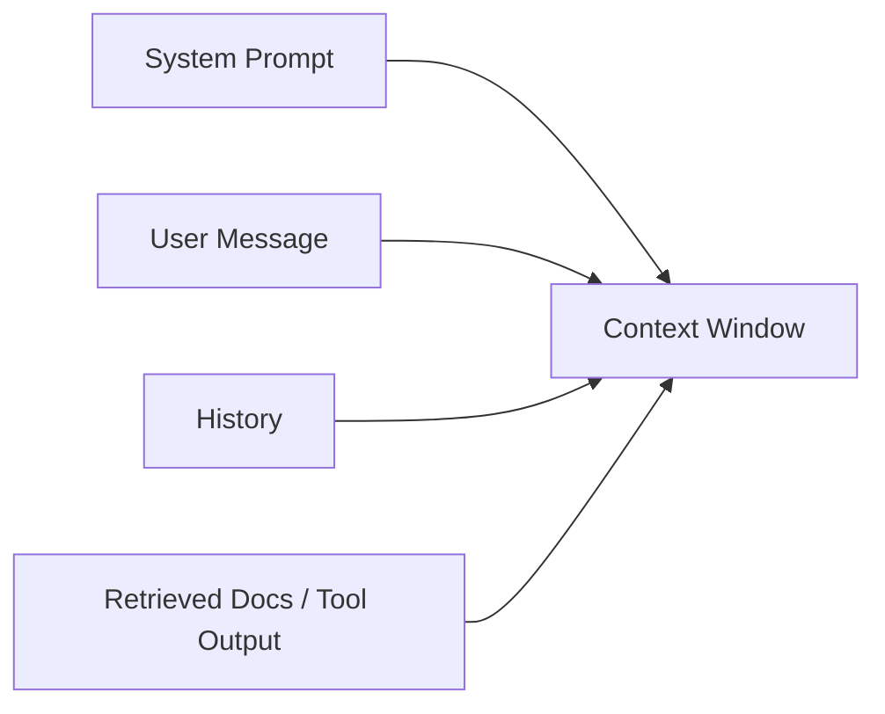
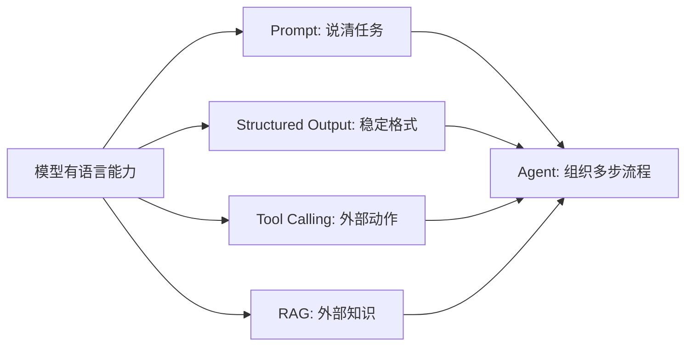

# 大模型基础认知

## 本章目标

这一章的目标不是讲复杂数学，而是帮你建立 LLM 应用开发最关键的认知地图。

读完后你应该能回答：

- 大模型本质上在做什么
- Token、上下文窗口、Embedding 分别是什么
- 为什么会幻觉
- Prompt、RAG、Tool Calling、Agent 为什么会出现

---

## 1. 先记住一句总纲

你可以先把大模型理解成：

> 一个根据已有上下文预测下一个 token 的模型，但因为参数规模、训练数据和网络结构足够强，所以表现出了很强的语言理解与生成能力。

这句话里最关键的词有四个：

- `token`
- `上下文`
- `预测`
- `泛化能力`

---

## 2. 生成过程总览图



---

## 3. Token 是什么

模型并不是直接理解“整句话”，而是把文本拆成更小的处理单位，也就是 `token`。

它可能是：

- 一个字
- 一个词的一部分
- 一个标点
- 特殊空格模式

### 为什么它重要

- 模型计费按 token 计
- 上下文窗口按 token 计
- 长文本截断也和 token 强相关

所以 token 不是理论细节，而是成本、性能和稳定性的核心变量。

---

## 4. 上下文窗口是什么

上下文窗口指的是：

> 模型在一次请求中最多能看到多少 token。

它通常会被这些内容一起占用：

- system prompt
- 用户问题
- 历史消息
- RAG 检索片段
- 工具返回结果



这就是为什么做 RAG 和 Agent 时，控制上下文长度很重要。

---

## 5. Embedding 是什么

Embedding 不是生成答案的模型，它的主要作用是把文本转成向量表示，用来衡量语义相似度。

最常见用途：

- 语义检索
- 文档召回
- 聚类和去重
- RAG 检索基础

一句话理解：

> 生成模型擅长“回答”，Embedding 模型擅长“找相似内容”。

---

## 6. 为什么会幻觉

幻觉指的是模型给出了看起来合理、实际上却可能错误或没有依据的内容。

常见原因：

- 问题超出模型知识边界
- Prompt 约束不足
- 检索资料不充分
- 用户要求的是实时信息，但模型没有实时数据源
- 工具调用失败但没有兜底

### 降低幻觉的方法

- 提示模型“不确定就说不知道”
- 使用结构化输出
- 接 RAG
- 接工具调用
- 做评测和人工抽检

---

## 7. 为什么 Prompt、RAG、Agent 会出现



它们不是孤立的热点词，而是在解决模型本体能力的边界问题：

- Prompt：任务表达不清
- Structured Output：结果无法稳定被程序消费
- Tool Calling：模型无法直接访问外部能力
- RAG：模型无法直接访问私有或最新知识
- Agent：单轮问答无法完成复杂目标

---

## 8. 一个最小代码示例

```python
import os
from  openai import OpenAI
from dotenv import load_dotenv
# https://hf-mirror.com 修改模型源
os.environ["HF_ENDPOINT"] = "https://hf-mirror.com"
load_dotenv()
messages = [
    {"role": "system", "content": "你是一名 AI 教学助理，请给前端工程师做解释"},
]
client = OpenAI(
    base_url=os.getenv("OPENAI_BASE_URL"),
    api_key=os.getenv("OPENAI_API_KEY")
)
messages.append({"role": "user", "content": "什么是 embedding？请用简洁例子说明。"})
chat_response = client.chat.completions.create(
    model=os.getenv("OPENAI_MODEL"),
    messages=messages,
)
print(chat_response.choices[0].message.content)
```

这段代码虽然短，但已经包含了很多核心概念：

- 角色消息
- 模型选择
- 文本输入
- 输出生成

---

## 9. 两个常见误区

### 误区一：把模型当成确定性接口

传统接口是固定逻辑，LLM 输出是概率型结果。

### 误区二：只要换更强模型就能解决一切

真实项目里，稳定性更多来自系统设计、数据链路和工程措施，而不是单纯升级模型。

---

## 10. 业务案例

### 案例一：企业制度问答

如果你直接问模型“公司年假怎么计算”，它可能回答一个通用规则，但不一定是你公司的制度。这就说明：仅靠模型记忆不够，要接 RAG。

### 案例二：查询订单状态

如果你问“订单 A1001 现在到哪了”，模型本身不知道实时状态。这说明：要接 Tool Calling。

---

## 本章小结

你需要真正建立的认知是：

- 模型本质是基于上下文做 token 预测
- Token、上下文窗口和 Embedding 都直接影响应用设计
- 幻觉是正常风险，不是偶发例外
- Prompt、RAG、Tool Calling、Agent 是为了解决不同边界问题

---

## 练习题

1. 用自己的话解释 token、context window、embedding
2. 举一个必须用 RAG 的例子
3. 举一个必须用 Tool Calling 的例子
4. 记录一次模型输出不靠谱的情况，并分析原因

---

## 下一章

下一章开始进入真正的开发入口：[模型 API 调用基础](./model-api-basics)
