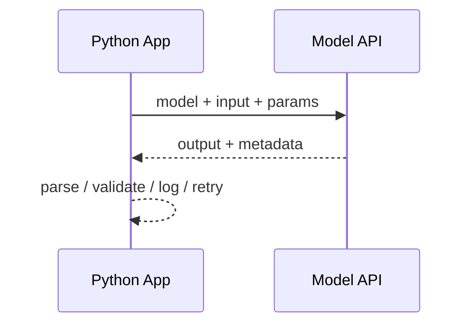

# 模型 API 调用基础

## 本章目标

这一章要把“会发一个请求”升级成“理解模型调用的工程入口”。

读完后你应该能：

- 理解一次模型 API 调用的完整组成
- 会写单轮与多轮消息调用
- 理解角色消息、模型参数、异常处理的意义
- 封装一个更接近项目代码的模型服务层

---

## 为什么这一章比看起来重要

很多人会觉得模型 API 调用很简单，不就是：

- 写 API Key
- 发请求
- 拿结果

但真实项目里，这一步其实是整个系统的入口，后面的这些能力都建立在这里：

- Prompt 注入
- 结构化输出
- Tool Calling
- RAG
- Agent
- 日志 / 重试 / 缓存

所以这一章不只是“教你调接口”，而是在帮你建立整个应用链路的入口认知。

---

## 一次调用到底发生了什么



这张图表达的是：

- 模型调用不是孤立动作
- 它后面通常还有解析、校验、日志和错误处理

---

## 1. 最小单轮调用

```python
from openai import OpenAI
from dotenv import load_dotenv
import os

load_dotenv()

client = OpenAI(
    base_url=os.getenv("OPENAI_BASE_URL"),
    api_key=os.getenv("OPENAI_API_KEY")
)

response = client.responses.create(
    model=os.getenv("OPENAI_MODEL"),
    messages=[{ "role": "user", content: "请用中文解释什么是 Prompt Engineering。"}],
)

print(response.output_text)
```

这个例子虽然简单，但已经包含三个基础要素：

- `client`
- `model`
- `messages`

---

## 2. 为什么更推荐理解“消息结构”而不是只写字符串

在真实系统里，输入往往不只是一个纯字符串，而是消息数组。

原因是：

- 你需要 system prompt
- 你需要用户问题
- 你可能还需要历史对话

也就是说，更接近实际的输入是：

```python
messages = [
    {
        "role": "system",
        "content": "你是一名面向前端工程师授课的 LLM 老师。",
    },
    {
        "role": "user",
        "content": "请比较 Prompt、RAG 和 Agent 的区别。",
    },
]
```

---

## 3. system / user / assistant 三种角色消息

### system

用来控制整体行为。

例如：

- 输出风格
- 任务边界
- 约束条件

### user

用户本轮输入。

### assistant

用于保留历史多轮对话内容。

这三类角色在后续的 Prompt、RAG、Agent 中都会频繁出现。

---

## 4. 多轮消息调用示例

```python
messages = [
    {
        "role": "system",
        "content": "你是一名面向前端工程师授课的 LLM 老师，回答要清晰分点。",
    },
    {
        "role": "user",
        "content": "请比较 Prompt、RAG 和 Agent 的区别。",
    },
]

response = client.responses.create(
    model=os.getenv("OPENAI_MODEL"),
    messages=messages,
)

print(chat_response.choices[0].message.content)
```

这段代码已经比“只传一个字符串”更接近真实应用写法。

---

## 5. 模型参数怎么理解

不同平台参数名字会略有差异，但核心思路通常类似。

### model

决定：

- 能力
- 成本
- 延迟

### temperature

一般来说：

- 越低越稳定
- 越高越发散

对于：

- 分类
- 结构化输出
- 工具调用

通常更倾向低一些。

### max output tokens

用来限制输出长度，防止模型生成过长内容。

---

## 6. 一个更像项目代码的模型服务封装

```python
import os
from  openai import OpenAI
from dotenv import load_dotenv

# https://hf-mirror.com 修改模型源
os.environ["HF_ENDPOINT"] = "https://hf-mirror.com"

load_dotenv()

class ChatService:
    def __init__(self):
        self.model = os.getenv("OPENAI_MODEL")
        self.client = OpenAI(
            base_url=os.getenv("OPENAI_BASE_URL"),
            api_key=os.getenv("OPENAI_API_KEY")
        )
    def ask(self, messages: list[dict], temperature: float = 0.2)  -> str:
        response = self.client.responses.create(
            model=self.model,
            messages=messages,
            temperature=temperature,
        )
        return response.choices[0].message.content
    # 模型调用失败处理
    def safe_ask(self, messages: list[dict]) -> str:
        try:
            return self.ask(messages)
        except Exception as exc:
            return f"模型调用失败: {exc}"
```

这个封装比直接在业务代码里裸写请求更稳妥，因为后续你可以更容易加：

- 日志
- 重试
- fallback
- token 统计

---


## 7. 两个业务案例

### 案例一：需求分析助手

```python
messages = [
    {
        "role": "system",
        "content": "你是一名资深技术方案顾问，请输出问题定义、风险点和 MVP 建议。",
    },
    {
        "role": "user",
        "content": "我们想做一个企业知识问答机器人，优先支持制度问答。",
    },
]
```

这个例子体现的是：

- system 控制输出结构和任务视角
- user 提供真实需求

### 案例二：前端报错解释助手

```python
messages = [
    {
        "role": "system",
        "content": "你是一名前端排障助手，回答时要先定位问题，再给修复建议。",
    },
    {
        "role": "user",
        "content": "Vite 打包后访问页面白屏，控制台提示 chunk load error。",
    },
]
```

这个例子体现的是：

- 模型调用本身已经可以承担业务分析角色
- 后续再接结构化输出或工具调用，就会更强

---

## 8. 一个更完整的最小主程序

```python
import os
from  openai import OpenAI
from dotenv import load_dotenv

# https://hf-mirror.com 修改模型源
os.environ["HF_ENDPOINT"] = "https://hf-mirror.com"

load_dotenv()

class ChatService:
    def __init__(self):
        self.model = os.getenv("OPENAI_MODEL")
        self.client = OpenAI(
            base_url=os.getenv("OPENAI_BASE_URL"),
            api_key=os.getenv("OPENAI_API_KEY")
        )
    def ask(self, messages: list[dict], temperature: float = 0.2)  -> str:
        response = self.client.chat.completions.create(
            model=self.model,
            messages=messages,
            temperature=temperature,
        )
        return response.choices[0].message.content
    # 模型调用失败处理
    def safe_ask(self, messages: list[dict]) -> str:
        try:
            return self.ask(messages)
        except Exception as exc:
            return f"模型调用失败: {exc}"

messages = [
    {"role": "system", "content": "你是一名 AI 架构讲师，回答要分点清晰。"},
    {"role": "user", "content": "请解释 Prompt、RAG、Agent 之间的关系。"},
]
chat_service = ChatService()
print(chat_service.ask(messages))
```

这个版本已经足够作为很多章节后续代码实验的基础入口。

---

## 9. 常见坑

### 坑一：把输入当成随便拼接的字符串

更好的方式通常是：

- system
- user
- history

结构化表达。

### 坑二：完全不做异常处理

一旦模型接口失败，整个链路就崩了。

### 坑三：业务代码里到处写模型调用细节

后期加日志、重试、版本化时会很难改。

### 坑四：不理解模型参数，只知道复制代码

后续做结构化输出、工具调用、RAG 时，你会越来越需要理解参数的取舍。

---

## 10. 前端工程师应该怎么理解这一章

你可以把模型 API 调用理解成：

- 一种新的后端服务能力
- 一种带概率性的智能接口

而你后续要做的事情，本质上就是：

- 用更好的输入协议控制它
- 用更好的系统设计约束它
- 用更好的工程方式接住它

---

## 本章小结

这一章最重要的结论有这些：

- 模型调用是整个 LLM 应用链路的入口
- 多轮消息结构比纯字符串更接近真实工程写法
- 角色消息、模型参数、异常处理都不是细枝末节
- 尽早封装模型服务层，会让你后续接 Prompt、RAG、Tool Calling、Agent 更顺畅

---

## 练习题

1. 写一个最小单轮调用脚本
2. 改写成 `system + user` 的消息数组形式
3. 封装一个 `ChatService`
4. 给调用加上异常处理
5. 分别写一个“需求分析助手”和“前端报错助手”的消息输入

---

## 下一章

基础调用理解清楚以后，就可以把控制模型行为这件事讲深一点：[Prompt 工程导论](./prompt/index)
