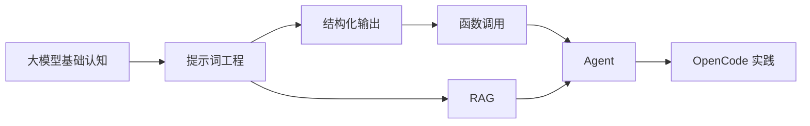

# OpenCode 学习导读

## 先把它想简单

前面你学的大模型知识，更多是在理解：

- 大模型是什么
- 提示词工程是什么
- Function Call 是什么
- RAG 是什么
- Agent 是什么

但如果只停留在概念层面，你会很容易出现一种感觉：

> 好像懂了，但不知道在真实开发里怎么用。

`OpenCode` 这一部分，就是帮助你把前面学到的能力，慢慢放到一个真实工具里去理解。

你可以先把 OpenCode 想成：

> 一个可以在命令行里和 AI 协作开发的工具。

它不只是聊天，还可以：

- 理解项目代码
- 帮你分析需求
- 帮你修改文件
- 帮你规划实现步骤
- 在不同模式下协助开发

所以你可以把这一部分理解成：

> 从“学概念”走向“学怎么在开发里使用 AI”。

---

## 为什么要学 OpenCode

很多人学大模型时，停留在网页聊天工具阶段。

这样虽然能提问，但离真实开发场景还有距离。

因为在真实开发里，你更关心的是：

- 它能不能理解我的项目
- 它能不能帮我分析代码
- 它能不能给我制定实现方案
- 它能不能直接帮我修改文件
- 它能不能和我一起完成开发任务

而 OpenCode 这类工具，正是在解决这些问题。

它让大模型从“会聊天”变成“会参与开发流程”。

---

## OpenCode 在这条学习路线里处在什么位置

你可以把前面的内容和这里连起来看：

- 提示词工程：教你怎么和模型说清楚任务
- 结构化输出：让模型输出更稳定
- Function Call：让模型会调用工具
- RAG：让模型会查资料
- Agent：让模型围绕目标组织流程

而 OpenCode 更像是：

> 把这些能力放进真实开发工具里，变成可落地的工作流。

所以这一部分不是新的理论起点，而是“实践导向的学习部分”。

---

## 学 OpenCode 时，你最应该关注什么

不要只盯着“命令怎么敲”，更重要的是理解它背后的协作方式。

你要重点关注：

- 它怎么理解项目上下文
- `plan` 模式和 `build` 模式有什么区别
- 它怎么帮助你先规划，再执行
- 它怎么在工程场景里使用大模型能力

也就是说，这一部分最重要的不是记命令，而是理解：

> 怎么把 AI 变成真正的开发搭档。

---

## 这一部分建议怎么读

目前这部分内容，最推荐你按这个顺序读：

1. `docs/large-model/opencode/opencode.mdx`
2. `docs/large-model/opencode/setting.mdx`

### 为什么先读 `opencode.mdx`

因为这一篇更像“上手导论”，会先带你理解：

- OpenCode 是什么
- 怎么安装
- 怎么启动
- 怎么切换模型
- `plan` 和 `build` 模式怎么用

### 为什么再读 `setting.mdx`

因为当你已经会用基础功能后，才更适合去看：

- 配置文件在哪里
- Provider 怎么配置
- 模型怎么自定义
- 配置优先级是什么

这个顺序会更符合学习曲线。

---

## 你在这一部分能获得什么

如果你顺着这部分学下来，你会逐步建立下面这些能力：

- 知道如何把 AI 引入命令行开发流程
- 知道如何切换和连接不同模型
- 知道如何让 AI 先规划，再执行修改
- 知道如何在项目上下文里与 AI 协作
- 知道如何配置自己的模型和工具环境

这些能力会把你从：

- “会问 AI 问题”

带到：

- “会用 AI 参与真实开发”

---

## 一张图看懂 OpenCode 在整条路线里的位置

这张图想表达的是：

- 前面学的是能力原理
- OpenCode 学的是把这些能力放进真实开发工具中使用

---

## 如果你现在是初学者，最适合怎么学这一部分

### 第一步：先把它当成开发助手，而不是神奇黑盒

你不需要一上来就把 OpenCode 想得特别复杂。

先把它理解成：

> 一个能读项目、会规划、能改代码的 AI 命令行助手。

### 第二步：先学基础操作，再理解背后模式

先学：

- 安装
- 启动
- 切换模型
- 连接模型

再去理解：

- 为什么有 `plan`
- 为什么有 `build`
- 为什么需要在工程上下文中工作

### 第三步：把它和你前面学过的内容连接起来

当你看到它能：

- 分析任务
- 修改文件
- 利用上下文
- 做多步协作

你就会更容易明白：

> 这其实是在真实场景里使用 Prompt、Agent、工具调用这些能力。

---

## 这一部分最推荐的阅读目标

你读完这里后，最好能回答这些问题：

- OpenCode 是什么
- 它和普通聊天式 AI 工具有什么不同
- 为什么 `plan` 和 `build` 要分开
- 它怎么帮助你参与真实开发流程
- 怎么配置自己的模型环境

如果这些问题你能说清楚，说明这部分你就真正入门了。

---

## 一句话总结

OpenCode 实践这一部分的本质就是：

> 把你前面学到的大模型能力，放进一个真实的开发协作工具里，从“理解概念”走向“真正会用”。
