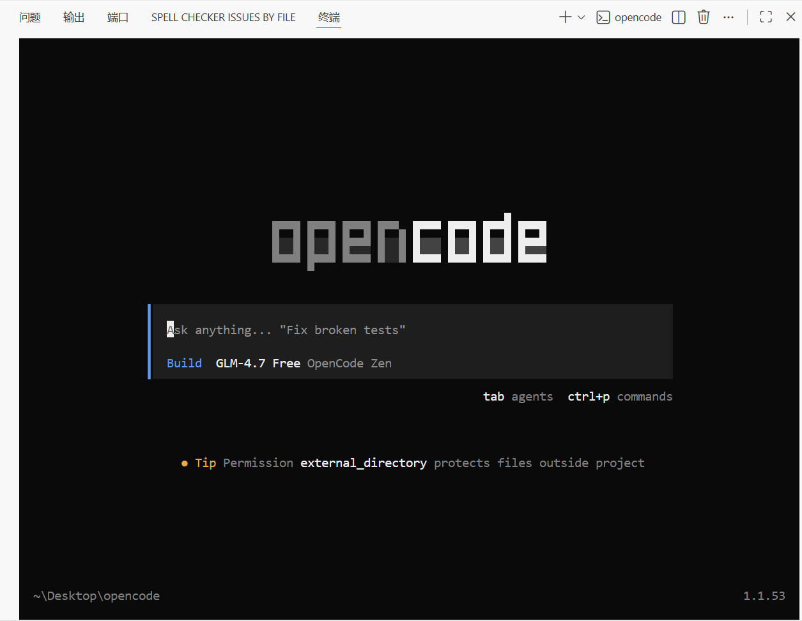
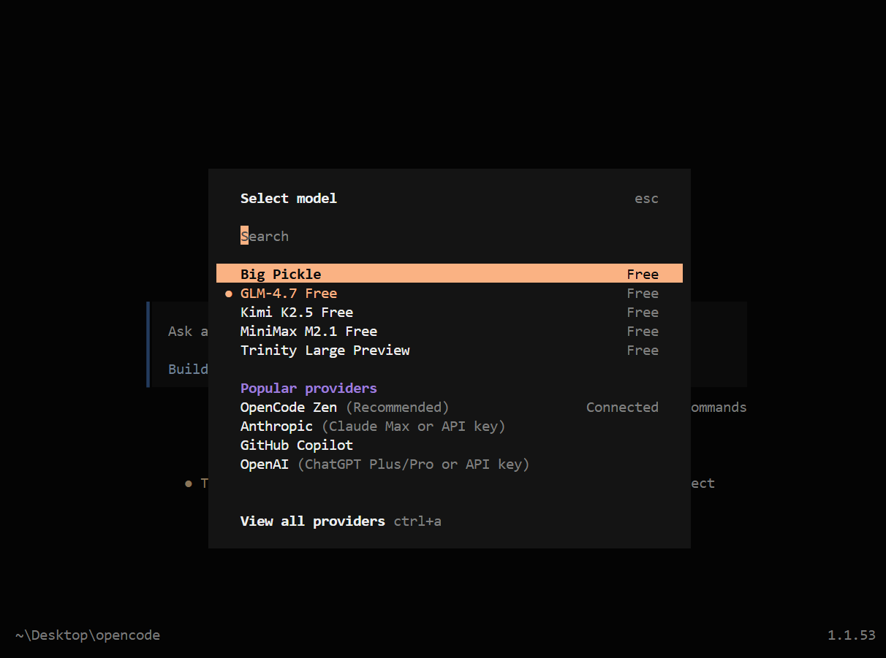
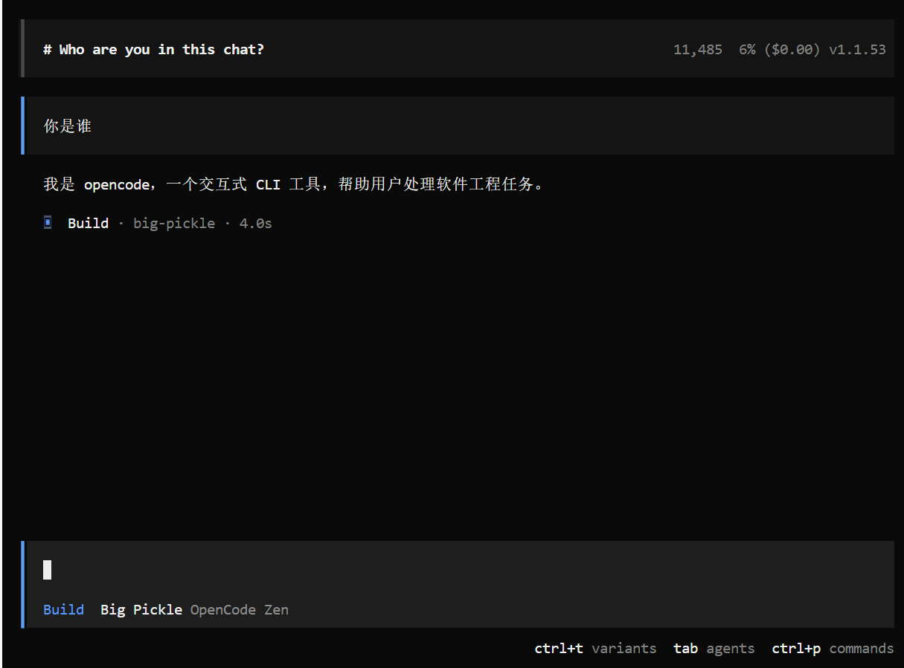
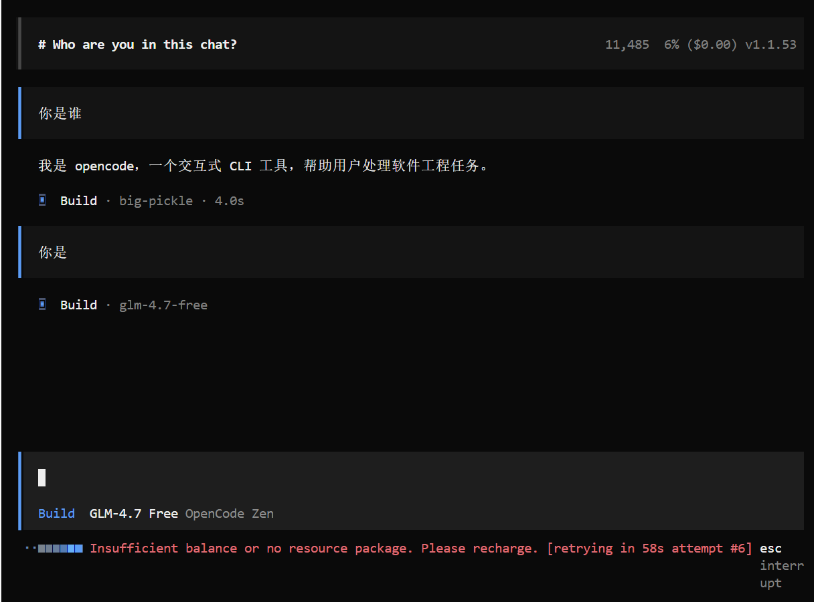
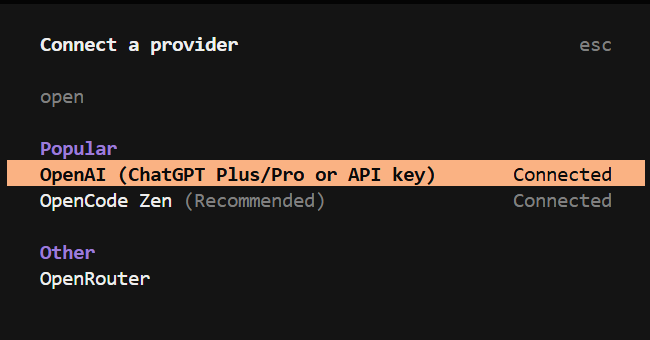
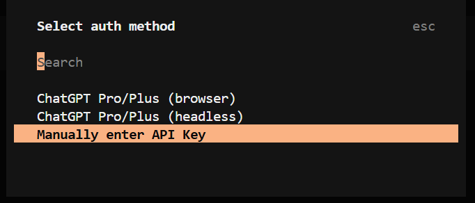
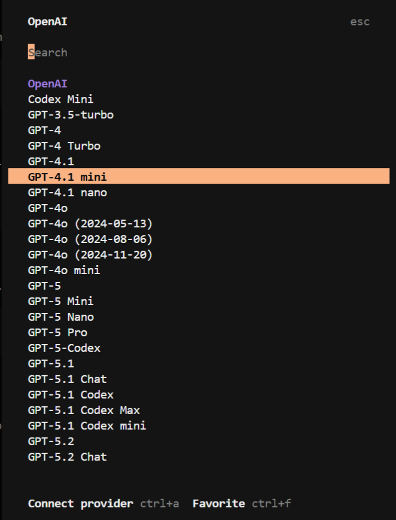
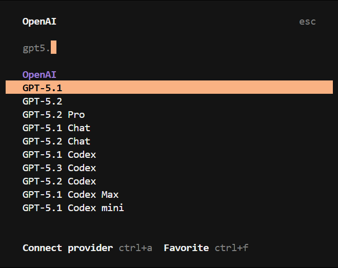
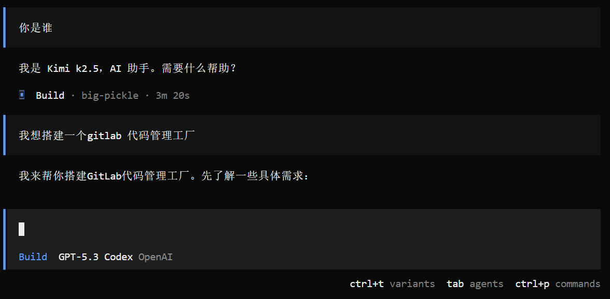

# OpenCode 上手指南

## 先把它想简单

如果你已经学过：

- 提示词工程
- 结构化输出
- Function Call
- RAG
- Agent

那你现在最自然会进入一个问题：

> 这些能力在真实开发里，到底怎么用？

`OpenCode` 就是一个很适合把这些能力放进真实开发流程里理解的工具。

你可以先把它想成：

> 一个运行在命令行里的 AI 开发助手。

它不只是和你聊天，而是可以：

- 理解项目代码
- 帮你分析需求
- 帮你制定实现计划
- 帮你修改文件
- 在项目上下文里持续协作

所以这篇内容的重点不是只告诉你“怎么安装”，而是帮你理解：

> OpenCode 在开发里到底怎么用。

---

## OpenCode 最适合用来做什么

OpenCode 很适合下面这些场景：

- 阅读和理解一个已有项目
- 先分析需求，再规划实现步骤
- 根据计划修改代码
- 查询项目里的某个文件或模块
- 在终端里和 AI 持续协作开发

如果你只是偶尔问一个问题，用普通网页聊天工具也许就够了。

但如果你希望 AI 真正进入你的开发流程，那 OpenCode 这类工具就会更有价值。

---

## 安装 OpenCode

安装方式有多种，你可以根据自己的系统和习惯来选。

### Windows

如果你在 Windows 上习惯用 `bun` 管理全局包，可以这样安装：

```bash
powershell -c "irm bun.sh/install.ps1 | iex"
bun add -g opencode-ai
```

如果你更习惯 `npm`，也可以：

```bash
npm i -g opencode-ai
```

如果你想走脚本安装，也可以：

```bash
curl -fsSL https://opencode.ai/install | bash
```

### macOS

如果你在 macOS 上，通常最自然的方式是：

```bash
brew install opencode-ai
```

---

## 安装完成后第一步做什么

安装完成后，先不要急着研究配置文件。

你最推荐先做的是：

```bash
opencode
```

先确认它能不能正常启动。

如果能正常进入界面，说明最基础的安装已经没问题。

你原来的截图这里仍然是有用的，可以帮助读者建立“第一次打开长什么样”的直觉：



---

## 第一次使用时，你最需要理解什么

很多初学者第一次打开 OpenCode，会被很多命令和模式搞懵。

其实你最先只需要理解 3 件事：

1. 它当前连接的是哪个模型
2. 它现在是 `plan` 还是 `build` 模式
3. 它是不是已经拿到了项目上下文

这 3 件事理解了，后面大多数操作都会顺很多。

---

## 怎么切换模型

最常用的命令之一就是：

```bash
/models
```

这个命令用来查看和切换当前可用模型。

你原来的这部分经验非常有价值：

- 有些模型后面会标 `Free`
- 免费模型不一定一直稳定可用
- 如果资源不足，可能会报错

下面这些截图可以继续保留，它们对新手很直观：





---

## 如果模型报错怎么办

有时候你切换到某个模型后，会遇到类似这样的报错：

```text
Insufficient balance or no resource package. Please recharge.
```

它的意思通常是：

- 当前账户余额不足
- 或者这个模型对应的资源包不可用

这不一定是 OpenCode 本身坏了，而可能只是：

> 当前这个模型暂时用不了，需要切换模型或重新配置 Provider。

你原来的错误截图这里也很适合保留：



### 这时候怎么做

最简单的处理方式通常是：

1. 退出当前模型
2. 再次执行 `/models`
3. 换一个可用模型
4. 如果没有合适模型，再去 `/connect` 自己连接 Provider

---

## 怎么连接自己的模型

如果默认模型不合适，或者你想接入自己的 `OpenAI`、其他平台或自建接口，就需要用：

```bash
/connect
```

这个命令可以帮助你连接新的模型来源。

例如你想接入 OpenAI，就可以在连接列表里选择相应 Provider。

你原来的这条路径对新手很清楚：

1. 输入 `/connect`
2. 选择 `OpenAI`
3. 选择手动输入 API Key
4. 选择模型

这些截图都建议保留，因为它们非常适合当“第一次连接模型”的图文教程：











---

## 最常用的几个命令

刚开始时，不需要记很多命令。

你最常用的其实就这几个：

```bash
/models   # 切换模型
/connect  # 连接模型
/init     # 初始化项目分析，并在根目录创建 AGENTS.md
/undo     # 撤销上一次修改
/redo     # 重做上一次撤销
/share    # 分享当前会话
```

如果你能先把这几个命令用熟，已经够你完成大部分基础上手了。

---

## `@` 有什么用

你原来提到的 `@` 这个点也很重要，初学者非常需要知道。

你可以把 `@` 理解成：

> 在项目中快速引用文件或搜索文件上下文。

它的作用是帮助你更快地把“项目上下文”交给 OpenCode。

这很关键，因为在工程场景里，AI 能不能给出靠谱帮助，很大程度上取决于：

> 它有没有看到正确的文件和上下文。

---

## `plan` 和 `build` 是什么意思

这部分是 OpenCode 最值得理解的地方之一。

因为它不只是一个功能切换，而是两种完全不同的协作模式。

### `plan` 模式

你可以把它理解成：

> 先规划，不动手。

在这个模式下，OpenCode 更像一个技术顾问。

它会：

- 理解你的需求
- 分析项目上下文
- 给出实现思路
- 帮你拆步骤

但它不会直接改文件。

### `build` 模式

你可以把它理解成：

> 进入执行，开始动手。

在这个模式下，OpenCode 才更像一个真正参与开发的助手。

它会：

- 修改代码
- 新增文件
- 调整项目内容
- 直接按需求实现功能

### 为什么要分这两种模式

因为真实开发里，很多时候最危险的不是“不会改”，而是：

> 还没想清楚，就直接乱改。

所以一个很好的工作习惯是：

1. 先用 `plan` 把事情想清楚
2. 再切到 `build` 让它执行

这会让你和 AI 的协作更稳定，也更像真实开发流程。

---

## 一个推荐的使用习惯

如果你是刚开始用 OpenCode，我很推荐你养成下面这个节奏：

### 第一步：先交代上下文

告诉它：

- 这是个什么项目
- 你要改哪里
- 你想实现什么
- 相关文件有哪些

### 第二步：先进入 `plan`

让它先：

- 分析需求
- 给出方案
- 说明会改哪些文件

### 第三步：你看完方案后，再进入 `build`

让它根据计划真正开始修改。

### 第四步：有问题就用 `/undo` 和 `/redo`

这样就形成了一个很自然的 AI 协作闭环。

---

## 用一个简单场景来理解

假设你正在做一个博客项目，你想让 OpenCode：

`帮我新增一篇 RAG 学习笔记，并保持和现有文档风格一致。`

这时更推荐的方式不是一上来就让它改，而是：

### 先在 `plan` 模式下

让它先回答：

- 应该改哪些文件
- 风格怎么保持一致
- 要不要补导航
- 文档结构怎么组织

### 再切到 `build` 模式

让它去真正创建和修改文件。

你会发现：

> 当你先规划再执行时，OpenCode 的表现通常会稳很多。

---

## 实战中最容易遇到的 4 个问题

真正上手 OpenCode 时，最常见的问题往往不是“命令不会敲”，而是“协作方式不对”。

---

## 问题 1：一上来就让它直接改，结果改乱了

### 原因

上下文不够，目标不够清楚。

### 更好的做法

先用 `plan`，把任务讲清楚，再进入 `build`。

---

## 问题 2：模型切换了，但结果一直报错

### 原因

可能是：

- 模型不可用
- 余额不足
- Provider 没配置好

### 更好的做法

先确认模型是否可用，再检查 `/connect` 和配置。

---

## 问题 3：AI 回答得很多，但没抓住项目重点

### 原因

你没有给足项目上下文，或者没有明确指定目标文件。

### 更好的做法

多用：

- 文件路径
- `@` 引用文件
- 明确的任务描述

---

## 问题 4：改完以后不知道怎么回退

### 更好的做法

记住：

- `/undo` 用来撤销
- `/redo` 用来重做

这两个命令在实际协作里非常重要。

---

## 读完这一篇后，你应该掌握什么

如果你看懂了这一篇，最好已经能回答这些问题：

- OpenCode 是什么
- 怎么安装和启动
- 怎么切换模型和连接 Provider
- `plan` 和 `build` 的区别是什么
- 为什么它更像一个开发协作工具，而不只是聊天工具

如果这些问题你能说清楚，说明你已经完成了最基础的上手。

---

## 下一步最适合读什么

如果你已经看完这一篇，下一步最适合读的是：

`docs/large-model/opencode/setting.mdx`

因为当你已经知道 OpenCode 怎么启动、怎么连模型、怎么协作后，下一步自然就是：

> 那我怎么把自己的模型、Provider 和配置管理得更清楚？

这就会进入配置部分。

---

## 一句话总结

OpenCode 上手指南的本质就是：

> 先学会把 OpenCode 当成一个真实开发搭档来使用，而不只是把它当成一个会聊天的 AI 工具。
