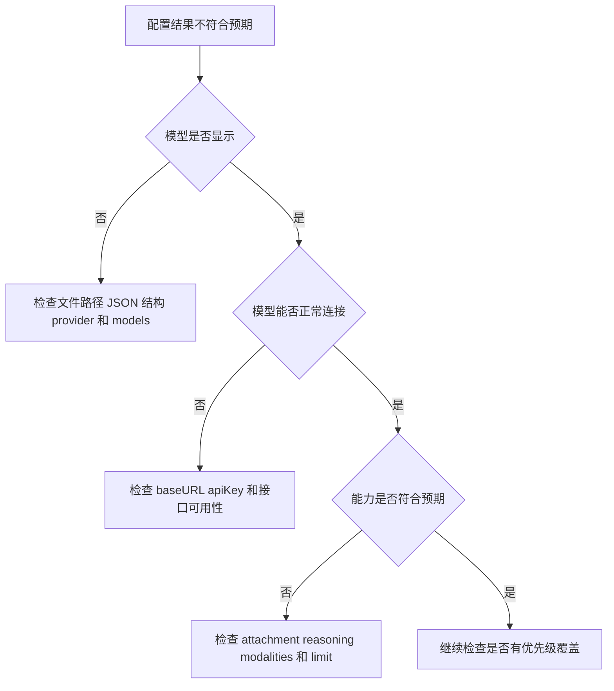

# OpenCode 配置指南

## 先把它想简单

如果说 `docs/large-model/opencode/opencode.mdx` 解决的是：

> OpenCode 怎么安装、怎么启动、怎么上手用。

那这一篇主要解决的是另一个问题：

> 当你不满足于默认环境时，怎么自己配置 OpenCode。

你可以先把配置理解成：

- 连接哪个模型 Provider
- 用什么 API Key
- 支持哪些模型
- 项目和全局配置谁优先
- 本地有哪些额外能力目录

这篇内容更偏“进阶使用”，但依然非常重要。

因为当你真的开始长期使用 OpenCode 时，配置往往决定了：

> 你能不能把它变成适合自己工作流的工具。

---

## 官方文档

如果你后面要查更完整的配置细节，可以看官方文档：

[官方文档](https://opencode.ai/docs/config/)

但如果你是第一次接触，建议先把这篇看懂，再回头看官方文档。

因为官方文档更像参考手册，而这篇更像学习导读。

---

## 配置文件在哪里

最先要搞清楚的是：

> OpenCode 的配置文件放在哪。

### Windows

Windows 常见位置是：

`%USERPROFILE%\.opencode\config.json`

如果你是用 `bun` 安装后，发现 `.opencode` 目录里还没有 `config.json`，那通常可以手动创建。

### macOS

macOS 常见位置是：

`~/.opencode/config.json`

### 你要先理解什么

配置文件本质上就是 OpenCode 的“全局设置入口”。

很多你平时在界面里点选的东西，最终都可以沉淀到配置文件里统一管理。

---

## 一个最小配置长什么样

下面是一个示例配置：

```json
{
  "$schema": "https://opencode.ai/config.json",
  "plugin": ["oh-my-opencode@3.1.2"],
  "provider": {
    "Mify-OpenAI": {
      "npm": "@ai-sdk/openai",
      "options": {
        "baseURL": "http://www.baidu.com",
        "apiKey": "sk-..."
      },
      "models": {
        "azure_openai/gpt-5.1-codex": {
          "name": "GPT-5.1 Codex",
          "attachment": true,
          "reasoning": true,
          "modalities": {
            "input": ["text", "image"],
            "output": ["text"]
          },
          "limit": {
            "context": 1000000,
            "output": 128000
          }
        }
      }
    }
  }
}
```

先不要被这段 JSON 吓到。

你在学习阶段，只要先看懂 4 个核心部分就够了：

- `$schema`
- `plugin`
- `provider`
- `models`

---

## 这份配置到底在表达什么

你可以把上面这份 JSON 理解成：

> 我在告诉 OpenCode：我想接什么服务、有哪些模型可用、这些模型有什么能力。

下面我们拆开来看。

---

## 1. `$schema` 是什么

这一项主要是告诉编辑器和工具：

> 这份配置应该遵循哪套结构规则。

对初学者来说，你可以先把它理解成“配置格式说明书入口”。

它的最大好处是：

- 编辑器更容易提示字段
- 更不容易写错配置结构

---

## 2. `plugin` 是什么

这一项表示你启用了哪些插件。

例如：

```json
"plugin": ["oh-my-opencode@3.1.2"]
```

你可以先把插件理解成：

> 给 OpenCode 增加额外能力的扩展模块。

如果你是刚入门，这一块不用一开始就玩很复杂。

先知道“它支持插件机制”就够了。

---

## 3. `provider` 是什么

这一项非常关键。

因为它决定了：

> OpenCode 到底连接哪一家模型服务。

例如你可以连接：

- OpenAI 风格接口
- 某个中转服务
- 自建兼容接口

在示例里：

```json
"provider": {
  "Mify-OpenAI": {
    "npm": "@ai-sdk/openai",
    "options": {
      "baseURL": "http://www.baidu.com",
      "apiKey": "sk-..."
    }
  }
}
```

这可以简单理解成：

- `Mify-OpenAI`：这是你给这个 Provider 起的名字
- `npm`：说明它使用哪种接入实现
- `baseURL`：接口地址
- `apiKey`：访问密钥

### 你要理解的重点

Provider 解决的是“连到哪里”的问题。

---

## 4. `models` 是什么

如果说 `provider` 决定“连到哪一家”，那 `models` 决定的是：

> 这家服务里，你具体想开放哪些模型给 OpenCode 使用。

例如：

```json
"models": {
  "azure_openai/gpt-5.1-codex": {
    "name": "GPT-5.1 Codex",
    "attachment": true,
    "reasoning": true
  }
}
```

### 这里你可以先重点理解几个字段

- `name`：显示名称
- `attachment`：是否支持附件输入
- `reasoning`：是否支持推理能力
- `modalities`：支持的输入输出类型
- `limit`：上下文和输出限制

### 你要理解的重点

`models` 解决的是“这家服务里，哪些模型能给我用、它们能力如何”的问题。

---

## 为什么配置模型能力也很重要

很多人只关心“模型名”，但忽略了能力描述。

例如：

- 有些模型支持图片输入
- 有些模型上下文很长
- 有些模型更擅长推理
- 有些模型输出长度有限

这些信息会直接影响你在 OpenCode 中的实际体验。

所以配置不只是“填个 key”，而是在定义：

> 这个模型在我的工作流里能做什么。

---

## 配置文件优先级

这部分也非常重要，因为很多“我明明改了配置为什么没生效”的问题，都和优先级有关。

常见优先级顺序如下：

1. 远程配置（`.well-known/opencode`）
2. 本地全局配置（`~/.opencode/config.json`）
3. 环境配置（`OPENCODE_CONFIG`）
4. 项目本地配置（`./opencode.json`）
5. 内联配置（`--config`）

你可以先不用死背，但一定要理解一个原则：

> 同一个配置项，越靠后的局部配置，往往越容易覆盖前面的全局配置。

---

## 怎么理解这些优先级

你可以把它想成“谁离当前执行更近，谁更有机会生效”。

例如：

- 全局配置像“默认习惯”
- 项目配置像“这个项目单独规定”
- 命令行内联配置像“这次临时特殊指定”

所以如果你发现某项配置和你预期不一致，不要只盯一个文件看。

要同时想：

- 有没有项目本地配置覆盖了全局配置
- 有没有环境变量在起作用
- 有没有命令行临时参数覆盖了前面的配置

---

## `.opencode` 目录里还会放什么

除了 `config.json`，`.opencode` 目录还可能存放很多扩展内容。

例如：

- `agents/`
- `commands/`
- `plugins/`
- `modes/`
- `skills/`
- `tools/`
- `themes/`

这些目录说明 OpenCode 不只是“一个命令”，而是一个可以不断扩展的工作平台。

你现在不用一口气全部学会，但要先建立这个感觉：

> 它是可配置、可扩展、可组织工作流的。

---

## 一个最常见的使用场景

假设你有自己的模型服务，想让 OpenCode 统一接入。

这时一个很常见的思路就是：

### 第一步：先配置 Provider

写清楚：

- 接口地址
- API Key
- 接入方式

### 第二步：再配置模型

写清楚：

- 模型名字
- 显示名
- 是否支持附件
- 上下文大小

### 第三步：启动 OpenCode 测试

确认：

- 模型能否显示
- 是否能正常响应
- 是否支持你需要的能力

这就是一条非常典型的配置闭环。

---

## 实战中最容易遇到的 4 个问题

配置类问题通常不是“不会写”，而是“哪里覆盖了哪里”或者“字段含义没搞清楚”。

---

## 问题 1：我明明写了配置，但模型没出现

### 可能原因

- `provider` 没写对
- `models` 结构不对
- 配置文件路径不对
- 被别的配置覆盖了

### 你应该先检查什么

- 文件位置对不对
- JSON 结构对不对
- 模型是不是定义在正确的 Provider 下

---

## 问题 2：API Key 填了，但还是连不上

### 可能原因

- `baseURL` 错了
- key 无效
- 服务端本身不可用
- 接口不兼容

### 你要理解

这类问题很多时候不是 OpenCode 本身坏了，而是接入链路有问题。

---

## 问题 3：明明改了全局配置，但项目里没生效

### 可能原因

- 项目本地配置覆盖了全局配置
- 环境变量覆盖了文件配置
- 命令行参数临时覆盖了配置

### 你要理解

这就是“配置优先级”最典型的坑。

---

## 问题 4：模型能连上，但能力和预期不一致

例如：

- 你以为支持附件，其实没开
- 你以为上下文很大，其实限制很小
- 你以为支持推理，其实配置没声明

### 你要理解

模型“能不能用”和“好不好用”是两回事。

配置里对能力的描述，也会影响实际使用体验。

---

## 一张图学会排查配置问题



---

## 如果你是初学者，最推荐怎么学配置

### 第一步：先学会看懂配置，而不是一上来追求复杂

你先只要看懂：

- 配置文件在哪
- provider 是什么
- models 是什么

### 第二步：先从一个最小可用配置开始

不要一开始就塞很多插件、很多模型、很多自定义项。

先让一个模型稳定可用，再慢慢加。

### 第三步：遇到问题优先从“路径、结构、优先级”排查

很多配置问题，不是概念问题，而是：

- 文件放错了
- JSON 写错了
- 被别的配置覆盖了

---

## 读完这一篇后，你应该掌握什么

如果你看懂了这一篇，最好已经能回答这些问题：

- OpenCode 配置文件放在哪
- `provider` 和 `models` 分别负责什么
- 为什么模型能力描述也很重要
- 配置优先级为什么会影响结果
- 遇到配置问题时该从哪里开始排查

如果这些问题你能讲清楚，说明你已经不只是“会复制配置”，而是真的开始理解配置系统了。

---

## 一句话总结

OpenCode 配置指南的本质就是：

> 搞清楚 OpenCode 到底连谁、用什么模型、哪些配置会生效，这样你才能把它真正变成适合自己工作流的开发工具。
