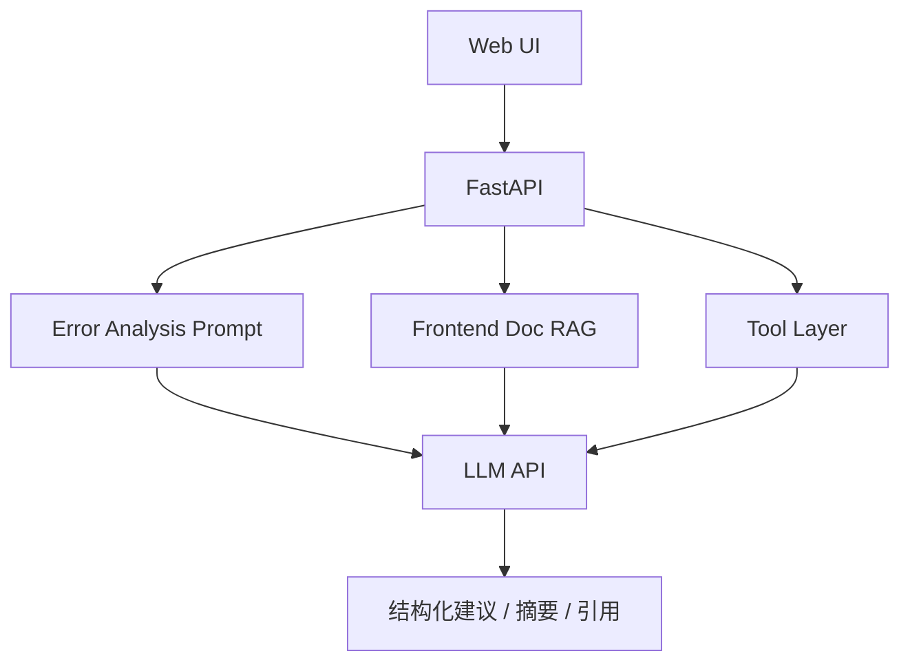

# 前端研发 Copilot 项目

## 项目目标

这个项目的目标是：围绕前端研发场景，做一个 AI 辅助系统，帮助解决你最熟悉的问题，例如：

- 报错分析
- 构建问题排查
- PR 摘要生成
- 文档检索
- 修复建议输出

这是非常适合你当前背景的项目，因为它可以自然把“前端经验”和“LLM 能力”结合起来。

---

## 一、为什么这个项目最容易做出差异化

因为很多人做 AI 项目时，场景都很泛：

- 通用聊天
- 通用问答
- 通用助手

而你如果做一个“前端研发 Copilot”，面试官会更容易感受到：

- 你不是为了转型硬做一个 AI 项目
- 你是在做“自己熟悉领域的 AI 增强系统”

这会非常自然。

---

## 二、可选的功能范围

你不需要一次全做完，可以从下面选 2 到 3 个功能做 MVP：

- 输入报错日志，输出排查建议
- 输入 PR diff 摘要，输出变更说明
- 输入问题关键词，检索内部前端规范文档
- 输入错误现象，输出可能原因和修复步骤

---

## 三、系统架构图



---

## 四、为什么它适合做作品集第三项目

因为这个项目很容易展示你的原有优势：

- 你知道前端团队常见问题是什么
- 你知道用户如何阅读排障建议
- 你知道怎样把 AI 结果做成更实用的交互界面

这会让你的作品集形成差异化组合：

- 一个 RAG 项目
- 一个 Agent 项目
- 一个领域型 Copilot 项目

---

## 五、MVP 版本建议

建议先选一个垂直子场景，比如：

### 方向一：错误排查助手

输入：

- 错误日志
- 现象描述

输出：

- 可能原因
- 排查步骤
- 修复建议

### 方向二：研发文档助手

输入：

- 问题描述

输出：

- 基于前端规范文档的回答
- 引用来源

### 方向三：PR 摘要助手

输入：

- diff 摘要或变更描述

输出：

- PR Summary
- 风险点
- 测试建议

---

## 六、推荐目录结构

```text
frontend-copilot/
  app/
    main.py
    api/
      routes.py
    llm/
      prompts.py
      schemas.py
      service.py
    rag/
      retriever.py
    tools/
      error_code.py
      build_info.py
    core/
      config.py
      logger.py
  frontend/
  docs/
  tests/
```

---

## 七、建议重点展示哪些技术点

这个项目不需要什么都做，但建议至少体现 3 个能力：

1. Prompt / Structured Output
2. RAG 或知识检索
3. 前端交互设计

如果你再补一个工具层，就更完整了。

---

## 八、一个结构化输出示例

```python
from pydantic import BaseModel


class FixSuggestion(BaseModel):
    issue_type: str
    possible_causes: list[str]
    investigation_steps: list[str]
    suggested_fix: str
```

这个结构很适合错误分析场景，也很适合做前端展示。

---

## 九、前端展示建议

这个项目是你最应该把 UI 做好的一个，因为这是你的强项。

建议页面支持：

- 粘贴错误日志
- 选择问题类型
- 查看结构化建议
- 展示引用文档来源
- 展示“复制建议”或“生成工单说明”按钮

如果页面交互做得好，它会比很多纯后端 AI 项目更有辨识度。

---

## 十、面试时怎么讲

你可以这样表达：

> 我做了一个前端研发 Copilot，核心目标是把大模型能力用在我熟悉的研发场景里。这个项目结合了结构化输出、研发知识检索和错误分析逻辑，重点不是做一个通用聊天页，而是提升研发团队在排障和文档使用中的效率。

这个说法会非常有辨识度。

---

## 十一、为什么这个项目很适合你

因为它能把你的前端背景转化成优势，而不是包袱。

你要让面试官看到的是：

- 你不只是“会前端的人来学 AI”
- 你是“懂前端业务场景、又会做 AI 应用的人”

这类复合型能力在团队里往往很有价值。

---

## 本章小结

这个项目是你最容易做出差异化的方向，特别适合当作第三个作品集项目，体现你把 LLM 能力嵌入熟悉业务场景的能力。

---

## 练习题

1. 在“错误排查”“研发文档问答”“PR 摘要”三个方向里选一个做 MVP
2. 定义一个结构化输出模型
3. 画一张系统架构图
4. 列出你准备做的前端交互点

---

## 下一章

项目准备好以后，最后要把这些内容翻译成求职语言： [就业路线与面试准备](../career)
