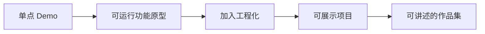

# 项目实战总览

## 本章目标

这一章的目标是把前面学到的 Prompt、RAG、Tool Calling、Agent、工程化能力，真正转化成作品集项目。

读完后你应该能：

- 知道什么样的项目更适合求职展示
- 理解项目选题、范围控制和分阶段实现的方法
- 建立“从单点 Demo 到完整作品集”的路线图

---

## 为什么项目是就业关键

如果你只是说：

- 我学过 RAG
- 我学过 Agent
- 我会 LangChain

这些在面试里说服力其实有限。

真正能帮助你拿到机会的，往往是：

- 你做过什么项目
- 这个项目解决什么问题
- 你为什么这么设计
- 你如何处理稳定性、日志、评测和成本问题

也就是说，企业最终看的是：

> 你能不能把知识点组合成可交付系统。

---

## 项目成长路线图

这个路线图很重要，因为很多人卡在两个极端：

- 要么只做很小的 Demo，展示不出深度
- 要么一上来想做太复杂，最后做不完

正确方式是逐步升级。

---

## 1. 什么样的项目更适合求职

适合作品集的项目，通常满足这 5 个特征：

1. 有明确业务场景
2. 技术链路完整
3. 能展示你的设计思考
4. 有前后端或系统交付感
5. 能在 3 到 5 分钟内讲清楚

---

## 2. 推荐的三类作品集项目

### 项目一：企业知识库问答助手

适合展示：

- RAG
- 检索优化
- 引用展示
- 评测和索引更新

### 项目二：客服 Ticket Agent

适合展示：

- Structured Output
- Tool Calling
- Agent
- 日志与护栏

### 项目三：前端研发 Copilot

适合展示：

- 你的原职业背景优势
- 研发场景理解
- FAQ / RAG / 工具 / 结构化建议的组合

---

## 3. 项目不要一开始就做太大

推荐按三阶段推进：

### 阶段一：MVP

先做最小闭环。

### 阶段二：增强版

再加日志、评测、引用、结构化输出。

### 阶段三：作品集版

最后补 README、架构图、演示页面、部署和讲解稿。

---

## 4. 作品集项目的标准结构

一个比较像样的项目，建议至少具备：

- 简洁清晰的页面或接口入口
- 明确的系统架构图
- README
- 一份可运行部署方式
- 核心能力说明
- 已知问题与后续优化

---

## 5. 面试官最关心你能讲什么

一个项目真正值钱，不是代码量多，而是你能把这些讲清楚：

- 为什么做这个项目
- 为什么选这个技术路线
- 系统链路是什么
- 哪些点效果最好，哪些点最难
- 你做了哪些工程化处理

---

## 本章小结

这一章最重要的结论是：

- 项目是把学习成果变成就业竞争力的关键环节
- 好项目不只是技术堆砌，而是业务、系统、工程化三者的结合
- 不要一口吃成胖子，分阶段迭代是更现实的路线

---

## 练习题

1. 从 3 个推荐方向里选 1 个，说明你为什么选它
2. 写出这个项目的 MVP 目标
3. 列出这个项目的 5 个核心功能

---

## 下一章

先从最经典、最适合入门求职的项目开始：[企业知识库问答项目](./rag-assistant-project)
