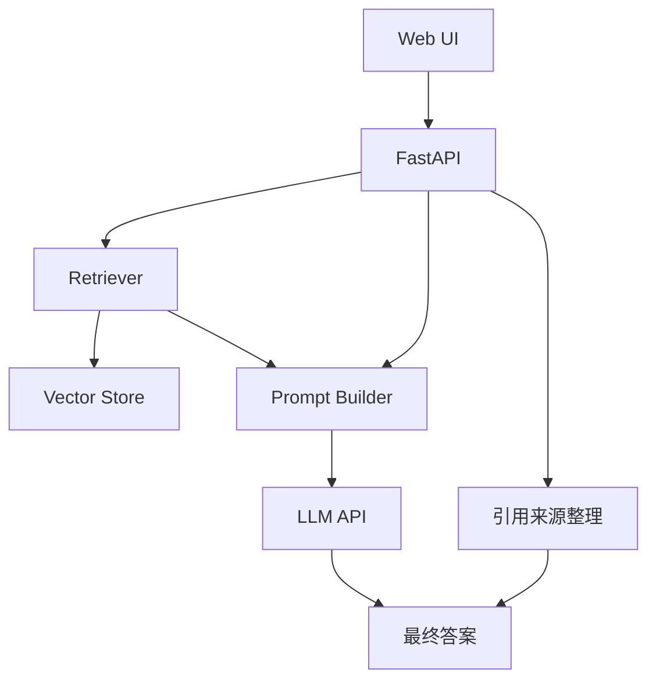

# 企业知识库问答项目

## 项目目标

这个项目的目标是做一个基于 RAG 的企业知识问答系统，面向的典型场景包括：

- 公司制度问答
- 产品文档问答
- FAQ 问答
- 内部知识库搜索助手

这是最适合前端工程师转 LLM 应用开发时作为第一个重点作品集项目的方向之一。

原因很简单：

- 业务价值清晰
- 技术链路完整
- 前后端都容易做展示
- 很适合体现 RAG 主线和工程化能力

---

## 一、为什么这个项目值得做

这个项目几乎能覆盖你在求职中最容易被问到的能力：

- 文档处理
- Chunking
- Embedding
- 检索与重排
- Prompt 约束
- 引用展示
- 评测
- 索引更新

也就是说，它不是一个“单点技巧项目”，而是一个完整系统项目。

---

## 二、系统架构图



这个架构足够清晰，也非常适合放进 README 和面试讲解里。

---

## 三、MVP 版本该做什么

### MVP 目标

只先完成一条最小闭环：

1. 导入一批文档
2. 做基础切块
3. 做 embedding 和检索
4. 基于检索片段回答问题
5. 在前端显示答案和来源标题

### MVP 不急着做的事

- 不急着做复杂 rerank
- 不急着做复杂权限系统
- 不急着做太多 fancy UI

先把主链路跑稳最重要。

---

## 四、推荐目录结构

```text
rag-assistant/
  app/
    main.py
    api/
      routes.py
    core/
      config.py
      logger.py
    rag/
      loader.py
      cleaner.py
      splitter.py
      embeddings.py
      retriever.py
      prompt_builder.py
      service.py
    schemas/
      qa.py
  data/
  frontend/
  tests/
  .env
```

这个结构的价值在于：

- 文档处理逻辑单独分层
- 方便你后续加评测和索引更新
- README 里看起来也更专业

---

## 五、核心实现步骤

### 第一步：准备知识源

推荐先选一类你容易拿到且结构清晰的文档：

- 公司制度示例文档
- 产品说明文档
- 自己整理的 FAQ Markdown

### 第二步：做最小清洗与切块

用你前面写过的：

- 文本清洗
- 去噪
- 固定长度或按段落切块

### 第三步：建立检索链路

- 生成 embedding
- 保存索引
- 用 top-k 做召回

### 第四步：拼接 Prompt

要求模型：

- 严格基于资料回答
- 不足则明确说明
- 尽量引用来源

### 第五步：前端展示结果

展示：

- 用户问题
- 最终答案
- 引用来源

---

## 六、一个最小服务接口示意

```python
from fastapi import FastAPI

app = FastAPI()


@app.post("/ask")
def ask_knowledge_base(payload: dict):
    question = payload["question"]
    # 这里省略检索和生成实现
    return {
        "answer": "根据制度规定，年假最多可结转 5 天。",
        "sources": [
            {
                "title": "员工年假制度",
                "snippet": "员工未休完的年假最多可结转 5 天。",
            }
        ],
    }
```

这个接口非常适合前后端联调，也很适合面试时解释系统输入输出。

---

## 七、前端展示建议

作为前端工程师，你在这个项目上最容易做出差异化。

建议前端至少包含：

- 左侧问题历史
- 右侧答案面板
- 来源卡片
- 引用片段高亮
- 失败时的兜底提示

如果做得更好一点，可以增加：

- “查看原文上下文”按钮
- 来源文档跳转
- 回答满意度反馈

---

## 八、第二阶段增强项

当 MVP 跑通后，可以继续做这些增强：

- 优化 chunking
- 加 metadata filter
- 加 query rewrite
- 加 rerank
- 加评测脚本
- 加索引更新时间显示
- 加引用来源展开

这些增强点非常适合写进 README 的“未来优化”部分。

---

## 九、工程化加分项

如果你想让项目更像真实系统，建议补这些：

- 基础日志
- 评测集
- 热门问题缓存
- 引用来源
- 更新索引脚本

这几项会显著提升项目质感。

---

## 十、README 推荐结构

建议这样写：

1. 项目背景
2. 系统架构图
3. 功能清单
4. 技术栈
5. 项目亮点
6. 本地运行方式
7. 效果截图
8. 已知问题与优化方向

---

## 十一、面试时可以怎么讲

你可以这样表达：

> 我做了一个企业知识库问答系统，重点不只是把 RAG 跑通，而是把文档处理、检索、回答约束、引用展示和基础评测串成了完整链路。这个项目让我比较系统地练到了 RAG 的数据层、检索层和工程化层。

这样的表达会明显比“我做了个 RAG Demo”更专业。

---

## 本章小结

这是一个非常适合作为第一主作品的项目，因为它：

- 技术链路完整
- 业务场景清晰
- 容易展示前端优势
- 非常适合写进简历

---

## 练习题

1. 选一类知识源，定义你的项目范围
2. 画一张你自己的架构图
3. 写出你的 `/ask` 接口输入输出结构
4. 列出你准备做的 5 个 MVP 功能

---

## 下一章

如果你想展示更强的动态任务处理能力，接下来适合看：[Ticket Agent 项目](./ticket-agent-project)
