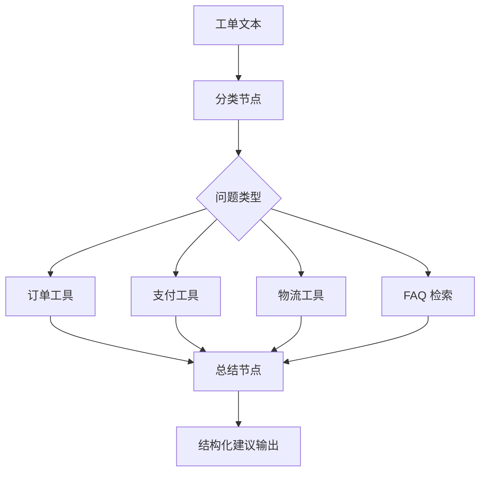

# Ticket Agent 项目

## 项目目标

这个项目的目标是做一个客服工单分诊与辅助处理 Agent。

它非常适合用来展示：

- Structured Output
- Tool Calling
- Agent
- 日志与护栏
- 多步任务组织能力

如果说 RAG 项目最适合展示“查知识”的能力，那么 Ticket Agent 项目最适合展示“多步决策 + 工具执行”的能力。

---

## 一、为什么这个项目很有含金量

因为它更贴近真实业务系统：

- 用户输入不是清晰问题，而是工单描述
- 系统需要先判断问题类型
- 再决定查什么、调什么
- 最终要输出建议，而不是仅给自然语言闲聊

这类项目很容易让面试官感受到：

> 你在做的是业务自动化系统，而不是聊天页。

---

## 二、系统架构图



---

## 三、MVP 版本建议

先做最小闭环：

1. 输入一段工单文本
2. 输出问题类别
3. 根据类别调用一个对应工具
4. 输出结构化建议

例如：

- category
- priority
- summary
- next_action

这已经足够构成一个很有说服力的 MVP。

---

## 四、推荐目录结构

```text
ticket-agent/
  app/
    main.py
    api/
      routes.py
    core/
      config.py
      logger.py
    agent/
      state.py
      planner.py
      executor.py
      summarizer.py
    tools/
      order.py
      payment.py
      logistics.py
    schemas/
      ticket.py
  tests/
  frontend/
  .env
```

这个结构非常适合体现：

- Agent 状态
- 工具执行层
- 结构化结果层

---

## 五、核心实现步骤

### 第一步：先定义结构化输出

建议先定义：

```python
from pydantic import BaseModel


class TicketResult(BaseModel):
    category: str
    priority: str
    summary: str
    next_action: str
```

### 第二步：做分类逻辑

可先用 Prompt 或 Few-shot 做问题分类。

### 第三步：设计工具层

例如：

- `query_order_status(order_id)`
- `query_payment_status(order_id)`
- `query_logistics_status(order_id)`

### 第四步：根据分类路由工具

这是这个项目的关键。

### 第五步：汇总生成建议

输出给客服或系统处理链路。

---

## 六、一个最小流程示例

```python
def route_ticket(category: str, order_id: str):
    if category == "order":
        return {"tool": "query_order_status", "result": {"status": "paid"}}
    if category == "payment":
        return {"tool": "query_payment_status", "result": {"payment": "success"}}
    return {"tool": "faq", "result": {"hint": "请先检查工单描述"}}
```

这段代码虽然简单，但它体现的正是 Agent 项目的核心：

- 先判断
- 再路由
- 再组织结果

---

## 七、前端展示建议

你可以把页面做成：

- 左侧输入工单文本
- 中间展示 Agent 路径
- 右侧展示最终结构化建议

如果想进一步突出工程感，可以加：

- 当前步骤日志
- 调用了哪个工具
- 参数和结果摘要

这会非常适合做演示。

---

## 八、增强项建议

MVP 完成后，可以继续增强：

- 增加更多工具
- 增加 FAQ 检索能力
- 增加最大轮次限制
- 增加高风险动作确认
- 增加 Agent step 日志
- 增加结构化校验失败重试

---

## 九、工程化亮点建议

这个项目特别适合做这些工程化加分项：

- 每一步 thought / action / observation 日志
- 工具调用参数日志
- 高风险工具确认
- 失败兜底
- 简单评测集

这会让项目明显更像真实业务系统。

---

## 十、面试里怎么讲

你可以这样表达：

> 我做了一个 Ticket Agent，用于客服工单的分类和辅助处理。核心思路是先做结构化分类，再根据问题类别选择订单、支付或物流工具，最后把结果汇总成结构化建议。为了控制 Agent 风险，我还加入了日志、轮次限制和高风险动作确认策略。

这类表述会让你的 Agent 项目非常有“工程落地感”。

---

## 本章小结

这个项目非常适合展示你对：

- Agent
- Tool Calling
- 结构化输出
- 护栏设计

的综合理解，是非常强的第二作品集方向。

---

## 练习题

1. 设计你的 TicketResult 结构
2. 列出 3 个你要接入的工具
3. 画一张 Ticket Agent 路由图
4. 写出 MVP 版接口返回结构

---

## 下一章

最后看一个最适合你背景做差异化的方向：[前端研发 Copilot 项目](./frontend-copilot-project)
