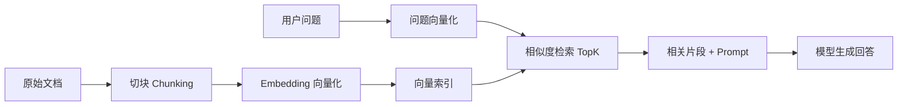

# RAG：让模型查资料再回答

RAG 是 Retrieval-Augmented Generation 的缩写，中文通常叫“检索增强生成”。

你可以先把它理解成一句非常实用的话：

> 先从外部知识库里找资料，再把资料交给模型回答。

这几乎是所有企业知识问答、客服助手、制度助手、文档助手的基础能力。

---

## 为什么需要 RAG

因为模型本身存在几个天然问题：

- 不知道最新知识
- 不知道你的私有资料
- 单靠记忆回答容易幻觉

而 RAG 的目标是：

> 让模型基于“当前检索到的依据”回答，而不是只凭参数记忆回答。

---

## RAG 总流程



---

## 1. RAG 的四个关键环节

### 文档切块

把大文档拆成适合检索的小片段。

### 向量化

把每个片段变成 embedding 向量。

### 检索

根据用户问题找到最相关的片段。

### 生成

把片段拼到 Prompt 里，让模型基于依据回答。

---

## 2. 一个纯 Python 的最小 RAG 示例

为了让你先抓住主线，下面示例不引入向量数据库，而是用内存数组模拟流程。

```python
from dataclasses import dataclass
from typing import List
import math


@dataclass
class DocChunk:
    text: str
    embedding: list[float]


def cosine_similarity(a: list[float], b: list[float]) -> float:
    dot = sum(x * y for x, y in zip(a, b))
    norm_a = math.sqrt(sum(x * x for x in a))
    norm_b = math.sqrt(sum(x * x for x in b))
    if norm_a == 0 or norm_b == 0:
        return 0.0
    return dot / (norm_a * norm_b)


def top_k_search(query_embedding: list[float], chunks: List[DocChunk], k: int = 2) -> List[DocChunk]:
    scored = [
        (chunk, cosine_similarity(query_embedding, chunk.embedding))
        for chunk in chunks
    ]
    scored.sort(key=lambda item: item[1], reverse=True)
    return [item[0] for item in scored[:k]]
```

上面这段代码先让你理解“检索”的本质：比较语义向量相似度，再取 Top K。

---

## 3. 用模型 Embedding 构建检索

如果你的模型服务支持 embedding，可以这样封装：

```python
import os
from dotenv import load_dotenv
from openai import OpenAI

load_dotenv()

client = OpenAI(
    api_key=os.environ["OPENAI_API_KEY"],
    base_url=os.getenv("OPENAI_BASE_URL", "https://api.openai.com/v1"),
)


def get_embedding(text: str) -> list[float]:
    response = client.embeddings.create(
        model="text-embedding-3-small",
        input=text,
    )
    return response.data[0].embedding
```

然后把文档片段与问题都向量化，再走 `top_k_search` 即可。

---

## 4. 把检索结果拼进 Prompt

```python
def build_rag_prompt(question: str, chunks: list[str]) -> str:
    joined_chunks = "\n\n".join(f"资料{i+1}:\n{chunk}" for i, chunk in enumerate(chunks))
    return f"""
    你是一名企业知识库问答助手。
    请严格依据给定资料回答问题。
    如果资料不足以回答，请明确说“资料不足，无法确定”。

    {joined_chunks}

    问题：{question}
    """
```

这个 Prompt 有两个关键点：

- 明确回答依据来自检索资料
- 资料不足时不允许编造

---

## 5. 一个最小可运行的 RAG 主流程

```python
def answer_with_rag(question: str, chunks: list[DocChunk]) -> str:
    query_embedding = get_embedding(question)
    top_chunks = top_k_search(query_embedding, chunks, k=3)
    prompt = build_rag_prompt(question, [item.text for item in top_chunks])

    response = client.responses.create(
        model=os.getenv("OPENAI_MODEL", "gpt-4.1-mini"),
        input=prompt,
    )
    return response.output_text
```

---

## 6. RAG 最容易踩坑的地方

### 切块太大

召回不准，噪声多。

### 切块太碎

语义上下文不完整，回答容易断裂。

### 只看生成效果，不看检索效果

很多问题其实不是模型不会答，而是没召回到正确片段。

### 没做引用展示

用户不相信答案时，最好能看到依据来源。

---

## 7. 前端工程师做 RAG 的优势

你天然更容易把 RAG 做成“能用的产品”，因为你熟悉：

- 搜索交互
- 引用片段高亮
- 结果卡片展示
- Loading、错误态、重试态
- 问题追问与多轮上下文 UX

企业往往不缺“会调 embedding 的人”，缺的是“能把 RAG 做成好产品的人”。

---

## 8. 面试里如何回答 RAG 优化

可以从这些角度说：

1. 优化切块策略
2. 优化召回 Top K
3. 做 query rewrite 或 query expansion
4. 加 rerank
5. 强化回答约束，要求引用依据
6. 建立离线评测集，分开评估召回和生成

---

## 本章练习

1. 用你熟悉的一份文档做切块实验
2. 写一个最小内存版 RAG 检索器
3. 给回答增加“引用来源”展示字段
4. 比较 `TopK=2` 和 `TopK=5` 的回答差异

---

## 下一章

当模型既会调用工具，又会查资料，就可以开始组织复杂多步流程了： [Agent](./agent)
