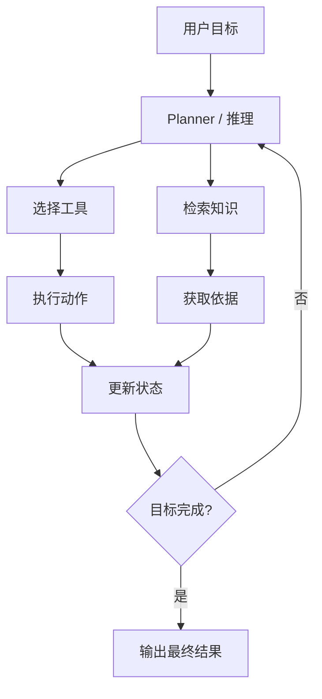
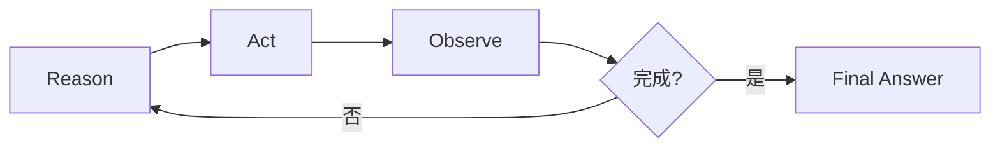

# Agent：让模型围绕目标执行多步任务

Agent 是当前最容易被神化、也最容易被误解的概念之一。

先给你一个工程师视角的定义：

> Agent 不是一种神秘的新模型，而是一种围绕目标、状态、工具和流程编排的大模型应用架构。

它本质上是在回答一个问题：

> 如果任务不能一步完成，系统该如何让模型分步骤推进？

---

## Agent 的基本组成



你会发现 Agent 其实是把前面几章全部串了起来：

- Prompt
- Structured Output
- Tool Calling
- RAG
- State Management

---

## 1. Agent 和普通聊天的区别

### 普通聊天

- 一问一答
- 单轮或简单多轮
- 很少涉及显式外部动作

### Agent

- 面向目标，不只是面向问题
- 会多步决策
- 会使用工具
- 会维护状态
- 可能会反复检查是否完成目标

---

## 2. 一个最小 Agent 循环

下面是一个教学版的 Agent loop。

```python
from dataclasses import dataclass, field


@dataclass
class AgentState:
    goal: str
    steps: list[str] = field(default_factory=list)
    observations: list[str] = field(default_factory=list)
    done: bool = False


def run_agent(state: AgentState):
    while not state.done:
        decision = think(state)
        state.steps.append(decision["thought"])

        if decision["action"] == "finish":
            state.done = True
            return decision["final_answer"]

        observation = act(decision["action"], decision["args"])
        state.observations.append(str(observation))
```

这里有三个关键点：

- `think`：当前该做什么
- `act`：执行动作
- `state`：记录过程

---

## 3. 一个简化版 ReAct 思路

ReAct 是很经典的 Agent 设计：

- Reason：先思考
- Act：再行动
- Observe：读取结果
- Repeat：继续迭代



这类模式非常适合：

- 问题排障
- 工单自动处理
- 数据查询与汇总
- 多工具编排任务

---

## 4. 为什么 Agent 容易失控

Agent 很强，但也很容易出问题，因为链路更长。

常见问题：

- 反复循环，不知道停
- 选错工具
- 工具结果理解错
- 状态污染
- 成本爆炸
- 延迟过长

所以工程上，Agent 一定要加“护栏”。

---

## 5. Agent 的护栏设计

### 限制最大轮次

防止无限循环。

### 限制工具白名单

防止访问危险能力。

### 状态结构化

不要把所有中间过程都堆成自然语言。

### 对关键步骤加人工确认

如发邮件、下单、删数据。

### 全链路日志

记录每一轮 thought、action、observation。

---

## 6. 一个更像项目代码的 Agent 骨架

```python
from typing import Any


def think(state: AgentState) -> dict[str, Any]:
    # 实际项目中，这里通常是一次模型调用
    if not state.observations:
        return {
            "thought": "先查询订单状态",
            "action": "query_order_status",
            "args": {"order_id": "A1001"},
        }

    return {
        "thought": "已经拿到订单状态，可以给用户总结",
        "action": "finish",
        "args": {},
        "final_answer": f"订单结果如下: {state.observations[-1]}",
    }


def act(action: str, args: dict[str, Any]) -> Any:
    if action == "query_order_status":
        return {"order_id": args["order_id"], "status": "paid", "delivery": "tomorrow"}
    raise ValueError(f"unsupported action: {action}")
```

这虽然是简化版，但已经体现了 Agent 的基本结构。

---

## 7. 什么时候适合用 Agent，什么时候不适合

### 适合

- 任务需要多步决策
- 工具数量较多，需要动态选择
- 用户目标不是一次提问就能完成

### 不适合

- 只是单次摘要或单次分类
- 完全可以写死流程的业务
- 对延迟和成本极度敏感的场景

不要为了“高级”而滥用 Agent。

---

## 8. 面试里怎么讲 Agent 项目

建议按这条线回答：

1. 业务目标是什么
2. 为什么单轮问答不够
3. Agent 拆成了哪些步骤
4. 接了哪些工具或知识库
5. 如何做状态管理、日志、重试、终止条件
6. 最终效果如何评估

这样会非常像真实项目复盘。

---

## 本章练习

1. 把之前的工具调用例子升级成两步 Agent
2. 为 Agent 增加最大轮次限制
3. 为每一轮 thought / action / observation 打日志
4. 设计一个“客服工单处理 Agent”的状态结构

---

## 下一章

学完核心能力后，真正决定你能不能就业的，是工程化能力：[LLM 应用工程化](../engineering/index)
