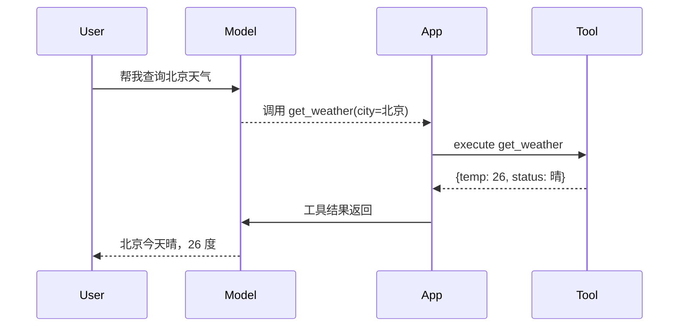

# 工具调用（Function Calling）

工具调用是很多人从“会用模型”迈向“会做应用”的分水岭。

因为从这一章开始，模型不再只是输出文本，而是开始参与决策：

- 要不要调用工具
- 调用哪个工具
- 给工具传什么参数
- 拿到工具结果后如何继续回答

---

## 先建立正确认知

模型不会真的执行函数。

它真正做的是：

1. 读懂工具说明
2. 判断当前问题是否需要工具
3. 生成一个结构化的“调用请求”
4. 由外部程序真正执行工具
5. 再把结果回传给模型生成最终答案



---

## 1. 什么时候需要工具调用

适合下面这些场景：

- 查天气、汇率、库存、订单状态
- 调公司内部系统接口
- 调数据库、搜索服务、工单服务
- 发邮件、创建日程、提交工单
- 调代码分析工具或文件处理工具

只要任务涉及“访问外部能力”，就很可能要上工具调用。

---

## 2. 一个最小工具示例

先写一个本地函数：

```python
def get_weather(city: str) -> dict:
    fake_data = {
        "北京": {"status": "晴", "temp": 26},
        "上海": {"status": "多云", "temp": 28},
        "深圳": {"status": "小雨", "temp": 30},
    }
    return fake_data.get(city, {"status": "未知", "temp": None})
```

再定义工具描述：

```python
weather_tool = {
    "type": "function",
    "name": "get_weather",
    "description": "查询指定城市天气",
    "parameters": {
        "type": "object",
        "properties": {
            "city": {
                "type": "string",
                "description": "要查询天气的城市，例如北京、上海、深圳",
            }
        },
        "required": ["city"],
        "additionalProperties": False,
    },
}
```

---

## 3. 用 Python 驱动一次工具调用流程

```python
import json
import os
from dotenv import load_dotenv
from openai import OpenAI

load_dotenv()

client = OpenAI(
    api_key=os.environ["OPENAI_API_KEY"],
    base_url=os.getenv("OPENAI_BASE_URL", "https://api.openai.com/v1"),
)


def run_weather_chat(question: str) -> str:
    response = client.responses.create(
        model=os.getenv("OPENAI_MODEL", "gpt-4.1-mini"),
        input=question,
        tools=[weather_tool],
    )

    for item in response.output:
        if item.type == "function_call" and item.name == "get_weather":
            args = json.loads(item.arguments)
            tool_result = get_weather(args["city"])

            second_response = client.responses.create(
                model=os.getenv("OPENAI_MODEL", "gpt-4.1-mini"),
                input=[
                    {"type": "function_call_output", "call_id": item.call_id, "output": json.dumps(tool_result, ensure_ascii=False)}
                ],
                previous_response_id=response.id,
            )
            return second_response.output_text

    return response.output_text


if __name__ == "__main__":
    print(run_weather_chat("帮我查询一下北京天气，并告诉我适不适合出门。"))
```

这里你已经能看到完整闭环：模型决策 -> 程序执行 -> 回传结果 -> 模型生成最终回答。

---

## 4. 工具调用和 RAG 的区别

很多初学者会混。

### Tool Calling

- 目标：调用外部能力
- 输出：动作请求
- 典型对象：天气、数据库、业务系统、邮件服务

### RAG

- 目标：补充外部知识
- 输出：基于文档片段作答
- 典型对象：制度、FAQ、产品文档、知识库

一句话区分：

> Tool Calling 更偏“做事”，RAG 更偏“查资料”。

---

## 5. 工程实践里的关键问题

### 工具描述要清晰

如果描述含糊，模型会误用工具。

### 参数 schema 要严格

否则模型可能传错字段或多传字段。

### 工具执行要可观测

你必须记录：

- 调用了哪个工具
- 传了什么参数
- 成功还是失败
- 耗时多久

### 要有降级策略

工具失败时，不能让整体流程直接崩掉。

---

## 6. 一个简单的工具注册表

```python
TOOLS = {
    "get_weather": get_weather,
}


def execute_tool(name: str, arguments: dict) -> dict:
    if name not in TOOLS:
        raise ValueError(f"未知工具: {name}")
    return TOOLS[name](**arguments)
```

未来你做 Agent 时，这种注册表模式会非常常见。

---

## 7. 面试题：如何避免模型乱调用工具

可以从这几个角度答：

1. 缩小工具集合，不要暴露无关工具
2. 写清晰的工具描述与参数 schema
3. 增加工具选择前的分类或路由步骤
4. 对高风险工具增加权限校验与人工确认
5. 记录调用日志，持续分析误调用样本

---

## 本章练习

1. 把 `get_weather` 改成 `query_order_status(order_id: str)`
2. 为工具执行增加异常处理
3. 打印每次工具调用的参数与耗时
4. 尝试同时注册两个工具，让模型自己选择

---

## 下一章

工具调用解决“做事”，接下来要解决“查资料”： [RAG](./RAG)
