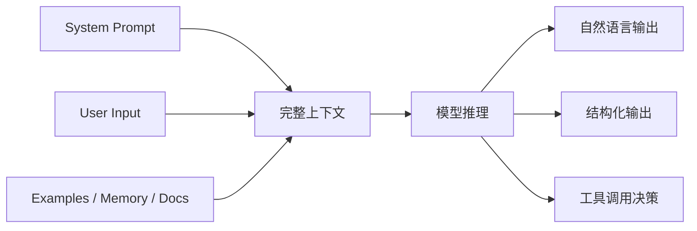
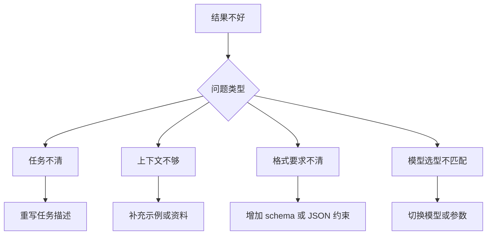

# 提示词工程

如果说大模型是一个能力很强但不完全可控的“概率型执行者”，那么提示词工程做的事情就是：

> 用更好的上下文设计，让模型更稳定地朝目标输出结果。

初学者容易把 Prompt 理解成“问一句话”；工程师应该把 Prompt 理解成：

- 任务协议
- 行为约束
- 输出契约
- 上下文编排

---

## Prompt 的系统视角



所以，Prompt 不是单句，而是一整组输入设计。

---

## 1. 好 Prompt 的四要素

### 角色

让模型知道自己以什么身份回答。

### 任务

让模型知道这次到底要完成什么目标。

### 约束

让模型知道边界、禁止项和质量要求。

### 输出格式

让模型知道最终应该产出什么结构。

一个模板如下：

```text
你是一名{角色}。
你的任务是{任务}。
请遵守以下约束：
1. {约束1}
2. {约束2}

输出格式：{格式要求}
```

---

## 2. 从聊天式 Prompt 升级到工程式 Prompt

### 弱 Prompt

```text
帮我分析这个需求。
```

问题：范围不清、受众不清、输出格式不清。

### 工程式 Prompt

```text
你是一名资深 AI 产品技术方案顾问。
请分析下面这个需求，并输出：
1. 问题定义
2. 输入输出设计
3. 可能需要的工具或知识库
4. 风险点
5. MVP 实现建议

要求：
- 面向中级前端工程师
- 使用中文
- 结构化标题输出
- 如果信息不足，请明确指出缺失信息，不要自行编造
```

这类 Prompt 更适合落地开发。

---

## 3. Few-shot 什么时候有用

当你需要模型模仿一种稳定格式或风格时，示例通常比抽象描述更有效。

### 示例场景

- 信息抽取
- 文本分类
- 前端报错归类
- PR 描述生成
- 工单摘要

```python
prompt = """
你是一名工单归类助手。
请根据示例输出 category 与 priority。

示例1:
输入: 登录后页面白屏，控制台提示 chunk load error
输出: {"category": "frontend_deploy", "priority": "high"}

示例2:
输入: 接口偶发 502，刷新后恢复
输出: {"category": "backend_gateway", "priority": "medium"}

现在请处理：
输入: 用户点击支付后一直 loading，没有成功页也没有错误提示
"""
```

---

## 4. Prompt 设计的常见模式

### 模式一：任务拆解

适合复杂需求分析。

```text
请先拆解任务，再逐步给出解决方案。
```

### 模式二：先判断再回答

适合路由决策、分类与工具选择。

```text
请先判断该问题属于哪个类别，再按对应策略作答。
```

### 模式三：先引用依据再输出结论

适合知识问答、RAG。

```text
先列出依据片段，再给最终回答；若依据不足，明确说明。
```

### 模式四：输出前自检

适合高风险任务。

```text
输出前检查是否满足：字段完整、没有编造、语言简洁。
```

---

## 5. Prompt 模板化

真实项目里，Prompt 不应该散落在业务代码里。

建议像管理前端常量和接口类型一样管理 Prompt。

```python
from textwrap import dedent


def build_summary_prompt(audience: str, text: str) -> str:
    return dedent(f"""
    你是一名内容总结助手。
    请将输入内容总结给 {audience} 阅读。

    要求：
    - 输出 3 条要点
    - 每条不超过 40 字
    - 如果存在不确定信息，请显式标注

    输入内容：
    {text}
    """)
```

优势：

- 便于复用
- 便于版本管理
- 便于 A/B 测试
- 便于评测

---

## 6. Prompt Debug 的方法

当结果不稳定时，不要只说“模型不行”，要按链路排查。



可以按这个顺序调试：

1. 明确任务是不是说清楚了
2. 检查是否缺少背景信息
3. 检查输出格式是否明确
4. 检查是否需要 few-shot
5. 检查模型选型是否合适

---

## 7. 一个可复用的 Prompt 调用封装

```python
from openai import OpenAI
from dotenv import load_dotenv
import os

load_dotenv()

client = OpenAI(
    api_key=os.environ["OPENAI_API_KEY"],
    base_url=os.getenv("OPENAI_BASE_URL", "https://api.openai.com/v1"),
)


def ask_llm(system_prompt: str, user_prompt: str) -> str:
    response = client.responses.create(
        model=os.getenv("OPENAI_MODEL", "gpt-4.1-mini"),
        input=[
            {"role": "system", "content": system_prompt},
            {"role": "user", "content": user_prompt},
        ],
    )
    return response.output_text


if __name__ == "__main__":
    result = ask_llm(
        system_prompt="你是一名 AI 架构讲师，回答要分点清晰。",
        user_prompt="请解释 Prompt、RAG、Agent 之间的关系。",
    )
    print(result)
```

---

## 8. 面试里该怎么讲 Prompt 工程

不要把它讲成“我会写提示词”，而要讲成：

> 我会把 Prompt 当作系统设计的一部分，围绕任务目标、约束、输出契约和评测结果持续迭代。

这是工程师视角，不是普通使用者视角。

---

## 本章练习

1. 把一个弱 Prompt 改写成工程式 Prompt
2. 写一个 Python 函数统一生成 Prompt 模板
3. 给同一个任务写一版 zero-shot 和一版 few-shot，对比输出差异
4. 记录一次 Prompt 调优过程，写出你做了哪些改动

---

## 下一章

当你会写 Prompt 后，下一步要解决的是“如何让输出稳定可解析”： [结构化输出](./structured-output)
