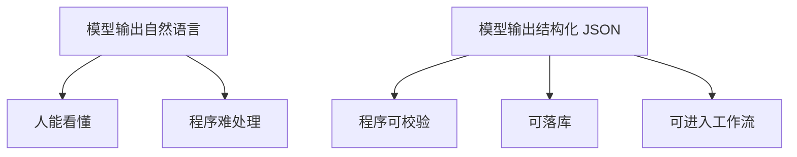

# 结构化输出

从就业角度看，结构化输出是大模型应用开发里最容易被低估、但最应该尽快掌握的能力之一。

因为真实系统不需要模型“聊得好”，而需要它：

- 可解析
- 可校验
- 可落库
- 可传给前端
- 可交给后续流程继续处理

这就是为什么你必须掌握结构化输出。

---

## 为什么自然语言不够

如果模型返回：

```text
我认为这个问题大概率属于支付异常，优先级偏高，建议立即排查回调链路。
```

人能看懂，但程序很难稳定消费。

而如果返回：

```json
{
  "category": "payment_issue",
  "priority": "high",
  "suggestion": "检查支付回调链路与订单状态同步"
}
```

你的后端、数据库、前端 UI、工作流引擎都能继续处理。

---

## 结构化输出在系统中的位置


---

## 1. 用 Pydantic 定义输出契约

```python
from pydantic import BaseModel, Field
from typing import Literal


class TicketAnalysis(BaseModel):
    category: Literal["frontend", "backend", "payment", "infra"] = Field(
        description="问题分类"
    )
    priority: Literal["low", "medium", "high"] = Field(description="优先级")
    summary: str = Field(description="一句话总结")
    next_action: str = Field(description="建议的下一步动作")
```

这就像前端里写 TypeScript interface，但这里不仅定义字段，还能在运行时做校验。

---

## 2. 请求模型输出 JSON

下面示例展示一种通用做法：让模型返回 JSON，再用 `pydantic` 验证。

```python
import json
import os
from dotenv import load_dotenv
from openai import OpenAI
from pydantic import ValidationError

load_dotenv()

client = OpenAI(
    api_key=os.environ["OPENAI_API_KEY"],
    base_url=os.getenv("OPENAI_BASE_URL", "https://api.openai.com/v1"),
)


def analyze_ticket(ticket_text: str) -> TicketAnalysis:
    prompt = f"""
    你是一名工单分析助手。
    请根据输入内容输出 JSON，字段必须包括：
    category, priority, summary, next_action。
    不要输出任何额外说明。

    输入内容：{ticket_text}
    """

    response = client.responses.create(
        model=os.getenv("OPENAI_MODEL", "gpt-4.1-mini"),
        input=prompt,
    )

    raw_text = response.output_text
    data = json.loads(raw_text)
    return TicketAnalysis.model_validate(data)


if __name__ == "__main__":
    result = analyze_ticket("用户支付后订单状态一直未更新，但支付渠道已经扣款。")
    print(result.model_dump())
```

---

## 3. 为什么要校验，而不是盲信模型

模型即使知道你要 JSON，也可能出现：

- 少字段
- 多字段
- 枚举值不合法
- 文本里混入解释性语言
- 输出为伪 JSON

因此工程上必须遵循：

> 模型负责生成候选结果，程序负责做最终校验。

---

## 4. 给结构化输出增加重试

```python
def safe_analyze_ticket(ticket_text: str, max_retries: int = 3) -> TicketAnalysis:
    last_error = None

    for _ in range(max_retries):
        try:
            return analyze_ticket(ticket_text)
        except (json.JSONDecodeError, ValidationError) as exc:
            last_error = exc

    raise RuntimeError(f"结构化输出失败: {last_error}")
```

如果你要更稳一点，可以把上一次错误信息拼回 Prompt，让模型修正输出。

---

## 5. 结构化输出 + 前端联动示例

```python
from fastapi import FastAPI

app = FastAPI()


@app.post("/analyze-ticket")
def analyze_ticket_api(payload: dict):
    result = safe_analyze_ticket(payload["text"])
    return result.model_dump()
```

前端调用：

```ts
const response = await fetch('/analyze-ticket', {
  method: 'POST',
  headers: { 'Content-Type': 'application/json' },
  body: JSON.stringify({ text })
})

const data = await response.json()
```

这就是你熟悉的接口契约模式，只是数据来源从传统规则引擎变成了 LLM。

---

## 6. 一张图看懂结构化输出的价值



---

## 7. 面试实战表达

你可以这样描述你的能力：

> 在 LLM 应用中，我会优先把关键链路做成结构化输出，再用 Pydantic 做运行时校验，并对失败场景设计重试与降级，保证结果可被程序稳定消费。

这句话非常像真实项目经验。

---

## 本章练习

1. 自己定义一个 `ResumeScore` 的 Pydantic 模型
2. 让模型输出候选人技能匹配结果并做校验
3. 故意让模型少返回一个字段，观察校验报错
4. 给结构化输出函数加重试与日志

---

## 下一章

有了结构化输出，你就能进一步进入真正的“能做事”阶段：[工具调用](./function-call)
