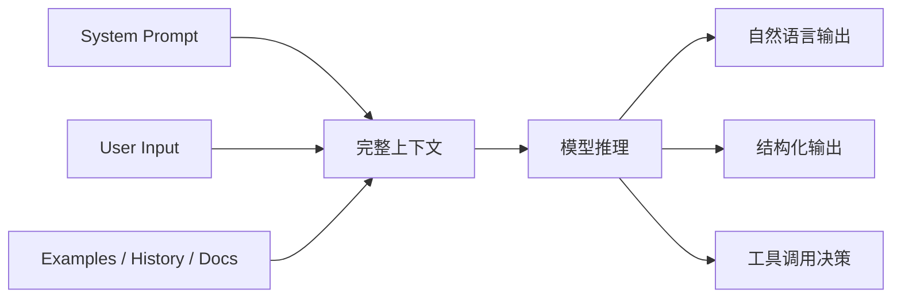

# Prompt 工程导论

## 本章目标

这一章的目标，是把你从“会向模型提问”提升到“会设计模型输入协议”。

读完后你应该能：

- 理解 Prompt 不是一句话，而是一整套上下文设计
- 知道好 Prompt 的核心组成部分
- 建立从聊天式提问到工程式 Prompt 的升级认知
- 用更系统的方式思考模型输出质量

---

## 为什么 Prompt 工程是所有后续能力的起点

你后面要学的很多内容都建立在 Prompt 之上：

- 结构化输出
- Tool Calling
- RAG 回答约束
- Agent 规划与决策

如果 Prompt 写得混乱，后续链路往往也会变得混乱。

所以 Prompt 工程不是“会聊天”，而是：

> 会用更清晰的上下文设计去控制一个概率型系统。

---

## Prompt 的系统视角



这张图想表达一个非常重要的事实：

- Prompt 不是一段随手写的文案
- Prompt 是模型当前轮次能看到的完整上下文

---

## 1. Prompt 不等于“用户问的那句话”

很多初学者说 Prompt 时，其实只想到：

- 用户输入的那句提问

但真实系统里的 Prompt 经常包括：

- system 指令
- 用户问题
- 历史对话
- 示例
- 检索资料
- 工具说明
- 输出格式要求

更准确的说法是：

> Prompt 是模型在当前轮次看到的任务上下文。

---

## 2. 好 Prompt 的四个核心组成部分

### 角色

告诉模型它现在扮演什么身份。

### 任务

告诉模型这次具体要完成什么。

### 约束

告诉模型哪些边界必须遵守。

### 输出格式

告诉模型结果应该长什么样。

这是几乎所有工程式 Prompt 的基础骨架。

---

## 3. 一个最简单的对比例子

### 弱 Prompt

```text
讲一下 RAG。
```

这个 Prompt 的问题是：

- 没有受众
- 没有深度要求
- 没有输出结构
- 没有约束

### 更好的 Prompt

```text
你是一名面向前端工程师教学的 AI 讲师。
请用中文解释什么是 RAG。
要求：
- 先给一句话定义
- 再说明它解决什么问题
- 最后举一个企业知识问答的例子
- 不要使用太多术语
```

第二个 Prompt 更好的原因不是“更长”，而是：

- 更清楚
- 更可控
- 更贴近目标

---

## 4. Prompt 工程真正解决什么问题

Prompt 工程不是为了追求某种“神奇咒语”，它真正解决的是这些问题：

- 任务表达不清
- 输出跑偏
- 输出格式不稳定
- 模型过度发散
- 业务目标和模型回答不一致

换句话说，Prompt 工程的核心价值是：

> 降低歧义，提升任务对齐程度。

---

## 5. 一个最小可运行对比实验

```python
from openai import OpenAI
from dotenv import load_dotenv
import os

load_dotenv()

client = OpenAI(
    api_key=os.environ["OPENAI_API_KEY"],
    base_url=os.getenv("OPENAI_BASE_URL", "https://api.openai.com/v1"),
)


def ask(prompt: str) -> str:
    response = client.responses.create(
        model=os.getenv("OPENAI_MODEL", "gpt-4.1-mini"),
        input=prompt,
    )
    return response.output_text


weak = "讲一下 RAG。"

better = """
你是一名面向前端工程师教学的 AI 讲师。
请用中文解释什么是 RAG。
要求：
- 先给一句话定义
- 再说明它解决什么问题
- 最后举一个企业知识问答的例子
- 不要使用太多术语
"""

print("弱 Prompt 结果:\n", ask(weak))
print("\n更好 Prompt 结果:\n", ask(better))
```

这个实验的价值在于：

- 帮你直观看到 Prompt 质量差异
- 帮你建立“Prompt 是可优化输入协议”的认知

---

## 6. 从聊天式 Prompt 升级到工程式 Prompt

### 聊天式 Prompt

更像：

- “帮我分析一下这个问题”
- “给我讲讲这个概念”

### 工程式 Prompt

更像：

- 有角色
- 有结构
- 有输出要求
- 有边界约束

例如：

```text
你是一名资深 AI 技术方案顾问。
请分析下面需求，并输出：
1. 问题定义
2. 输入输出设计
3. 是否需要 RAG
4. 是否需要工具调用
5. MVP 实现建议

要求：
- 面向中级前端工程师
- 使用中文
- 如果信息不足，明确指出
```

这种 Prompt 就明显更适合系统开发场景。

---

## 7. 两个业务案例

### 案例一：需求分析

适合 Prompt 结构：

- 角色：技术方案顾问
- 任务：分析需求
- 输出：问题定义、风险点、MVP

### 案例二：前端报错辅助诊断

适合 Prompt 结构：

- 角色：前端排障助手
- 任务：定位错误原因
- 输出：原因、排查步骤、修复建议

---

## 8. Prompt 工程常见误区

### 误区一：Prompt 越长越好

不是越长越好，而是越清楚越好。

### 误区二：Prompt 工程就是写花哨文案

真正重要的是任务协议设计，不是文案修辞。

### 误区三：Prompt 能解决一切问题

很多问题其实需要：

- 结构化输出
- 工具调用
- RAG
- 评测

而不是只改 Prompt。

---

## 9. 前端工程师应该怎么理解 Prompt

你可以把 Prompt 想成一种：

- 面向模型的“运行时协议”
- 类似接口契约 + 组件 props + 业务规则说明的混合体

这会比把它理解成“问一句话”更准确得多。

---

## 本章小结

这一章最重要的结论是：

- Prompt 是完整上下文设计，不只是用户提问
- Prompt 工程的核心是降低歧义、提升任务对齐
- 工程式 Prompt 通常包含角色、任务、约束和输出格式
- 你后面学的结构化输出、RAG、Agent 都会建立在 Prompt 之上

---

## 练习题

1. 把一个弱 Prompt 改写成工程式 Prompt
2. 写一个“需求分析助手”的 Prompt
3. 写一个“前端排障助手”的 Prompt
4. 用自己的话解释为什么 Prompt 不是一句话，而是一整套上下文

---

## 下一章

继续进入 Prompt 工程最常见的几种任务输入方式：[Zero-shot、One-shot 与 Few-shot](./zero-shot-few-shot)
