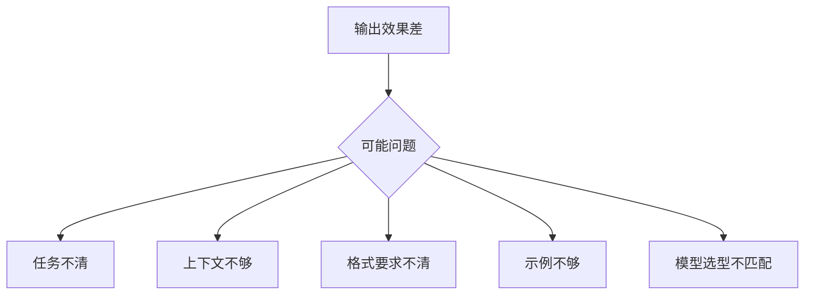

# Prompt 调试方法

## 本章目标

这一章讨论 Prompt 工程里最像“工程工作”的部分：调试。

读完后你应该能：

- 理解 Prompt 调试为什么不能靠感觉
- 掌握一套更有条理的调试顺序
- 知道如何记录 Prompt 版本和实验结果
- 从任务、上下文、格式、模型等角度定位问题

---

## 为什么 Prompt 调试非常重要

很多人学 Prompt 时只学“怎么写”，但真实项目里更常见的问题是：

- 写了 Prompt，但输出不稳定
- 同类问题结果差异很大
- 有时很好，有时很差
- 不知道问题到底出在哪

这时你需要的不是“再灵感发挥一下”，而是：

> 一套系统化的调试方法。

---

## 调试流程图



---

## 1. 最推荐的调试顺序

建议按这个顺序排查：

1. 任务是不是说清楚了
2. 上下文是不是不够
3. 输出格式是不是不明确
4. 是否需要示例
5. 模型选型是否合适

这个顺序很重要，因为：

- 前三项通常比换模型更值得先看

---

## 2. 一个典型问题示例

### 原 Prompt

```text
帮我分析这个报错。
```

### 问题在哪

- 报错内容没给
- 输出目标不明确
- 没说要分析到什么程度

### 改写后

```text
你是一名前端排障助手。
请分析下面报错，并输出：
1. 可能原因
2. 排查步骤
3. 修复建议
4. 风险提示

报错内容：{error_log}
```

你会发现，这次改动并没有使用什么“神秘技巧”，只是把任务说清楚了。

---

## 3. 为什么要记录 Prompt 版本

如果你想做得更像工程师，而不是只靠记忆调试，建议记录：

- Prompt 版本号
- 做了什么改动
- 对哪些样本有效
- 对哪些样本无效

例如：

```python
PROMPT_VERSION = "ticket-analysis-v3"
```

这种小习惯对后面评测和项目迭代非常有帮助。

---

## 4. 一个更成熟的调试记录方式

你可以为每次调整记录：

- 改了什么
- 为什么改
- 改完效果如何

例如：

```python
prompt_change_log = {
    "version": "v3",
    "change": "增加输出格式和风险提示字段",
    "reason": "v2 输出经常少给排查步骤",
}
```

---

## 5. 两个业务案例

### 案例一：需求分析 Prompt

如果输出太泛，你要先看：

- 是否没限定输出结构
- 是否没指定面向谁讲

### 案例二：错误诊断 Prompt

如果输出太空洞，你要先看：

- 是否没给错误日志
- 是否没要求“先分析再回答”

---

## 6. 常见坑

### 坑一：一上来就换模型

很多时候问题是 Prompt 没说清楚，不是模型不行。

### 坑二：一次改很多项

最后不知道到底是哪项改动起作用。

### 坑三：没有失败样本意识

Prompt 调试最有价值的往往是失败样本。

---

## 7. 一个很实用的经验

调 Prompt 时，尽量把问题拆成：

- 任务理解问题
- 格式问题
- 信息缺失问题
- 示例问题

这样会比“这个 Prompt 不太好”更容易指导优化。

---

## 本章小结

本章最重要的结论是：

- Prompt 调试是一种输入协议调优工作，不是靠灵感碰运气
- 最值得先排查的是任务清晰度、上下文完整性和输出格式
- 版本记录和失败样本对 Prompt 优化非常有价值

---

## 练习题

1. 找一个失败 Prompt，按“任务 / 上下文 / 格式 / 示例”四个维度分析问题
2. 为这个 Prompt 做两轮改写
3. 给改写版本编一个版本号并记录变更原因

---

## 下一章

当 Prompt 调优到一定阶段，你会自然进入程序消费结果的问题：[结构化输出](./structured-output)
