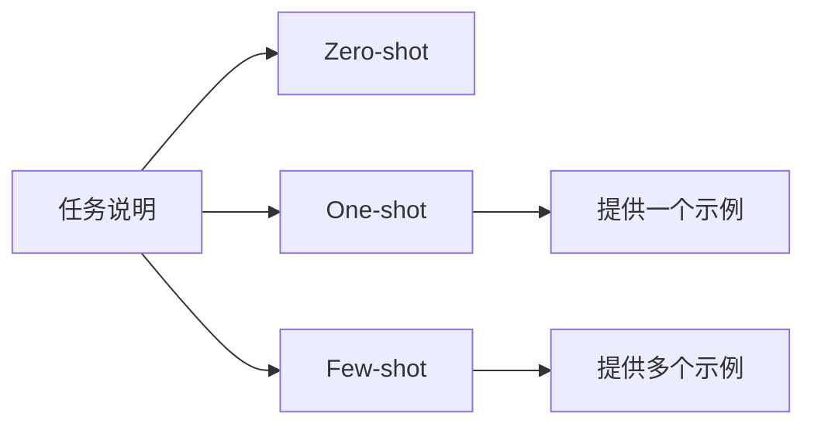

# Zero-shot、One-shot 与 Few-shot

## 本章目标

这一章讨论 Prompt 工程里最基础但也最常用的三种方式：

- Zero-shot
- One-shot
- Few-shot

读完后你应该能：

- 理解这三种方式分别适合什么问题
- 知道什么时候只靠任务描述就够，什么时候必须给示例
- 会写一个 few-shot Prompt
- 学会从任务复杂度和输出稳定性角度做选择

---

## 为什么“示例”这么重要

模型虽然很强，但它并不是每次都能完全猜中你脑子里的输出标准。

有些任务只靠说明就够了；但有些任务如果不提供示例，模型就很容易：

- 风格不稳定
- 分类口径不一致
- 输出结构跑偏

这就是 shot 方法存在的原因。

---

## 三种方式的关系图



---

## 1. Zero-shot：不给示例，直接做任务

Zero-shot 的意思是：

- 不给任何样例
- 只靠任务说明让模型完成任务

### 适合场景

- 概念解释
- 普通总结
- 翻译
- 简单改写
- 通用问答

例如：

```text
请用中文解释什么是向量数据库。
```

这类任务通常不需要示例，因为任务本身已经足够清楚。

---

## 2. One-shot：给一个示例

One-shot 适合那些：

- 规则不完全一眼能说清
- 但一个样例就足以帮助模型理解风格或输出格式

例如：

```text
你是一名工单摘要助手。

示例：
输入: 页面白屏，刷新后恢复，控制台提示 chunk load error
输出: 生产环境静态资源版本不一致，建议检查部署与缓存策略。

现在请处理：
输入: 支付成功但订单状态未更新，用户重复提交订单。
```

---

## 3. Few-shot：给多个示例

Few-shot 更适合：

- 分类任务
- 抽取任务
- 固定格式输出
- 特定团队风格模仿
- 有口径要求的业务规则判断

例如：

```python
prompt = """
你是一名工单归类助手。

示例1:
输入: 支付成功但订单状态未更新
输出: {"category": "payment", "priority": "high"}

示例2:
输入: 页面白屏，控制台提示 chunk load error
输出: {"category": "frontend", "priority": "high"}

示例3:
输入: 物流单号查不到更新记录
输出: {"category": "logistics", "priority": "medium"}

现在处理：
输入: 用户点击结算后一直 loading，没有成功页也没有错误提示
"""
```

---

## 4. 怎么判断该用哪一种

你可以用这个简单原则判断：

### 任务非常常见、非常直接

优先试 Zero-shot。

### 任务需要固定风格或格式

优先试 One-shot 或 Few-shot。

### 任务有细口径、分类边界容易混

优先试 Few-shot。

---

## 5. 一个很实用的判断标准：输出稳定性

你可以不只看“答得对不对”，还要看：

- 格式是否稳定
- 分类是否一致
- 同类问题是否输出风格统一

如果 Zero-shot 输出波动很大，那通常就是一个信号：

- 你可能需要加示例。

---

## 6. 两个业务案例

### 案例一：错误日志归类

这种任务经常适合 few-shot，因为：

- 类别边界容易混
- 输出格式常固定
- 少量高质量样本能显著提升一致性

### 案例二：PR 摘要生成

如果团队已经有固定风格的 PR 描述模板，给 1 到 3 个高质量示例，通常会明显更稳。

---

## 7. 一个对比实验建议

选同一个任务，分别尝试：

1. zero-shot
2. one-shot
3. few-shot

然后对比：

- 输出格式
- 稳定性
- 是否跑偏

这会让你非常直观地建立 shot 方法的感觉。

---

## 8. 常见坑

### 坑一：示例太差

模型会“学习”你的差示例。

### 坑二：示例风格不一致

会让模型不知道到底该模仿什么。

### 坑三：任务明明很简单，还硬堆很多示例

会增加上下文成本，也未必提升效果。

### 坑四：示例太少，但规则太复杂

这时 few-shot 依然可能不稳，可能还需要结构化约束或工具支持。

---

## 本章小结

本章最重要的结论是：

- Zero-shot 适合简单直接任务
- One-shot 和 Few-shot 适合需要稳定格式、风格和规则的任务
- 示例的质量和一致性非常重要
- 选择哪种方式，核心看任务复杂度和输出稳定性要求

---

## 练习题

1. 为“工单分类”分别写 zero-shot、one-shot、few-shot 三版 Prompt
2. 比较三版结果的稳定性
3. 找一个你认为只用 zero-shot 就足够的任务，并说明原因
4. 找一个你认为必须用 few-shot 的任务，并说明原因

---

## 下一章

掌握 shot 之后，继续进入更系统的 Prompt 设计套路：[常见 Prompt 模式](./prompt-patterns)
