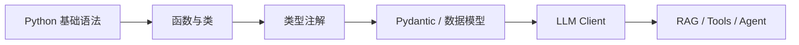

# Python for LLM 开发基础

## 本章目标

这一章不是一门完整的 Python 语言课，而是一门专门面向 LLM 应用开发的 Python 过渡课。

你的背景是中级前端工程师，所以这章的重点不是从零解释变量和循环，而是帮助你快速掌握：

- 在 LLM 项目里最常见的 Python 写法
- Python 项目是怎么组织代码的
- 为什么 `type hints`、`dataclass`、`pydantic` 特别重要
- 如何把前端工程思维迁移到 Python 项目中

读完后你应该能：

- 看懂并编写一个小型 Python LLM 项目
- 用类和函数做简单封装
- 用 `pydantic` 定义结构化数据
- 理解 Python 项目分层为什么重要

---

## 为什么前端工程师学 Python 容易卡住

如果你已经熟悉 JavaScript / TypeScript，那么真正的困难通常不是语法，而是：

- Python 不像 TS 那样强依赖显式类型系统
- Python 项目常用“模块 + 包”的组织方式
- 运行时校验更多依赖 `pydantic` 这类工具
- 错误处理、环境管理、脚本风格和前端不完全一样

所以这一章最核心的任务是：

> 帮你建立“Python 在 LLM 项目里怎么写才像工程代码”的感觉。

---

## 一张图理解 Python 在 LLM 项目里的位置



这张图想表达的是：

- 你不需要先成为 Python 高手
- 但你需要补齐 LLM 工程里最常用的那一部分

---

## 1. 你最常用到的 Python 语法块

### 函数

Python 里最常见的封装单位之一就是函数。

```python
def summarize_text(text: str, max_points: int = 3) -> list[str]:
    return [f"要点{i + 1}: {text[:20]}" for i in range(max_points)]
```

这里你需要关注几个点：

- `def` 定义函数
- `text: str` 是类型注解
- `max_points: int = 3` 是默认参数
- `-> list[str]` 是返回值类型提示

如果你熟悉 TypeScript，可以把它理解成：

- 更轻量的函数类型表达
- 但没有 TS 那么严格的静态类型保护

---

### 字典

Python 的 `dict` 在 LLM 项目里极其常见，因为：

- 请求参数常用 dict 表示
- JSON 解析结果常是 dict
- metadata 常是 dict

```python
payload = {
    "question": "什么是 RAG?",
    "top_k": 3,
    "need_citation": True,
}
```

---

### 列表推导式

列表推导式非常常见，尤其是在做数据处理时。

```python
titles = [doc["title"] for doc in documents]
```

如果你从前端视角看，它有点像：

- `documents.map(doc => doc.title)`

只是语法不同。

---

### 异常处理

异常处理在 LLM 项目里特别重要，因为：

- 模型可能请求失败
- JSON 可能解析失败
- 工具调用可能报错
- 环境变量可能缺失

```python
try:
    result = call_model()
except Exception as exc:
    print(f"调用失败: {exc}")
```

工程里一般不建议只 `print`，后面你会学到应该写日志，但这里先理解结构。

---

## 2. 类型注解为什么在 LLM 项目里特别重要

很多人刚学 Python 时会觉得：

> Python 不是动态语言吗，为什么还要写这么多类型注解？

原因很简单：在 LLM 项目中，类型注解的价值非常大。

它能帮助你：

- 读代码更快
- 理解函数输入输出
- 配合编辑器提示
- 更自然地过渡到 `pydantic`

例如：

```python
def classify_ticket(text: str) -> dict[str, str]:
    return {
        "category": "payment",
        "priority": "high",
    }
```

即使 Python 运行时不强制这个类型，这种写法也会显著提升可读性。

---

## 3. dataclass：轻量数据结构

在 LLM 工程里，你经常会需要一类“只是装数据”的对象，比如：

- 文档 chunk
- 检索结果
- Agent 状态

这种情况下，`dataclass` 非常适合。

```python
from dataclasses import dataclass


@dataclass
class SearchResult:
    title: str
    score: float
    snippet: str
```

你可以把它理解成一种：

- 比 dict 更清晰
- 比手写类更轻量

的数据结构表达方式。

---

## 4. pydantic：结构化输出时代的核心基础设施

如果说 `dataclass` 更适合描述纯数据结构，那么 `pydantic` 更适合做：

- 运行时校验
- 结构化输出约束
- API 输入输出模型

这在 LLM 项目里非常重要，因为模型输出本来就不完全稳定。

```python
from pydantic import BaseModel


class TicketResult(BaseModel):
    category: str
    priority: str
    summary: str
```

为什么它这么重要？

因为在 LLM 应用里，你经常需要：

- “模型给我一个 JSON”
- “程序再校验这个 JSON 是否合法”

而 `pydantic` 正是这个环节的核心工具之一。

---

## 5. 类和封装：为什么不要所有逻辑都写在一个脚本里

很多初学者在学 LLM 时，容易把所有代码都塞进一个脚本，比如：

- 读取 `.env`
- 初始化模型
- 拼 Prompt
- 调接口
- 解析结果

这样短期能跑，但长期非常难维护。

更好的做法是做一点点封装。

例如先封装一个最小客户端：

```python
from openai import OpenAI


class LLMClient:
    def __init__(self, api_key: str, base_url: str, model: str):
        self.model = model
        self.client = OpenAI(api_key=api_key, base_url=base_url)

    def ask(self, prompt: str) -> str:
        response = self.client.responses.create(
            model=self.model,
            input=prompt,
        )
        return response.output_text
```

这个类看起来很简单，但它给你带来的好处很大：

- 模型初始化逻辑集中管理
- 后面更容易加日志、重试、缓存
- 业务层不用每次重复写调用细节

---

## 6. 模块化组织：像管理前端项目一样管理 Python 项目

在前端里你已经很熟悉这些分层：

- `api`
- `utils`
- `types`
- `components`
- `hooks`

Python LLM 项目同样需要分层，只是名字不同。

例如：

- `client.py`：模型客户端
- `prompts.py`：Prompt 模板
- `schemas.py`：Pydantic 模型
- `tools.py`：工具函数
- `rag.py`：RAG 逻辑
- `agent.py`：Agent 流程

这和你原来的工程思维是完全兼容的。

---

## 7. 一个小型 Python LLM 文件组织示例

### `schemas.py`

```python
from pydantic import BaseModel


class SummaryResult(BaseModel):
    title: str
    bullet_points: list[str]
```

### `prompts.py`

```python
def build_summary_prompt(text: str) -> str:
    return f"请把下面内容总结成 3 条要点：\n{text}"
```

### `service.py`

```python
from prompts import build_summary_prompt


def summarize(service_client, text: str):
    prompt = build_summary_prompt(text)
    return service_client.ask(prompt)
```

这个例子虽小，但已经体现了：

- Prompt 和业务逻辑分离
- Schema 单独管理
- 服务层做整合

---

## 8. Python 中最常见的三类错误

### 环境错误

- 没激活 conda 环境
- 没装依赖
- `.env` 没读取成功

### 运行时错误

- 变量不存在
- 类型不匹配
- JSON 解析失败

### 结构设计错误

- 一个文件塞太多逻辑
- Prompt、Schema、业务逻辑高度耦合
- 没做最小封装，后期难以演进

---

## 9. 一个更接近实战的小例子

下面给你一个从配置、客户端到服务的最小链路。

### `config.py`

```python
from dotenv import load_dotenv
import os

load_dotenv()


def get_settings() -> dict[str, str]:
    return {
        "api_key": os.environ["OPENAI_API_KEY"],
        "base_url": os.getenv("OPENAI_BASE_URL", "https://api.openai.com/v1"),
        "model": os.getenv("OPENAI_MODEL", "gpt-4.1-mini"),
    }
```

### `client.py`

```python
from openai import OpenAI


class LLMClient:
    def __init__(self, api_key: str, base_url: str, model: str):
        self.model = model
        self.client = OpenAI(api_key=api_key, base_url=base_url)

    def ask(self, prompt: str) -> str:
        response = self.client.responses.create(
            model=self.model,
            input=prompt,
        )
        return response.output_text
```

### `main.py`

```python
from config import get_settings
from client import LLMClient

settings = get_settings()

client = LLMClient(
    api_key=settings["api_key"],
    base_url=settings["base_url"],
    model=settings["model"],
)

print(client.ask("请解释什么是 Agent。"))
```

这个例子已经很适合作为你所有后续实验的基础骨架。

---

## 10. 前端工程师迁移对照表

| 前端概念 | Python/LLM 中的近似概念 |
| --- | --- |
| TypeScript interface | type hints / pydantic |
| API service | client.py |
| utils | helper functions |
| store | state / memory / dataclass |
| config | .env + config.py |
| middleware | 日志 / 重试 / 缓存封装 |

这个表格的意义是：

- 你不是从零开始
- 你是在迁移已有工程能力

---

## 11. 学这一章时最重要的心态

不要把目标定成：

- 我要先学完整个 Python 语言

那样会非常慢，也不是最优路径。

更好的目标是：

> 先学会支撑 LLM 应用开发的那一部分 Python。

当你一路做到 RAG、Agent、项目实战时，Python 会自然越来越熟。

---

## 本章小结

这一章最重要的结论有这些：

- 你不需要先成为 Python 专家，先掌握 LLM 开发常用部分就够了
- `type hints`、`dataclass`、`pydantic` 是你最该优先掌握的三个点
- 不要把所有逻辑塞进一个脚本，要尽早建立模块化习惯
- 前端工程师的大量工程思维其实可以直接迁移到 Python 项目中

---

## 练习题

1. 写一个 `LLMClient` 类，封装简单问答
2. 写一个 `SummaryResult` 的 `pydantic` 模型
3. 把一个单文件脚本拆成 `config.py`、`client.py`、`main.py`
4. 设计一个 `dataclass` 表示检索结果
5. 用自己的话解释 `dataclass` 和 `pydantic` 的区别

---

## 下一章

掌握 Python 基础后，下一步要把模型调用这件事真正讲透：[模型 API 调用基础](./model-api-basics)
