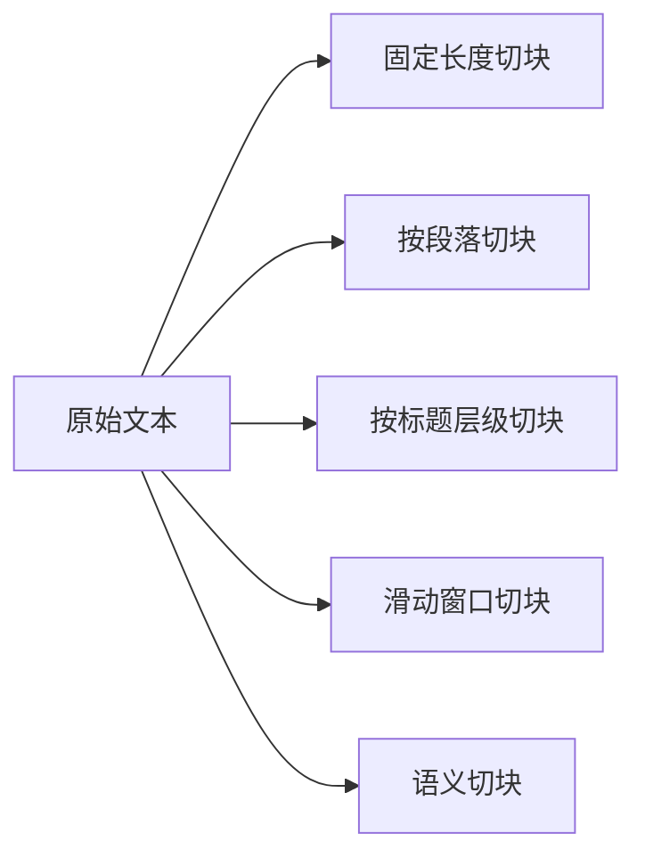

# 切块策略

## 本章目标

这一章讨论 RAG 里最重要、最容易被低估、同时也是最需要实验的环节：切块。

读完后你应该能：

- 理解为什么 chunking 对召回效果影响巨大
- 区分不同切块方法的适用场景
- 写出一个最小可运行的 chunk 函数
- 知道如何思考 `chunk_size` 和 `overlap`

---

## 为什么切块决定了 RAG 的上限

在 RAG 里，模型最终看到的不是原始文档，而是一个个 chunk。

所以 chunk 的质量会直接影响：

- embedding 表达的语义质量
- 检索召回的准确率
- 最终喂给模型的上下文质量

你可以把 chunk 理解成 RAG 系统里的“知识原子单元”。

如果这个单元设计得不好，整个系统都会变得不稳定。

---

## 切块的核心矛盾

### 太大

- 一块里信息过多，语义容易发散
- 相似度搜索不够精准
- 噪声一起被召回
- 占用上下文变大

### 太小

- 语义上下文不完整
- 条款、句子可能被切断
- 检索回来后模型也难理解整体意思

所以切块本质上是在平衡：

> 精准度 与 语义完整性。

---

## 常见切块方式全景图



---

## 1. 固定长度切块

最简单，也是很多人入门时第一个会写的方法。

```python
def chunk_text(text: str, chunk_size: int = 200, overlap: int = 50) -> list[str]:
    chunks = []
    start = 0
    while start < len(text):
        end = start + chunk_size
        chunks.append(text[start:end])
        start += chunk_size - overlap
    return chunks
```

### 优点

- 实现简单
- 适合快速实验

### 缺点

- 容易在句子中间切开
- 不理解结构
- 对制度、文档类内容不够友好

---

## 2. 按段落切块

如果文档结构相对自然，按段落切块通常比固定长度更适合阅读型知识。

```python
def chunk_by_paragraph(text: str) -> list[str]:
    paragraphs = [p.strip() for p in text.split("\n\n")]
    return [p for p in paragraphs if p]
```

### 适合场景

- FAQ
- 产品文档
- 说明文档

---

## 3. 按标题层级切块

如果文档本身有明确结构，比如：

- `# 一级标题`
- `## 二级标题`
- `3.2 条款`

那么按标题层级切块通常效果更好，因为它更符合知识原本的组织方式。

### 适合场景

- 企业制度
- 技术规范
- API 文档
- 培训手册

---

## 4. overlap 为什么重要

overlap 的直觉很简单：

> 给相邻 chunk 一部分重叠区域，防止关键信息刚好落在边界上被切碎。

例如：

```text
员工未休完的年假最多可结转 5 天，需在次年 3 月底前使用完毕。
```

如果“可结转 5 天”和“次年 3 月底前使用完毕”被切进两个完全独立的 chunk，模型在回答时就可能丢掉其中一半信息。

---

## 5. `chunk_size` 怎么选

没有统一标准，但可以按经验思考：

### 偏小 chunk

适合：

- FAQ
- 一问一答记录
- 比较短的知识片段

### 偏中等 chunk

适合：

- 制度条款
- 普通产品文档
- 研发规范

### 偏大 chunk

适合：

- 强依赖上下文的长段说明
- 需要整段背景的业务描述

经验上，不是选一个完美值，而是：

> 基于你的数据类型做实验。

---

## 6. 一个稍微更实用的切块数据结构

```python
from dataclasses import dataclass


@dataclass
class Chunk:
    chunk_id: str
    doc_id: str
    title: str
    text: str
    order: int
```

为什么建议这样做？

因为后面做这些事时会很方便：

- 引用原文
- 按文档过滤
- 拼接相邻 chunk
- 分析召回错误

---

## 7. 一个简单的分块函数示例

```python
def build_chunks(doc_id: str, title: str, text: str, chunk_size: int = 300, overlap: int = 50) -> list[Chunk]:
    chunks = []
    start = 0
    order = 0

    while start < len(text):
        end = start + chunk_size
        chunk_text = text[start:end]
        chunks.append(
            Chunk(
                chunk_id=f"{doc_id}-{order}",
                doc_id=doc_id,
                title=title,
                text=chunk_text,
                order=order,
            )
        )
        start += chunk_size - overlap
        order += 1

    return chunks
```

---

## 8. 两个业务案例

### 案例一：企业制度问答

适合策略：

- 优先按条款标题切块
- 较少依赖固定长度
- 保留编号和标题

原因：

- 用户常问“年假结转”“试用期离职”这类规则问题
- 标题和条款编号往往就是最好的召回线索

### 案例二：前端研发文档问答

适合策略：

- 按章节或 API 段落切块
- 代码段与说明视情况分开

原因：

- 错误排查常依赖某个接口说明或某段规范说明
- 如果把太多代码和说明混在一起，召回容易跑偏

---

## 9. 切块实验该怎么做

建议不要凭感觉选参数，而是做小规模实验。

你可以准备 10 到 20 个问题样本，然后对比：

- `chunk_size=200`
- `chunk_size=400`
- `chunk_size=800`

再对比：

- `overlap=0`
- `overlap=50`
- `overlap=100`

观察指标：

- 正确片段是否更容易召回
- 回答是否更完整
- 上下文噪声是否增加

---

## 10. 常见坑

### 坑一：只按字符切，不考虑语义边界

结果是句子、条款、标题经常被切断。

### 坑二：chunk 太大，觉得“信息更全”

实际上更容易召回一大段杂糅内容。

### 坑三：完全没有 overlap

边界上的关键信息容易被拆开。

### 坑四：不同类型文档用同一策略

FAQ、制度文档、API 文档，最佳切块方式往往不同。

---

## 本章小结

这一章最重要的结论有四个：

- chunk 是 RAG 的知识原子单元
- chunk 太大或太小都会带来明显问题
- `chunk_size` 和 `overlap` 必须结合数据类型实验
- 结构化文档优先考虑按标题、段落、条款切块，而不是机械按字符切

---

## 练习题

1. 用固定长度方式切一份文档，并观察切断句子的情况
2. 再尝试按段落切块，对比差异
3. 为 chunk 增加 `doc_id`、`title`、`order` 字段
4. 用 5 个问题样本，对比两个不同 `chunk_size` 的检索结果

---

## 下一章

chunk 切好后，下一步就是把它们变成向量表示：[Embedding 与向量存储](./embedding-vector-store)
