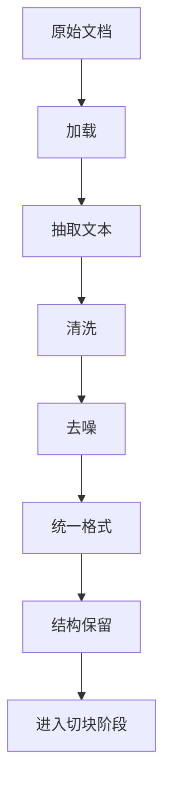

# 文档处理

## 本章目标

这一章讨论 RAG 的第一条生命线：原始文档质量。

很多人一上来就急着做 embedding、上向量库，但真实项目里，文档处理质量往往直接决定后面 50% 以上的效果上限。

读完后你应该能：

- 理解为什么文档处理是 RAG 的起点
- 对常见文档格式建立清洗思路
- 写出最小文本清洗脚本
- 知道哪些噪声会严重破坏后续检索效果

---

## 为什么文档处理这么重要

RAG 里的知识不是天降的，而是从真实世界的“脏文档”里来的。

这些文档常常存在：

- PDF 解析后换行混乱
- Markdown 混着导航、菜单、版权信息
- 网页抓取后包含大量无关 DOM 文本
- 制度文档里有目录、页码、页眉页脚
- FAQ 内容格式不统一

如果这些内容原封不动进入索引层，后果通常是：

- chunk 很难切好
- embedding 学到噪声
- 检索结果经常命中废话
- 回答里夹杂无意义文本

---

## 文档处理总体流程



---

## 1. 常见文档来源有哪些

真实项目里最常见的知识来源包括：

- PDF
- Markdown
- HTML / Wiki 页面
- 数据库 FAQ 记录
- 飞书/Notion/Confluence 导出内容
- 代码仓库中的 README、设计文档、规范文档

不同来源的问题不一样，因此处理方式也不一样。

---

## 2. 文档处理的四个核心目标

### 目标一：去噪

移除与问答无关的信息，例如导航、版权、重复页脚。

### 目标二：保留结构

尽量保留标题、段落、编号、表格说明等结构信息。

### 目标三：统一格式

让后续切块处理面对的是更一致的文本格式。

### 目标四：可追溯

后续最好能知道某个 chunk 来自哪份文档、哪一节、哪个标题。

---

## 3. 最小文本清洗示例

```python
def clean_text(text: str) -> str:
    lines = [line.strip() for line in text.splitlines()]
    lines = [line for line in lines if line]
    return "\n".join(lines)
```

这只是最基础的第一步，作用是：

- 去掉多余空白
- 去掉空行
- 让文本至少进入“可读状态”

---

## 4. 去掉明显噪声的示例

```python
NOISE_PATTERNS = [
    "版权所有",
    "返回顶部",
    "下一页",
    "上一页",
]


def remove_noise_lines(text: str) -> str:
    cleaned_lines = []
    for line in text.splitlines():
        normalized = line.strip()
        if not normalized:
            continue
        if any(pattern in normalized for pattern in NOISE_PATTERNS):
            continue
        cleaned_lines.append(normalized)
    return "\n".join(cleaned_lines)
```

这段代码虽然朴素，但在早期项目里非常实用。

---

## 5. 为什么“保留结构”比“纯清洗”更重要

很多初学者会把文档处理理解成：

> 只要把文本抽出来就行。

但真实情况是，如果把结构全部抹平，你会丢掉很多检索价值。

例如制度文档：

```text
3.2 年假结转规则
员工未休完的年假最多可结转 5 天，需在次年 3 月底前使用完毕。
```

如果保留标题 `3.2 年假结转规则`，后续 chunk 命中时，模型更容易理解这段话的定位和语境。

因此，较好的策略通常是：

- 清噪声
- 保标题
- 保段落
- 保编号

---

## 6. 一个稍微像工程代码的文档标准化示例

```python
from dataclasses import dataclass


@dataclass
class RawDocument:
    doc_id: str
    title: str
    source: str
    content: str


def normalize_document(doc: RawDocument) -> RawDocument:
    text = clean_text(doc.content)
    text = remove_noise_lines(text)
    return RawDocument(
        doc_id=doc.doc_id,
        title=doc.title.strip(),
        source=doc.source,
        content=text,
    )
```

这里很重要的一点是：

- 不只是保存正文
- 还保留 `doc_id`、`title`、`source`

这样你后面才容易做：

- 引用展示
- metadata filter
- 调试问题定位

---

## 7. 两个典型案例

### 案例一：企业制度 PDF

问题：

- 页眉页脚重复
- 页码混杂在正文里
- 换行混乱

处理策略：

- 先提取文本
- 去页脚、页码、版权信息
- 按标题和段落重新组织文本

### 案例二：研发文档 Markdown

问题：

- 菜单导航和目录很多
- 代码块和说明混在一起
- 链接文字可能污染语义

处理策略：

- 保留标题层级
- 视情况保留或移除代码块
- 去掉导航与无意义链接文本

---

## 8. 常见坑

### 坑一：把整个网页完整抓下来就直接入库

结果通常是导航、按钮、页脚全进来了。

### 坑二：清洗过度

把标题、编号、结构全去掉，导致语义定位变差。

### 坑三：不保留来源信息

后续没法做引用，也没法定位召回问题出在哪份文档。

### 坑四：不同来源混在一起但格式不统一

会让后续切块策略很难统一。

---

## 9. 适合前端工程师的思维迁移

你可以把文档处理想成“数据预处理 + 内容标准化”。

这和前端里常见的这些工作很像：

- 接第三方接口前做字段规范化
- 把脏数据转成统一 UI 模型
- 在渲染前做去噪和格式转换

RAG 里的文档处理，本质上也是在做“知识数据的标准化”。

---

## 本章小结

你现在最该记住的是：

- RAG 效果往往从文档处理就已经分出高下
- 清洗不是目的，保留对检索有意义的结构才是重点
- 来源信息和 metadata 要尽早保留
- 文档质量差，后面的 chunking、embedding、retrieval 都会被拖累

---

## 练习题

1. 准备一份 Markdown 文档，写一个清洗脚本去掉空白和导航噪声
2. 准备一份 PDF 文本抽取结果，观察哪些行明显不适合入库
3. 定义一个 `RawDocument` 数据结构，保留 `doc_id`、`title`、`source`
4. 比较“保留标题”和“只保留正文”两种处理方式的差异

---

## 下一章

文档清洗后，接下来进入 RAG 最关键的调参点之一：[切块策略](./chunking)
