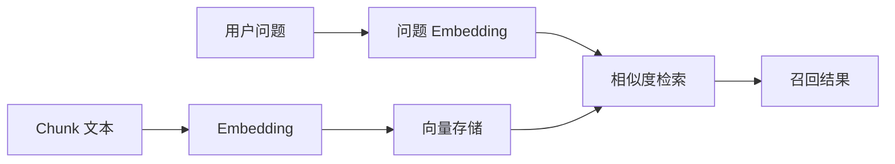

# Embedding 与向量存储

## 本章目标

这一章会把 RAG 里最常见但也最容易被“神秘化”的两个概念讲清楚：`embedding` 和 `vector store`。

读完后你应该能：

- 用工程视角理解 embedding 的作用
- 知道为什么相似度搜索能支持语义检索
- 写出最小 embedding 调用代码
- 明白向量存储在系统中的职责

---

## 1. Embedding 到底是什么

最简化地说，embedding 就是：

> 把文本变成一串可以用于语义计算的数字向量。

例如两句话：

- “年假最多能结转多少天”
- “公司年假结转规则是什么”

虽然字面并不完全一样，但语义非常接近。embedding 的目标，就是让它们在向量空间里更靠近。

---

## 2. 生成模型和 embedding 模型的职责区别

### 生成模型

- 擅长生成答案
- 擅长总结、解释、写作、推理

### embedding 模型

- 擅长表示语义
- 擅长比较相似度
- 擅长做检索与聚类的前置表示

一句话理解：

> 生成模型负责“说”，embedding 模型负责“找”。

---

## 3. 整体流程图



---

## 4. 一个最小 embedding 调用

```python
import os
from dotenv import load_dotenv
from openai import OpenAI

load_dotenv()

client = OpenAI(
    api_key=os.environ["OPENAI_API_KEY"],
    base_url=os.getenv("OPENAI_BASE_URL", "https://api.openai.com/v1"),
)


def get_embedding(text: str) -> list[float]:
    response = client.embeddings.create(
        model="text-embedding-3-small",
        input=text,
    )
    return response.data[0].embedding
```

---

## 5. 为什么要存向量，而不是每次现算

如果文档有几千、几万甚至几十万条 chunk，每次用户提问时都重新给每个 chunk 计算 embedding，成本和耗时都无法接受。

所以常见做法是：

- 离线阶段先把 chunk embedding 好
- 保存进向量存储
- 在线阶段只给“用户问题”算 embedding
- 再在已存向量里做相似度搜索

---

## 6. 一个最小内存版向量存储结构

在入门阶段，你不一定要一开始就接外部向量库。先用内存结构理解主线是很有价值的。

```python
from dataclasses import dataclass


@dataclass
class VectorRecord:
    chunk_id: str
    doc_id: str
    text: str
    embedding: list[float]
    metadata: dict
```

这就是一个最简版“向量存储记录”。

---

## 7. metadata 为什么很重要

只存向量还不够，真实项目里通常还要同时存 metadata，例如：

- 文档标题
- 文档来源
- 所属部门
- 产品线
- 版本号
- 创建时间

原因是后续常常要做：

- 过滤某类文档
- 展示引用来源
- 排查哪份文档召回错了

---

## 8. 两个业务案例

### 案例一：FAQ 系统

每条 FAQ 通常都比较短，适合每条 FAQ 一条记录，metadata 里带上：

- FAQ 分类
- 产品线
- 适用版本

### 案例二：研发规范文档

每个 chunk 可能对应一小节规范内容，metadata 建议保留：

- 章节标题
- 所属仓库
- 文档路径

后续前端展示引用时会非常方便。

---

## 9. 常见坑

### 坑一：把 embedding 当成“会回答”的模型

它不负责回答，它只负责语义表示。

### 坑二：不保存 metadata

后面做引用和过滤会非常痛苦。

### 坑三：只想着“接向量库”，不关心 chunk 质量

坏 chunk 进了再好的向量库也还是坏数据。

### 坑四：没有区分离线链路和在线链路

离线建索引和在线检索是两套时序，不应混在一起理解。

---

## 10. 一个更完整的教学示例

```python
def build_vector_records(chunks: list[dict]) -> list[VectorRecord]:
    records = []
    for chunk in chunks:
        records.append(
            VectorRecord(
                chunk_id=chunk["chunk_id"],
                doc_id=chunk["doc_id"],
                text=chunk["text"],
                embedding=get_embedding(chunk["text"]),
                metadata={
                    "title": chunk.get("title", ""),
                    "source": chunk.get("source", ""),
                },
            )
        )
    return records
```

这段代码已经很接近一个教学版索引构建流程。

---

## 本章小结

本章最重要的结论是：

- embedding 的作用是语义表示，不是生成答案
- 向量存储的作用是保存表示并支持高效相似度检索
- metadata 是向量系统里不可忽视的一部分
- 真正的 RAG 效果来自“好 chunk + 好 embedding + 好检索”，而不是只靠某一个环节

---

## 练习题

1. 用 `get_embedding` 给 3 段文本生成向量
2. 设计一个 `VectorRecord` 数据结构
3. 为 chunk 增加 metadata 字段
4. 思考：FAQ 场景和制度场景的 metadata 有什么不同

---

## 下一章

向量准备好后，真正决定“找得准不准”的，是：[检索策略](./retrieval)
